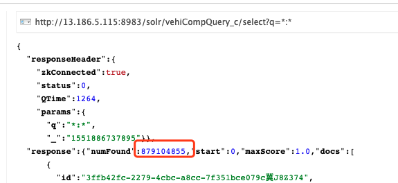

# 沧州升级

## 熟悉现场环境

两个问题：特征搜车、新增设备的同步

## 停止生产者

定时任务备份如下：

*/1 * * * * /software/crontabSpace/PSMonitor.sh
*/5 * * * * /software/crontabSpace/javaLayerMonitor.sh
*/1 * * * * /software/crontabSpace/webLayerMonitor.sh
*/1 * * * * /software/crontabSpace/drawerMonitor.sh
*/1 * * * * /software/crontabSpace/PSMonitor2.sh
0 */2 * * * /usr/local/bin/nmon -s 20 -c 360 -f -m /mnt/disk01/nmon_log/

停止所有消费者：

[root@telchinacz04 logs]# ps -ef|grep vbds.jar
root      2759     1  0 Jan22 ?        02:12:19 java -jar /software/dataDump/vbds.jar countDataForCangZhou
root     26294     1  5 Jan22 ?        2-07:01:28 java -jar /software/dataDump/vbds.jar ypdc
root     26470     1  7 Jan22 ?        3-08:40:41 java -jar /software/dataDump/vbds.jar gczs
root     26537     1  3 Jan22 ?        1-07:51:33 java -jar /software/dataDump/vbds.jar monitorJob
root     26586     1  9 Jan22 ?        3-23:04:29 java -jar /software/dataDump/vbds.jar tpcfx
root     27086     1  7 Jan22 ?        3-06:48:11 java -jar /software/dataDump/vbds.jar commonHBase
root     27136     1  1 Jan22 ?        20:05:48 java -jar /software/dataDump/vbds.jar commonHdfs
root     39327 20597  0 13:32 pts/0    00:00:00 grep --color=auto vbds.jar

root     33910     1  3 Jan22 ?        1-11:45:45 java -jar **/software/dataDump/SolrIndexConsumerForCangzhou.jar**

备份solr5安装目录：

cexec 'mv /opt/solr /opt/solr5-bak'

备份etc目录下的solr服务文件：

cexec 'cp -rp /etc/rc.d/init.d/solr /opt/solr5-bak/solr-etc-conf'

每个节点备份solr data：

cp -rp /mnt/disk01/solr_data /mnt/disk01/solr_data_bak

统一将备份迁移到一个目录solr_upgrade_bak：

[root@telchinacz01 solr_upgrade_bak]# cexec ls -l /mnt/disk01/solr_upgrade_bak/
************************* all *************************
--------- 13.186.5.112---------
total 12
drwxr-xr-x 3 root root 4096 Mar  6 15:10 solr5-bak
drwxrwxrwx 5 root root 4096 Mar  6 14:01 solr_data_bak
-rwxr--r-- 1 root root 2697 Nov 28  2017 solr-etc-conf
--------- 13.186.5.113---------
total 12
drwxr-xr-x 3 root root 4096 Mar  6 15:10 solr5-bak
drwxrwxrwx 4 root root 4096 Mar  6 14:01 solr_data_bak
-rwxr--r-- 1 root root 2697 Nov 28  2017 solr-etc-conf
--------- 13.186.5.114---------
total 12
drwxr-xr-x 3 root root 4096 Mar  6 15:10 solr5-bak
drwxrwxrwx 4 root root 4096 Mar  6 14:01 solr_data_bak
-rwxr--r-- 1 root root 2697 Nov 28  2017 solr-etc-conf
--------- 13.186.5.115---------
total 12
drwxr-xr-x 3 root root 4096 Mar  6 15:10 solr5-bak
drwxrwxrwx 4 root root 4096 Mar  6 14:01 solr_data_bak
-rwxr--r-- 1 root root 2697 Nov 28  2017 solr-etc-conf

升级索引：

cd /tmp/solr-6.6.0/server/solr-webapp/webapp/WEB-INF/lib/

java -cp lucene-core-6.6.0.jar:lucene-backward-codecs-6.6.0.jar org.apache.lucene.index.IndexUpgrader /mnt/disk01/solr_data/data/vehiCompQuery_c

升级hdp和solr的jdk版本

