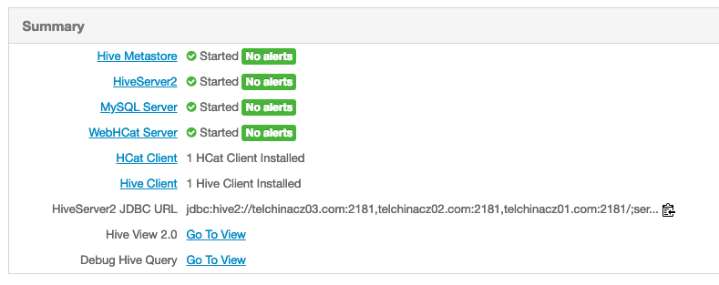
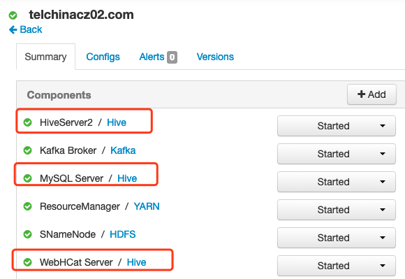
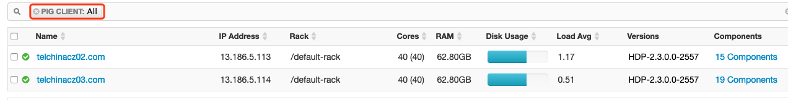
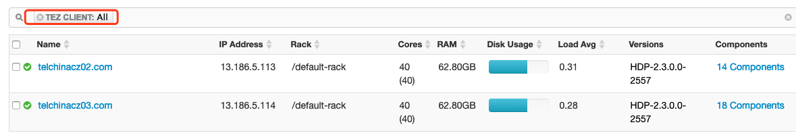
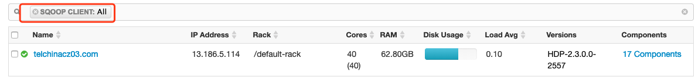
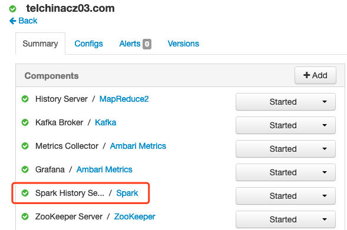
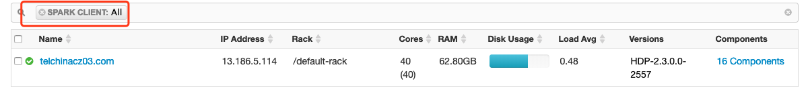

# HDP升级

## 检查工作

一切正常

硬盘占用了66%，应该足够

## 升级前hdfs大小：

```shell
[root@telchinacz01 ~]# hdfs dfs -du /
15176444918    /YCCX
2743069        /app-logs
5919134212847  /apps
457118103      /hdp
0              /mapred
5172677        /mr-history
446459656247   /tmp
173766014      /user
624403998788   /vbds
[root@telchinacz01 ~]# hdfs dfs -du /
15176444918    /YCCX
2794944        /app-logs
5918849463291  /apps
0              /ats
457118103      /hdp
0              /mapred
5777065        /mr-history
446459663178   /tmp
173812129      /user
624403998788   /vbds
[root@telchinacz01 namenode]# hdfs dfs -du /
15176444918    45529334754     /YCCX
2968994        8906982         /app-logs
6027786512969  18086580764379  /apps
697            2091            /ats
10468058       1642016910      /atsv2
1075409170     3226227510      /hdp
0              0               /mapred
6886354        20659062        /mr-history
446459679266   1339379037798   /tmp
178320561      572811747       /user
624403998788   1873211996364   /vbds
```

## 升级前数据抽取位置记录：

### Bayonet:

2019-03-07 17:19:45     http://13.186.3.30:6120/pic?did=dc34077c-f15f-1034-afca-c412f5307682&bid=165237&pid=65554&ptime=1551950385&mtime=928&cid=88     冀J9V9P0  false, 10753978283,BAYONET,a4812760-5967-48ea-86a6-5d88356123dd,维明与交通南侧,4,由北向南,38.34083814666283,116.80236546349845  13090100000000000176    2019-03-07 17:19:56       http://13.186.3.30:6120/pic?did=f645c7a4-f15f-1034-987e-c412f5307692&bid=492646&pid=65730&ptime=1551950396&mtime=341&cid=88     冀J0D7T2        false, 10753978292,BAYONET,30269725-07f0-416e-8994-9789e4c65609,南川与清池南侧,3,由北向南,38.298910992955214,116.86889024982253   13090100000000000030    2019-03-07 17:19:58     http://13.186.3.30:6120/pic?did=e119c790-f15f-1034-8136-c412f53076a8&bid=90078&pid=65702&ptime=1551950398&mtime=844&cid=88        UNKNOWN false, 10753978295,BAYONET,965e870f-4e26-43e0-8b37-783d0358d116,新华与朝阳南侧,3,由北向南,38.31845241111995,116.84466281521283    13090100000000000043    2019-03-07 17:19:57     http://13.186.3.30:6120/pic?did=f645c7a4-f15f-1034-987e-c412f5307692&bid=492646&pid=65731&ptime=1551950397&mtime=105&cid=88       冀JUZ542        false, 10753978296,BAYONET,3c97f921-1e40-44e5-a916-46ff0b16fb75,黄河与开元南侧,1,由南向北,38.28772678106216,116.825744904764      13090100000000000042    2019-03-07 17:19:57     http://13.186.3.30:6120/pic?did=f38ab84e-f15f-1034-afcb-c412f5307682&bid=105615&pid=65578&ptime=1551950397&mtime=310&cid=88       浙JP93Z5        false, 10753978297,BAYONET,afa63087-9cac-4153-93d2-f3a2fc823613,西安与吉林南侧,8,由北向南,null,null       13090100000000000137    2019-03-07 17:19:57     http://13.186.3.30:6120/pic?did=c4dd5bc8-f15f-1034-afc9-c412f5307682&bid=105615&pid=65568&ptime=1551950397&mtime=099&cid=88       冀J187XY        false]
2019-03-07 17:10:42 [INFO] Query :10753978405 TO 10753980405

### TAIL:

2019-03-07 17:19:55     http://13.186.3.30:6120/pic?did=e757db7e-f15f-1034-80ba-c412f5307687&bid=3360&pid=65597&ptime=1551950395&mtime=042&cid=88 冀JP7623        false, 10753979029,TAIL,33c9a8e3-4f77-48ef-88f6-61cdef77a194,海河与浮阳交口,2,由东向西,38.27949732044575,116.85065669439928       13090100000000000071    2019-03-07 17:20:05     http://13.186.3.30:6120/pic?did=bdc8fb1c-f15f-1034-82fb-c412f530ef59&bid=514599&pid=65558&ptime=1551950405&mtime=217&cid=88       冀J7P8U8        false, 10753979030,TAIL,6fb87272-9a40-4573-971f-a7f6c8b0b058,解放与千童交口,9,由西向东,38.30684740502715,116.88845596611101       13090100000000000046    2019-03-07 17:20:05     http://13.186.3.30:6120/pic?did=d51fa14e-f15f-1034-82fc-c412f530ef59&bid=37666&pid=65581&ptime=1551950405&mtime=897&cid=88        冀JZ7923        false, 10753979031,TAIL,8eeee493-3367-4552-8677-40aa22c20d30,北京与宁夏交口,6,由西向东,null,null        13090100000000000180      2019-03-07 17:20:07     http://13.186.3.30:6120/pic?did=bdc8fb1c-f15f-1034-82fb-c412f530ef59&bid=514596&pid=65665&ptime=1551950407&mtime=574&cid=88     京KK01L3  false, 10753979033,TAIL,73b11144-c3cf-40bf-bcf4-3144e9e7886b,御河与浮阳交口,6,由西向东,null,null        13090100000000000178    2019-03-07 17:20:06     http://13.186.3.30:6120/pic?did=8426ff08-f15f-1034-8ecf-c412f53076a4&bid=485064&pid=65686&ptime=1551950406&mtime=338&cid=88       UNKNOWN false]
2019-03-07 17:10:49 [INFO] Query :10753979113 TO 10753981113

## 升级前消费位置记录：

### solr:

10753978941,TAIL,93673a26-b97a-4835-b7c3-4ea05671d3f9,解放与永安交口,6,由南向北,38.3103218429152,116.83570901315699     2019-03-07T17:20:01Z    13090100000000000150    冀JVT766  现代-瑞纳-20102013      轿车    红色    未知    未知    蓝      http://13.186.3.30:6120/pic?did=ff47b95c-f15f-1034-80bb-c412f5307687&bid=472644&pid=65586&ptime=1551950401&mtime=167&cid=88       未知    2261,1582,508,424
10753979019,TAIL,c3fa2871-a223-4220-b3f9-c1188d26b4f5,永济与浮阳交口,11,由北向南,38.33175851694116,116.85267557461809   2019-03-07T17:19:58Z    13090100000000000047    冀J929D3  未知    轿车    白色    未知    未知    蓝      http://13.186.3.30:6120/pic?did=bdc8fb1c-f15f-1034-82fb-c412f530ef59&bid=514599&pid=65557&ptime=1551950398&mtime=054&cid=88       未知    1752,1413,508,508
10753979023,TAIL,4fe51f40-aea5-41c3-8aea-3b6391812986,解放与开元交口,3,由东向西,38.31152839769678,116.82760693633604    2019-03-07T17:20:05Z    13090100000000000056    冀J467ZL  斯柯达-晶锐-20122014    轿车    蓝色    未知    未知    蓝      http://13.186.3.30:6120/pic?did=d51fa14e-f15f-1034-82fc-c412f530ef59&bid=37667&pid=65549&ptime=1551950405&mtime=519&cid=88        未知    2204,1356,508,508
10753979027,TAIL,50b1d18e-ae57-4c7e-8f0d-1491b3f57b57,解放与长芦交口,2,由东向西,38.30520141705447,116.90248207963427    2019-03-07T17:20:01Z    13090100000000000054    冀J567B8  未知    轿车    灰色    未知    未知    蓝      http://13.186.3.30:6120/pic?did=ff47b95c-f15f-1034-80bb-c412f5307687&bid=472644&pid=65600&ptime=1551950401&mtime=440&cid=88       未知    1356,1300,508,508

### commonhdfs:

2019-03-07T17:19:59Z,冀J1J0N7
2019-03-07T17:20:05Z,冀J152G1
2019-03-07T17:20:05Z,冀JG0071
2019-03-07T17:20:06Z,冀J128SP
2019-03-07T17:20:05Z,冀J0P8Y0
2019-03-07T17:19:49Z,冀J1C5W5
2019-03-07T17:20:04Z,冀J9T7W2
2019-03-07T17:20:05Z,冀J3ME27
2019-03-07T17:20:01Z,冀J880PM
2019-03-07T17:20:01Z,冀JVT766
2019-03-07T17:19:58Z,冀J929D3
2019-03-07T17:20:05Z,冀J467ZL
2019-03-07T17:20:01Z,冀J567B8

### commonHBase:

```shell
10753978941,TAIL,93673a26-b97a-4835-b7c3-4ea05671d3f9,解放与永安交口,6,由南向北,38.3103218429152,116.83570901315699     2019-03-07T17:20:01Z    13090100000000000150    冀JVT766  现代-瑞纳-20102013      轿车    红色    未知    未知    蓝      http://13.186.3.30:6120/pic?did=ff47b95c-f15f-1034-80bb-c412f5307687&bid=472644&pid=65586&ptime=1551950401&mtime=167&cid=88       未知    2261,1582,508,424
10753979019,TAIL,c3fa2871-a223-4220-b3f9-c1188d26b4f5,永济与浮阳交口,11,由北向南,38.33175851694116,116.85267557461809   2019-03-07T17:19:58Z    13090100000000000047    冀J929D3  未知    轿车    白色    未知    未知    蓝      http://13.186.3.30:6120/pic?did=bdc8fb1c-f15f-1034-82fb-c412f530ef59&bid=514599&pid=65557&ptime=1551950398&mtime=054&cid=88       未知    1752,1413,508,508
10753979023,TAIL,4fe51f40-aea5-41c3-8aea-3b6391812986,解放与开元交口,3,由东向西,38.31152839769678,116.82760693633604    2019-03-07T17:20:05Z    13090100000000000056    冀J467ZL  斯柯达-晶锐-20122014    轿车    蓝色    未知    未知    蓝      http://13.186.3.30:6120/pic?did=d51fa14e-f15f-1034-82fc-c412f530ef59&bid=37667&pid=65549&ptime=1551950405&mtime=519&cid=88        未知    2204,1356,508,508
10753979027,TAIL,50b1d18e-ae57-4c7e-8f0d-1491b3f57b57,解放与长芦交口,2,由东向西,38.30520141705447,116.90248207963427    2019-03-07T17:20:01Z    13090100000000000054    冀J567B8  未知    轿车    灰色    未知    未知    蓝      http://13.186.3.30:6120/pic?did=ff47b95c-f15f-1034-80bb-c412f5307687&bid=472644&pid=65600&ptime=1551950401&mtime=440&cid=88       未知    1356,1300,508,508
```

## 停止所有solr实例

solr、solr8984、solr8985、solr8986

## 停止所有定时任务：

[root@telchinacz01 ~]# cexec crontab -l

```shell
[root@telchinacz01 ~]# cexec crontab -l
************************* all *************************
--------- 13.186.5.112---------
0 */2 * * * /usr/local/bin/nmon -s 20 -c 360 -f -m /mnt/disk01/nmon_log/
--------- 13.186.5.113---------
0 */2 * * * /usr/local/bin/nmon -s 20 -c 360 -f -m /mnt/disk01/nmon_log/
--------- 13.186.5.114---------
#35 1 * * * /software/ypdc_workspace/run.sh >/dev/null 2>&1
0 */2 * * * /usr/local/bin/nmon -s 20 -c 360 -f -m /mnt/disk01/nmon_log/
--------- 13.186.5.115---------
#*/1 * * * * /software/crontabSpace/PSMonitor.sh
#*/5 * * * * /software/crontabSpace/javaLayerMonitor.sh
#*/1 * * * * /software/crontabSpace/webLayerMonitor.sh
*/1 * * * * /software/crontabSpace/drawerMonitor.sh
#*/1 * * * * /software/crontabSpace/PSMonitor2.sh
0 */2 * * * /usr/local/bin/nmon -s 20 -c 360 -f -m /mnt/disk01/nmon_log/
```

### 记录kafka消费位置：

```shell
[root@telchinacz01 bin]# sh kafka-consumer-groups.sh --list --zookeeper 13.186.5.112:2181
solr_index_fomal_1
gczsGrouptest1
commonHBase
ypdc_new_1
TPCFX_HOME_001
commonHDFS
gczsGroup
monitorGroup
gczsGrouptest
[root@telchinacz01 bin]# date;sh kafka-run-class.sh kafka.tools.ConsumerOffsetChecker --group solr_index_fomal_1 --zookeeper 13.186.5.112:2181
Fri Mar  8 10:36:41 CST 2019
Group           Topic                          Pid Offset          logSize         Lag             Owner
solr_index_fomal_1 telchina_vsd_topic_num1        0   665132943       665132943       0               none
solr_index_fomal_1 telchina_vsd_topic_num1        1   637871692       637871692       0               none
solr_index_fomal_1 telchina_vsd_topic_num1        2   637851434       637851434       0               none
[root@telchinacz01 bin]# date;sh kafka-run-class.sh kafka.tools.ConsumerOffsetChecker --group gczsGrouptest1 --zookeeper 13.186.5.112:2181                  
Fri Mar  8 10:37:06 CST 2019
Group           Topic                          Pid Offset          logSize         Lag             Owner
gczsGrouptest1  telchina_vsd_topic_num1        0   5084            665132943       665127859       none
gczsGrouptest1  telchina_vsd_topic_num1        1   -1              637871692       unknown         none
gczsGrouptest1  telchina_vsd_topic_num1        2   -1              637851434       unknown         none
[root@telchinacz01 bin]# date;sh kafka-run-class.sh kafka.tools.ConsumerOffsetChecker --group commonHBase --zookeeper 13.186.5.112:2181              
Fri Mar  8 10:37:39 CST 2019
Group           Topic                          Pid Offset          logSize         Lag             Owner
commonHBase     telchina_vsd_topic_num1        0   665132943       665132943       0               none
commonHBase     telchina_vsd_topic_num1        1   637871692       637871692       0               none
commonHBase     telchina_vsd_topic_num1        2   637851434       637851434       0               none
[root@telchinacz01 bin]# date;sh kafka-run-class.sh kafka.tools.ConsumerOffsetChecker --group ypdc_new_1 --zookeeper 13.186.5.112:2181           
Fri Mar  8 10:37:51 CST 2019
Group           Topic                          Pid Offset          logSize         Lag             Owner
ypdc_new_1      telchina_vsd_topic_num1        0   665132943       665132943       0               none
ypdc_new_1      telchina_vsd_topic_num1        1   637871692       637871692       0               none
ypdc_new_1      telchina_vsd_topic_num1        2   637851434       637851434       0               none
[root@telchinacz01 bin]# date;sh kafka-run-class.sh kafka.tools.ConsumerOffsetChecker --group TPCFX_HOME_001 --zookeeper 13.186.5.112:2181          
Fri Mar  8 10:38:02 CST 2019
Group           Topic                          Pid Offset          logSize         Lag             Owner
TPCFX_HOME_001  telchina_vsd_topic_num1        0   665132943       665132943       0               none
TPCFX_HOME_001  telchina_vsd_topic_num1        1   637871692       637871692       0               none
TPCFX_HOME_001  telchina_vsd_topic_num1        2   637851434       637851434       0               none
[root@telchinacz01 bin]# date;sh kafka-run-class.sh kafka.tools.ConsumerOffsetChecker --group commonHDFS --zookeeper 13.186.5.112:2181              
Fri Mar  8 10:38:14 CST 2019
Group           Topic                          Pid Offset          logSize         Lag             Owner
commonHDFS      telchina_vsd_topic_num1        0   665132943       665132943       0               none
commonHDFS      telchina_vsd_topic_num1        1   637871692       637871692       0               none
commonHDFS      telchina_vsd_topic_num1        2   637851434       637851434       0               none
[root@telchinacz01 bin]# date;sh kafka-run-class.sh kafka.tools.ConsumerOffsetChecker --group gczsGroup --zookeeper 13.186.5.112:2181          
Fri Mar  8 10:38:28 CST 2019
Group           Topic                          Pid Offset          logSize         Lag             Owner
gczsGroup       telchina_vsd_topic_num1        0   665132943       665132943       0               none
gczsGroup       telchina_vsd_topic_num1        1   637871692       637871692       0               none
gczsGroup       telchina_vsd_topic_num1        2   637851434       637851434       0               none
[root@telchinacz01 bin]# date;sh kafka-run-class.sh kafka.tools.ConsumerOffsetChecker --group monitorGroup --zookeeper 13.186.5.112:2181         
Fri Mar  8 10:38:44 CST 2019
Group           Topic                          Pid Offset          logSize         Lag             Owner
monitorGroup    telchina_vsd_topic_num1        0   665132943       665132943       0               none
monitorGroup    telchina_vsd_topic_num1        1   637871692       637871692       0               none
monitorGroup    telchina_vsd_topic_num1        2   637851434       637851434       0               none
[root@telchinacz01 bin]# date;sh kafka-run-class.sh kafka.tools.ConsumerOffsetChecker --group gczsGrouptest --zookeeper 13.186.5.112:2181            
Fri Mar  8 10:38:55 CST 2019
Group           Topic                          Pid Offset          logSize         Lag             Owner
gczsGrouptest   telchina_vsd_topic_num1        0   14              665132943       665132929       none
gczsGrouptest   telchina_vsd_topic_num1        1   -1              637871692       unknown         none
gczsGrouptest   telchina_vsd_topic_num1        2   -1              637851434       unknown         none
[root@telchinacz01 bin]# 
```

## 升级ambari2.5

### 备份ambari数据库：

```shell
[root@telchinacz01 opt]# mkdir -p upgrade-hdp-bak
[root@telchinacz01 opt]# cd upgrade-hdp-bak/
[root@telchinacz01 upgrade-hdp-bak]# pg_dump -U ambari ambari > ambari-before-upgrade.sql
[root@telchinacz01 upgrade-hdp-bak]# cp -rp /etc/ambari-server/conf/ambari.properties ./
```

### 删除无用组件
















### 修改HBase配置：

org.apache.hadoop.hbase.security.access.SecureBulkLoadEndpoint,cn.telchina.vbds.bigdatastudy.coprocessor.QypzEndPoint,cn.telchina.vbds.bigdatastudy.coprocessor.CCRCEndPoint,cn.telchina.vbds.bigdatastudy.coprocessor.SingleXscpcbEndPoint,cn.telchina.vbds.bigdatastudy.coprocessor.YNCLWJEndPoint

## 升级到HDP3.1时

datanode heap太小，启动失败，无法手工修改参数，最终解决方法：

连接ambari的postgres数据库，修改数据库中的参数后，返回到页面，居然可以修改页面参数了。


Mapredure check失败，原因是hdfs上的mapreducre压缩包无法解压，用本地的替换后成功

## 参数警告：

| Type    | Service        | Property                                                    | Current Value | Description                                                  |
| ------- | -------------- | ----------------------------------------------------------- | ------------- | ------------------------------------------------------------ |
| Warning | HDFS           | dfs.datanode.du.reserved                                    | 1073741824    | Value is less than the recommended default of 1488239239168Reserved space in bytes per volume. Always leave this much space free for non dfs use. |
| Warning | Ambari Metrics | hbase_master_heapsize                                       | 512           | Value is less than the recommended default of 1024 HBase Master Heap Size. In embedded mode, total heap size is sum of master and regionserver heap sizes. |
| Warning | Ambari Metrics | hbase_master_xmn_size                                       | 256           | Value is greater than the recommended maximum Xmn size of 204 (20% of hbase_master_heapsize + hbase_regionserver_heapsize) HBase Master maximum value for young generation heap size. |
| Warning | YARN           | yarn.nodemanager.linux-container-executor.cgroups.hierarchy | /yarn         | yarn.nodemanager.linux-container-executor.cgroups.hierarchy and yarn_hierarchy should always have same valueyarn.nodemanager.linux-container-executor.cgroups.hierarchy and yarn_hierarchy should always have same valueName of the Cgroups hierarchy under which all YARN jobs will be launched |
| Warning | YARN           | yarn.scheduler.maximum-allocation-mb                        | 46080         | Values greater than 36864MB are not recommended The maximum allocation for every container request at the RM, in MBs. Memory requests higher than this won't take effect, and will get capped to this value. |

| Type    | Service        | Property                                                    | Current Value | Description                                                  |
| ------- | -------------- | ----------------------------------------------------------- | ------------- | ------------------------------------------------------------ |
| Warning | Ambari Metrics | hbase_master_heapsize                                       | 1024          | Value is less than the recommended default of 1152 HBase Master Heap Size. In embedded mode, total heap size is sum of master and regionserver heap sizes. |
| Warning | YARN           | yarn.nodemanager.linux-container-executor.cgroups.hierarchy | /yarn         | yarn.nodemanager.linux-container-executor.cgroups.hierarchy and yarn_hierarchy should always have same valueyarn.nodemanager.linux-container-executor.cgroups.hierarchy and yarn_hierarchy should always have same valueName of the Cgroups hierarchy under which all YARN jobs will be launched |
| Warning | YARN           | yarn.scheduler.maximum-allocation-mb                        | 46080         | Values greater than 36864MB are not recommended The maximum allocation for every container request at the RM, in MBs. Memory requests higher than this won't take effect, and will get capped to this value. |