# DKHPlatform总结

## 安装过程

1. 解压安装包：

   ```shell
   unzip -d /root /software/DKHPlatform.zip
   ```

2. 为安装包所在目录设置权限：

   ```shell
   Chmod -R 755 DKHPlatform
   ```

3. 运行安装脚本：

   ```shell
   sh /root/DKHPlatform/Setup/bin/setup.sh
   ```

setup.sh脚本只是部署了一个web应用，后续的安装工作使用这个web应用完成。

4. 使用浏览器打开地址：http://10.10.51.45:8091，页面如下：

   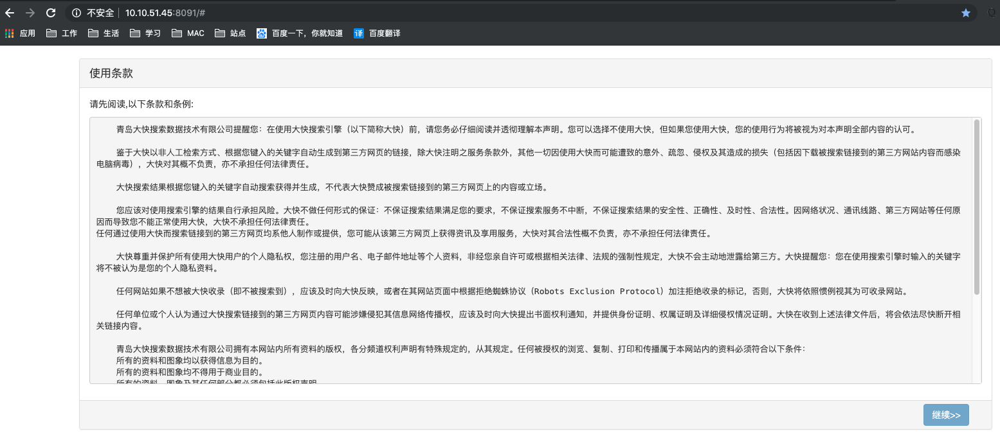

5. 设置集群主机信息，如下：

   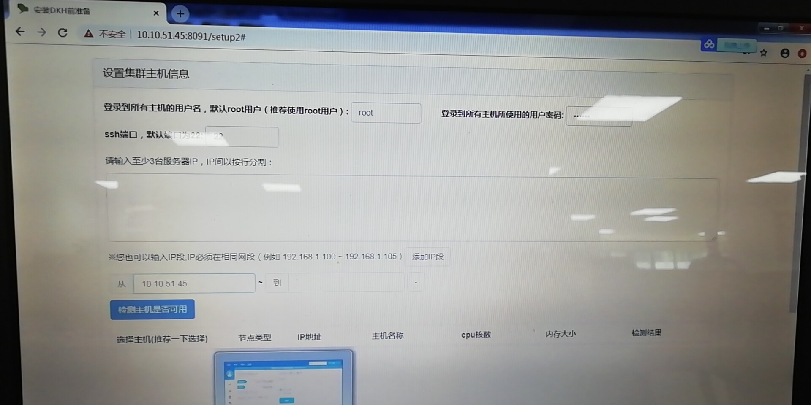

6. 设置免密登陆：

   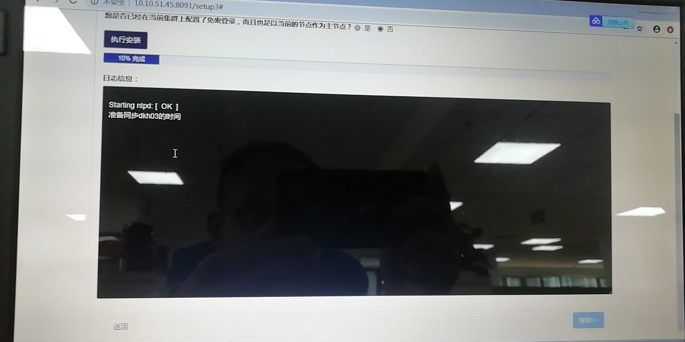

7. 安装mysql服务：

   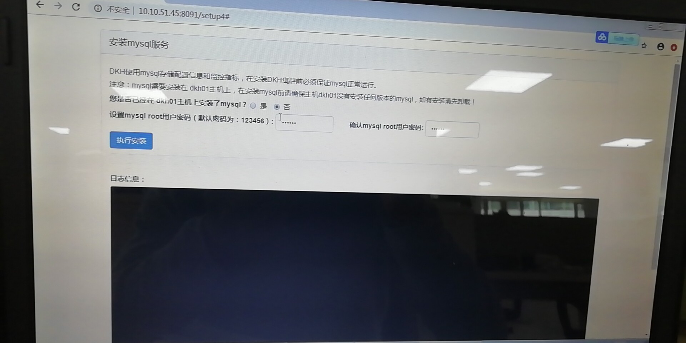

8. 安装ldap服务：

   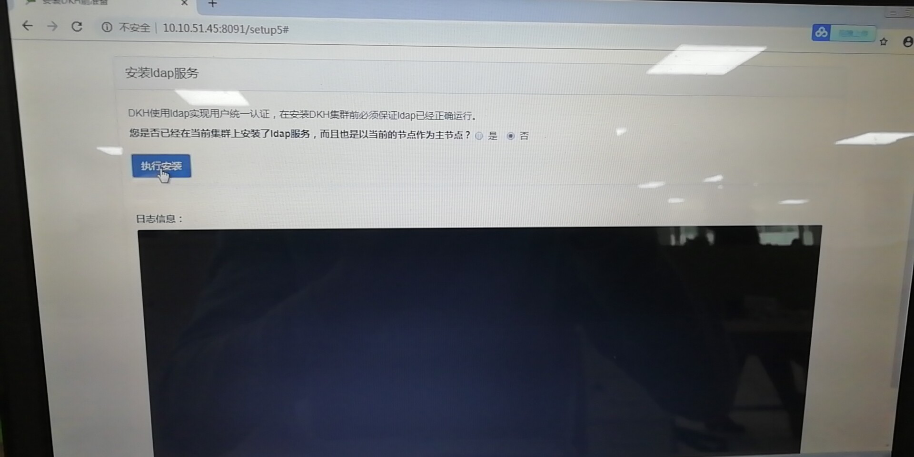

9. 启动DKH安装向导：

   

10. 设置集群名称：

    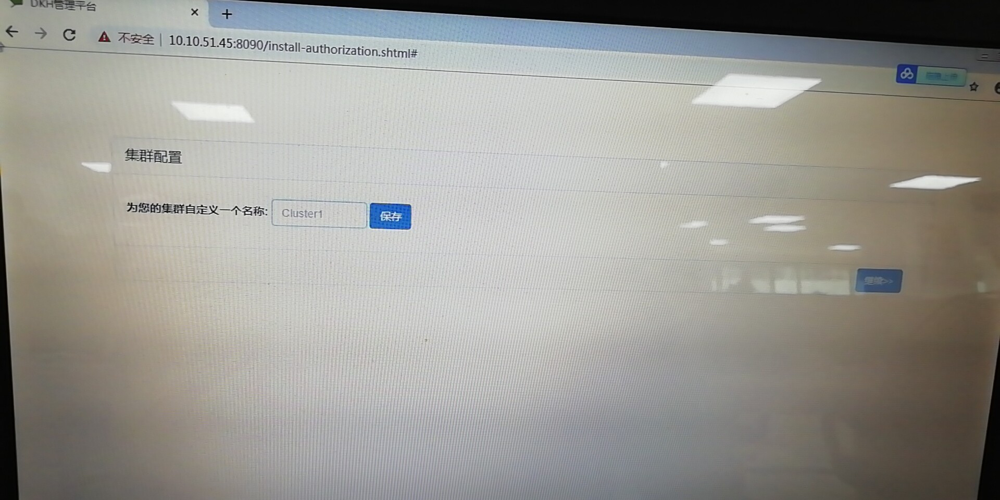

11. 主机角色分配：

    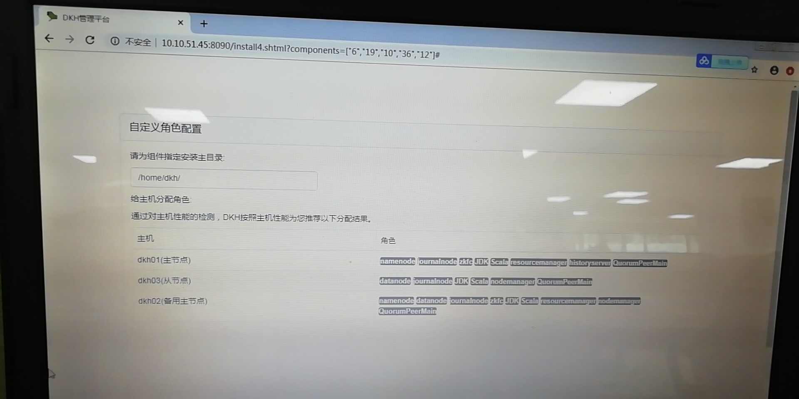

12. 开始DKH安装：

    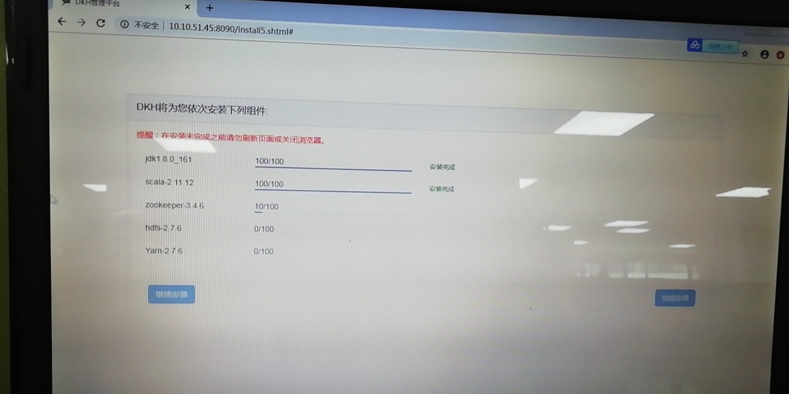

13. 安装完成，DKH管理界面首页如下：

    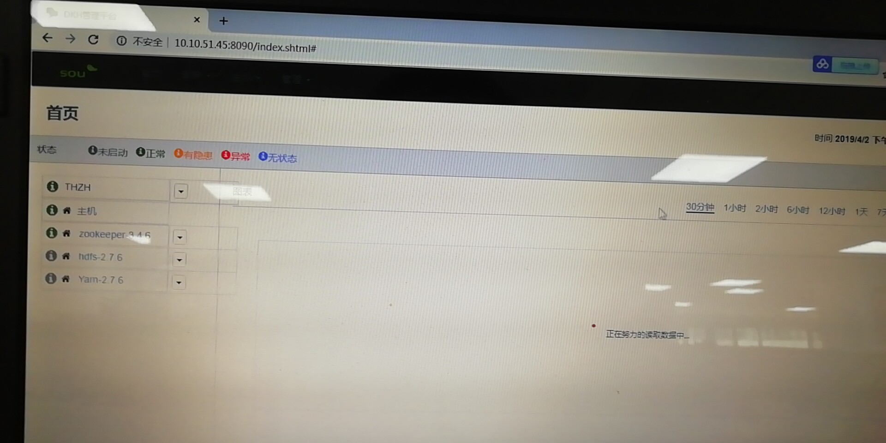

14. 可以继续添加其他组件，如下：

    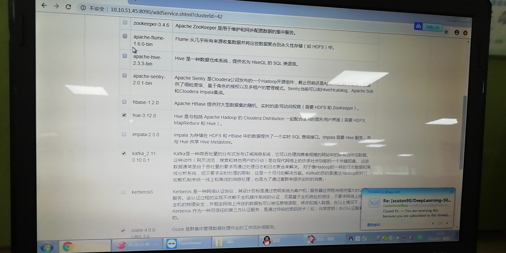

    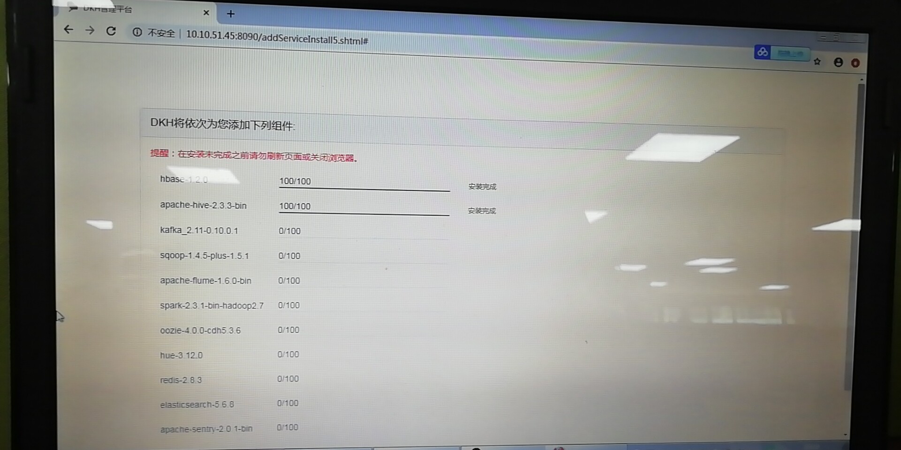

​        总结：DKH的安装过程非常简单，大部分操作都是通过向导界面完成，缺点是向导界面功能比较简单，不能进行个性定制化安装。 此外DKH只能安装在内核版本较低的Linux操作系统上，不支持Centos7以上版本的操作系统，而低版本的Linux内核是有安全隐患的。

​        我们当前使用的是开源产品HDP，HDP的安装过程总体上分为如下两个大的步骤：

​        首先是Ambari的安装，这一步的安装过程涉及的细节非常多，而且官方虽然提供了非常完善的安装手册，但没有提供可视化安装工具，大部分安装步骤都需要通过Linux命令完成。针对这种情况，我们专门开发了一个完善的shell脚本工程，只需要执行一个入口脚本install.sh，就能完成所有安装工作，包括：服务器免密登录设置、yum源配置、安装依赖的rpm包、防火墙与selinux配置、JDK安装、ntp时间同步配置、Hive Metastore mysql安装、Ambari服务安装及配置等一系列安装工作。这一步的安装过程可以借鉴大快搜索的经验，开发一个小巧的web工程替代当前的shell脚本，进一步简化安装。

​        完成Ambair安装后，即可通过Ambari提供的可视化管理界面进行所有hadoop、spark等大数据组件的安装，Ambari提供的可视化安装界面比大快搜索安装界面功能强大很多，例如：支持安装环境的前提检查，避免安装出错；支持人为地自定义各个大数据组件在每台服务器上的分配；支持自定义各个组件的实例数量；支持各个组件的配置修改；支持安装失败的回滚操作和重试操作。

​       

## 功能组件

与业内使用率较高的HDP比较如下：

| 组件                 | DKH（当前最新版本） | HDP（当前最新版本） |
| -------------------- | ------------------- | ------------------- |
| HDFS                 | 2.7.6               | 3.1.1               |
| YARN                 | 2.7.6               | 3.1.1               |
| MapReduce            | 2.7.6               | 3.1.1               |
| HBase                | 1.2.0               | 2.0.2               |
| Kafka                | 2.11-0.10.0.1       | 2.11-2.0.0          |
| ZooKeeper            | 3.4.6               | 3.4.6               |
| Spark                | 2.3.1               | 2.3.2               |
| Flume                | 1.6.0               | 新版本中去掉了      |
| Hive                 | 2.3.3               | 3.1.0               |
| Sqoop                | 1.4.5               | 1.4.7               |
| Oozie                | 4.0.0-cdh5.3.6      | 4.4.0               |
| Kerberos             | kerberos5           | 1.10.3-30           |
| Tez                  | 无                  | 0.9.1               |
| Pig                  | 无                  | 0.16.0              |
| Storm                | 无                  | 1.2.1               |
| Solr                 | 无                  |                     |
| Accumulo             | 无                  | 1.7.0               |
| Atlas                | 无                  | 0.7.0               |
| Knox                 | 无                  | 0.5.0               |
| Log Search           | 无                  | 0.5.0               |
| Ranger               | 无                  | 1.2.0               |
| Ranger KMS           | 无                  | 1.2.0               |
| Zeppelin Notebook    | 无                  | 0.8.0               |
| Druid                | 无                  | 0.12.1              |
| Superset             | 无                  | 0.23.0              |
| elasticsearch        | 5.6.8               | 无                  |
| elasticsearch-plugin | 有                  | 无                  |
| redis                | 2.8.3               | 无                  |
| impala               | 2.5.0               | 无                  |
| Hue                  | 3.12.0              | 无                  |
| apache-sentry        | 2.0.1               | 无                  |

总结：与HDP相比，大块搜索的DKH具备最常用的hadoop基本组件（HDFS、MapReduce、Yarn、HBase、Kafka、ZooKeeper、Spark、Hive等），但版本相对落后，而且比HDP少很多组件，其中相对重要的如Tez、Pig、Storm、Solr。但是DKH也多了几个组件是HDP所不具备的，如：elasticsearch、redis、impala、Hue。

## 管理平台

大快搜索DKH管理界面如下：

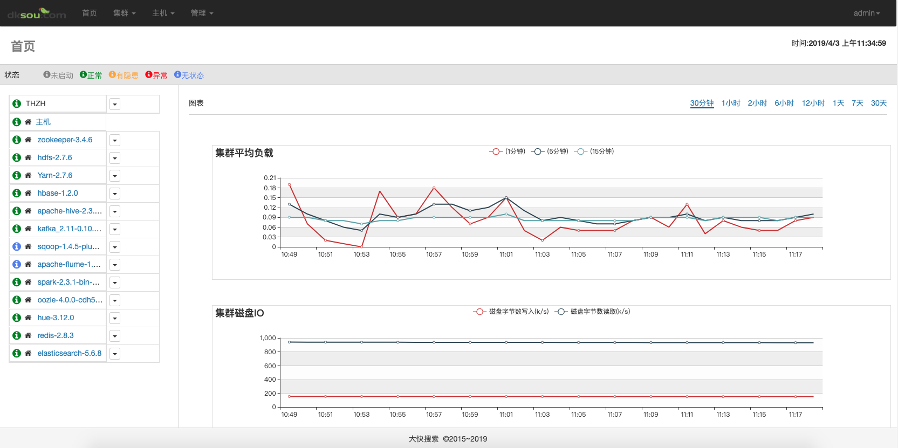

HDP管理界面如下：

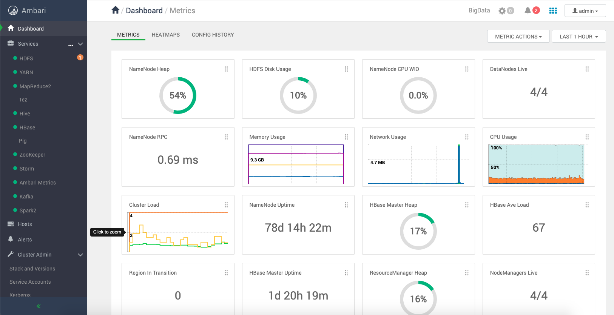

DKH与HDP管理平台对比：

| 对比项                 | DKH                                  | HDP                                                          |
| ---------------------- | ------------------------------------ | ------------------------------------------------------------ |
| 美观度                 | 管理界面提供的功能非常少，非常单薄。 | 管理界面提供的功能特别丰富强大，界面合理美观。               |
| 组件启动和停止         | 只支持单个组件的启停                 | 既支持单个组件启停，又支持所有组件的批量启停，而且支持设置开机自启动 |
| 组件添加和卸载         | 支持                                 | 支持                                                         |
| 各组件的参数配置       | 支持                                 | 支持，且有版本控制功能，有配置组的概念，可以针对不同主机进行不同配置。 |
| 组件状态及主机状态监控 | 支持                                 | 支持                                                         |
| 添加与移除主机         | 支持                                 | 支持                                                         |
| 组件健康状态检查       | 不支持                               | 支持                                                         |
| 维护模式               | 不支持                               | 支持                                                         |
| 组件版本升级           | 不支持，需要厂商提供技术支持。       | 支持                                                         |

## 版权问题

大快搜索DKH为商业软件，测试版本仅支持3到5台主机，不提供技术支持，不提供安全保障。如果研发和项目上使用，必须采购商业版本。由于产品中不提供版本升级功能，所以如果要进行版本升级，必须采购技术支持服务。

HDP完全开源，不存在版权问题，官方提供的产品手册非常完善，遇到的问题通过社区基本都能够解决。产品提供的版本升级功能非常强大，而且有非常翔实的官方指导手册，我们能够独立完成版本升级工作。