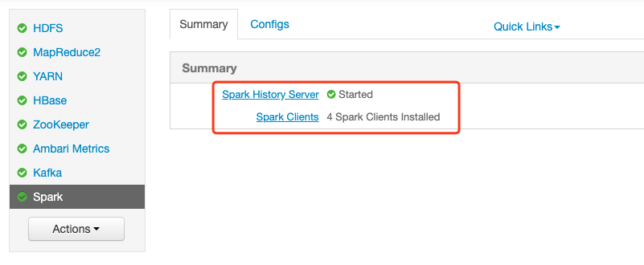
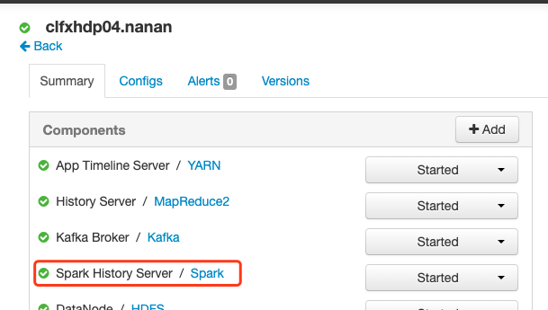

1、ypdc硬编码问题

沟通点位问题

沟通区域碰撞问题

开始升级HDP





```sh
[root@clfxhdp01 ~]# sh /usr/hdp/current/kafka-broker/bin/kafka-consumer-groups.sh --zookeeper localhost:2181 --list 
22
solr_index_fomal_1
solrIndexGroup111
solrIndexClient
console-consumer-10302
kafka_group_test_wuyong
solrIndexClient22
solrIndexGroup
tpcfxGroup
hdfsGroup
1
MonitorConsumerKafkaGroupId
testConsumer
hbaseGroup
ygf
testgroup1
gczsGroup
solrIndexGroup22
Picture1400ConsumerGroup
[root@clfxhdp01 ~]# sh /usr/hdp/current/kafka-broker/bin/kafka-consumer-groups.sh --zookeeper localhost:2181 --describe --group 22
GROUP, TOPIC, PARTITION, CURRENT OFFSET, LOG END OFFSET, LAG, OWNER
22, hellogelin, 0, 264, 264, 0, none
22, hellogelin, 1, 240, 240, 0, none
22, hellogelin, 2, 128, 128, 0, none
22, hellogelin, 3, 192, 192, 0, none
GROUP, TOPIC, PARTITION, CURRENT OFFSET, LOG END OFFSET, LAG, OWNER
22, telchina_vsd_topic_num1, 0, 230, 24564793, 24564563, none
22, telchina_vsd_topic_num1, 1, 237, 25376162, 25375925, none
22, telchina_vsd_topic_num1, 2, 231, 24579389, 24579158, none
22, telchina_vsd_topic_num1, 3, 235, 23151912, 23151677, none
[root@clfxhdp01 ~]# sh /usr/hdp/current/kafka-broker/bin/kafka-consumer-groups.sh --zookeeper localhost:2181 --describe --group solr_index_fomal_1
GROUP, TOPIC, PARTITION, CURRENT OFFSET, LOG END OFFSET, LAG, OWNER
solr_index_fomal_1, telchina_vsd_topic_num1, 0, 24564793, 24564793, 0, none
solr_index_fomal_1, telchina_vsd_topic_num1, 1, 25376162, 25376162, 0, none
solr_index_fomal_1, telchina_vsd_topic_num1, 2, 24579389, 24579389, 0, none
solr_index_fomal_1, telchina_vsd_topic_num1, 3, 23151912, 23151912, 0, none
[root@clfxhdp01 ~]# sh /usr/hdp/current/kafka-broker/bin/kafka-consumer-groups.sh --zookeeper localhost:2181 --describe --group solrIndexGroup111
GROUP, TOPIC, PARTITION, CURRENT OFFSET, LOG END OFFSET, LAG, OWNER
solrIndexGroup111, sjqxAfterCarTopic, 0, 0, 63909890, 63909890, none
solrIndexGroup111, sjqxAfterCarTopic, 1, 0, 59657611, 59657611, none
solrIndexGroup111, sjqxAfterCarTopic, 2, 1, 64044412, 64044411, none
solrIndexGroup111, sjqxAfterCarTopic, 3, 3, 63854795, 63854792, none
[root@clfxhdp01 ~]# sh /usr/hdp/current/kafka-broker/bin/kafka-consumer-groups.sh --zookeeper localhost:2181 --describe --group solrIndexClient
GROUP, TOPIC, PARTITION, CURRENT OFFSET, LOG END OFFSET, LAG, OWNER
solrIndexClient, sjqxAfterCycleTopic, 0, 8159945, 8159945, 0, none
solrIndexClient, sjqxAfterCycleTopic, 1, 7483918, 7483918, 0, none
solrIndexClient, sjqxAfterCycleTopic, 2, 8092781, 8092781, 0, none
solrIndexClient, sjqxAfterCycleTopic, 3, 8150341, 8150341, 0, none
[root@clfxhdp01 ~]# sh /usr/hdp/current/kafka-broker/bin/kafka-consumer-groups.sh --zookeeper localhost:2181 --describe --group console-consumer-10302
GROUP, TOPIC, PARTITION, CURRENT OFFSET, LOG END OFFSET, LAG, OWNER
console-consumer-10302, trace, 0, 4, 93929783, 93929779, none
[root@clfxhdp01 ~]# sh /usr/hdp/current/kafka-broker/bin/kafka-consumer-groups.sh --zookeeper localhost:2181 --describe --group kafka_group_test_wuyong
GROUP, TOPIC, PARTITION, CURRENT OFFSET, LOG END OFFSET, LAG, OWNER
kafka_group_test_wuyong, telchina_vsd_topic_num1, 0, 2, 24564793, 24564791, none
kafka_group_test_wuyong, telchina_vsd_topic_num1, 1, 7, 25376162, 25376155, none
kafka_group_test_wuyong, telchina_vsd_topic_num1, 2, 3, 24579389, 24579386, none
kafka_group_test_wuyong, telchina_vsd_topic_num1, 3, 6, 23151912, 23151906, none
[root@clfxhdp01 ~]# sh /usr/hdp/current/kafka-broker/bin/kafka-consumer-groups.sh --zookeeper localhost:2181 --describe --group solrIndexClient22
GROUP, TOPIC, PARTITION, CURRENT OFFSET, LOG END OFFSET, LAG, OWNER
solrIndexClient22, sjqxAfterCycleTopic, 0, 1, 8159945, 8159944, none
solrIndexClient22, sjqxAfterCycleTopic, 1, 1, 7483918, 7483917, none
solrIndexClient22, sjqxAfterCycleTopic, 2, 1, 8092781, 8092780, none
solrIndexClient22, sjqxAfterCycleTopic, 3, 1, 8150341, 8150340, none
[root@clfxhdp01 ~]# sh /usr/hdp/current/kafka-broker/bin/kafka-consumer-groups.sh --zookeeper localhost:2181 --describe --group solrIndexGroup
GROUP, TOPIC, PARTITION, CURRENT OFFSET, LOG END OFFSET, LAG, OWNER
solrIndexGroup, sjqxAfterCarTopic, 0, 63909890, 63909890, 0, none
solrIndexGroup, sjqxAfterCarTopic, 1, 59657611, 59657611, 0, none
solrIndexGroup, sjqxAfterCarTopic, 2, 64044412, 64044412, 0, none
solrIndexGroup, sjqxAfterCarTopic, 3, 63854795, 63854795, 0, none
[root@clfxhdp01 ~]# sh /usr/hdp/current/kafka-broker/bin/kafka-consumer-groups.sh --zookeeper localhost:2181 --describe --group tpcfxGroup
GROUP, TOPIC, PARTITION, CURRENT OFFSET, LOG END OFFSET, LAG, OWNER
tpcfxGroup, sjqxAfterCarTopic, 0, 63909890, 63909890, 0, none
tpcfxGroup, sjqxAfterCarTopic, 1, 59657611, 59657611, 0, none
tpcfxGroup, sjqxAfterCarTopic, 2, 64044412, 64044412, 0, none
tpcfxGroup, sjqxAfterCarTopic, 3, 63854795, 63854795, 0, none
[root@clfxhdp01 ~]# sh /usr/hdp/current/kafka-broker/bin/kafka-consumer-groups.sh --zookeeper localhost:2181 --describe --group hdfsGroup
GROUP, TOPIC, PARTITION, CURRENT OFFSET, LOG END OFFSET, LAG, OWNER
hdfsGroup, sjqxAfterCarTopic, 0, 63909890, 63909890, 0, none
hdfsGroup, sjqxAfterCarTopic, 1, 59657611, 59657611, 0, none
hdfsGroup, sjqxAfterCarTopic, 2, 64044412, 64044412, 0, none
hdfsGroup, sjqxAfterCarTopic, 3, 63854795, 63854795, 0, none
[root@clfxhdp01 ~]# sh /usr/hdp/current/kafka-broker/bin/kafka-consumer-groups.sh --zookeeper localhost:2181 --describe --group 1
GROUP, TOPIC, PARTITION, CURRENT OFFSET, LOG END OFFSET, LAG, OWNER
1, hellogelin, 0, 0, 264, 264, none
1, hellogelin, 1, 0, 240, 240, none
1, hellogelin, 2, 0, 128, 128, none
1, hellogelin, 3, 0, 192, 192, none
[root@clfxhdp01 ~]# sh /usr/hdp/current/kafka-broker/bin/kafka-consumer-groups.sh --zookeeper localhost:2181 --describe --group MonitorConsumerKafkaGroupId
GROUP, TOPIC, PARTITION, CURRENT OFFSET, LOG END OFFSET, LAG, OWNER
MonitorConsumerKafkaGroupId, telchina_vsd_topic_num1, 0, 24564793, 24564793, 0, none
MonitorConsumerKafkaGroupId, telchina_vsd_topic_num1, 1, 25376162, 25376162, 0, none
MonitorConsumerKafkaGroupId, telchina_vsd_topic_num1, 2, 24579389, 24579389, 0, none
MonitorConsumerKafkaGroupId, telchina_vsd_topic_num1, 3, 23151912, 23151912, 0, none
[root@clfxhdp01 ~]# sh /usr/hdp/current/kafka-broker/bin/kafka-consumer-groups.sh --zookeeper localhost:2181 --describe --group testConsumer
GROUP, TOPIC, PARTITION, CURRENT OFFSET, LOG END OFFSET, LAG, OWNER
testConsumer, hellogelin, 0, 0, 264, 264, none
testConsumer, hellogelin, 1, 0, 240, 240, none
testConsumer, hellogelin, 2, 0, 128, 128, none
testConsumer, hellogelin, 3, 0, 192, 192, none
[root@clfxhdp01 ~]# sh /usr/hdp/current/kafka-broker/bin/kafka-consumer-groups.sh --zookeeper localhost:2181 --describe --group hbaseGroup
GROUP, TOPIC, PARTITION, CURRENT OFFSET, LOG END OFFSET, LAG, OWNER
hbaseGroup, sjqxAfterCarTopic, 0, 63909890, 63909890, 0, none
hbaseGroup, sjqxAfterCarTopic, 1, 59657611, 59657611, 0, none
hbaseGroup, sjqxAfterCarTopic, 2, 64044412, 64044412, 0, none
hbaseGroup, sjqxAfterCarTopic, 3, 63854795, 63854795, 0, none
[root@clfxhdp01 ~]# sh /usr/hdp/current/kafka-broker/bin/kafka-consumer-groups.sh --zookeeper localhost:2181 --describe --group ygf
Could not fetch offset from zookeeper for group ygf partition [VIID_IMAGE,11] due to missing offset data in zookeeper.
Could not fetch offset from zookeeper for group ygf partition [VIID_IMAGE,6] due to missing offset data in zookeeper.
Could not fetch offset from zookeeper for group ygf partition [VIID_IMAGE,8] due to missing offset data in zookeeper.
Could not fetch offset from zookeeper for group ygf partition [VIID_IMAGE,5] due to missing offset data in zookeeper.
Could not fetch offset from zookeeper for group ygf partition [VIID_IMAGE,4] due to missing offset data in zookeeper.
Could not fetch offset from zookeeper for group ygf partition [VIID_IMAGE,10] due to missing offset data in zookeeper.
Could not fetch offset from zookeeper for group ygf partition [VIID_IMAGE,9] due to missing offset data in zookeeper.
Could not fetch offset from zookeeper for group ygf partition [VIID_IMAGE,7] due to missing offset data in zookeeper.
GROUP, TOPIC, PARTITION, CURRENT OFFSET, LOG END OFFSET, LAG, OWNER
ygf, VIID_IMAGE, 0, 1111, 14659069, 14657958, none
ygf, VIID_IMAGE, 1, 1304, 15508574, 15507270, none
ygf, VIID_IMAGE, 2, 1300, 16856114, 16854814, none
ygf, VIID_IMAGE, 3, 1302, 16024876, 16023574, none
ygf, VIID_IMAGE, 4, unknown, 14695162, unknown, none
ygf, VIID_IMAGE, 5, unknown, 15692420, unknown, none
ygf, VIID_IMAGE, 6, unknown, 15365545, unknown, none
ygf, VIID_IMAGE, 7, unknown, 15696941, unknown, none
ygf, VIID_IMAGE, 8, unknown, 15304148, unknown, none
ygf, VIID_IMAGE, 9, unknown, 15079017, unknown, none
ygf, VIID_IMAGE, 10, unknown, 17213359, unknown, none
ygf, VIID_IMAGE, 11, unknown, 13802484, unknown, none
[root@clfxhdp01 ~]# sh /usr/hdp/current/kafka-broker/bin/kafka-consumer-groups.sh --zookeeper localhost:2181 --describe --group testgroup1
GROUP, TOPIC, PARTITION, CURRENT OFFSET, LOG END OFFSET, LAG, OWNER
testgroup1, trace, 0, 4, 93929783, 93929779, none
[root@clfxhdp01 ~]# sh /usr/hdp/current/kafka-broker/bin/kafka-consumer-groups.sh --zookeeper localhost:2181 --describe --group gczsGroup
GROUP, TOPIC, PARTITION, CURRENT OFFSET, LOG END OFFSET, LAG, OWNER
gczsGroup, sjqxAfterCarTopic, 0, 63909890, 63909890, 0, none
gczsGroup, sjqxAfterCarTopic, 1, 59657611, 59657611, 0, none
gczsGroup, sjqxAfterCarTopic, 2, 64044412, 64044412, 0, none
gczsGroup, sjqxAfterCarTopic, 3, 63854795, 63854795, 0, none
GROUP, TOPIC, PARTITION, CURRENT OFFSET, LOG END OFFSET, LAG, OWNER
gczsGroup, telchina_vsd_topic_num1, 0, 428198, 24564793, 24136595, none
gczsGroup, telchina_vsd_topic_num1, 1, 429189, 25376162, 24946973, none
gczsGroup, telchina_vsd_topic_num1, 2, 428199, 24579389, 24151190, none
gczsGroup, telchina_vsd_topic_num1, 3, 428203, 23151912, 22723709, none
[root@clfxhdp01 ~]# sh /usr/hdp/current/kafka-broker/bin/kafka-consumer-groups.sh --zookeeper localhost:2181 --describe --group solrIndexGroup22
GROUP, TOPIC, PARTITION, CURRENT OFFSET, LOG END OFFSET, LAG, OWNER
solrIndexGroup22, sjqxAfterCarTopic, 0, 1, 63909890, 63909889, none
solrIndexGroup22, sjqxAfterCarTopic, 1, 1, 59657611, 59657610, none
solrIndexGroup22, sjqxAfterCarTopic, 2, 1, 64044412, 64044411, none
solrIndexGroup22, sjqxAfterCarTopic, 3, 3, 63854795, 63854792, none
[root@clfxhdp01 ~]# sh /usr/hdp/current/kafka-broker/bin/kafka-consumer-groups.sh --zookeeper localhost:2181 --describe --group Picture1400ConsumerGroup
GROUP, TOPIC, PARTITION, CURRENT OFFSET, LOG END OFFSET, LAG, OWNER
Picture1400ConsumerGroup, VIID_IMAGE, 0, 14213372, 14659069, 445697, none
Picture1400ConsumerGroup, VIID_IMAGE, 1, 14933064, 15508574, 575510, none
Picture1400ConsumerGroup, VIID_IMAGE, 2, 15907438, 16856114, 948676, none
Picture1400ConsumerGroup, VIID_IMAGE, 3, 14886344, 16024876, 1138532, none
Picture1400ConsumerGroup, VIID_IMAGE, 4, 14158767, 14695162, 536395, none
Picture1400ConsumerGroup, VIID_IMAGE, 5, 14279796, 15692420, 1412624, none
Picture1400ConsumerGroup, VIID_IMAGE, 6, 15037231, 15365545, 328314, none
Picture1400ConsumerGroup, VIID_IMAGE, 7, 15196774, 15696941, 500167, none
Picture1400ConsumerGroup, VIID_IMAGE, 8, 14808955, 15304148, 495193, none
Picture1400ConsumerGroup, VIID_IMAGE, 9, 14475878, 15079017, 603139, none
Picture1400ConsumerGroup, VIID_IMAGE, 10, 16218320, 17213359, 995039, none
Picture1400ConsumerGroup, VIID_IMAGE, 11, 13381590, 13802484, 420894, none
```


```sh
[hdfs@clfxhdp01 ~]$ hdfs dfs -du /
664435825      /YCCX
1435394        /app-logs
2662280575889  /apps
0              /ats
207888607      /hdp
0              /mapred
2637623        /mr-history
19828286       /tmp
143673         /user
251910417972   /vbds
[hdfs@clfxhdp01 namenode]$ hdfs dfs -du /
664435825      /YCCX
1465481        /app-logs
2662281874988  /apps
0              /ats
423962628      /hdp
0              /mapred
2974118        /mr-history
19833828       /tmp
236633         /user
252028647077   /vbds
[hdfs@clfxhdp01 hdfs-bak]$ hdfs dfs -du /
664435825      1993307475     /YCCX
1537427        4612281        /app-logs
2659246485723  7982973946161  /apps
696            2088           /ats
15867602       1658215542     /atsv2
826179674      2478539022     /hdp
0              0              /mapred
3403976        10211928       /mr-history
19837736       59513208       /tmp
391441         1174323        /user
252028647077   756085941231   /vbds
```


org.apache.hadoop.hbase.security.access.SecureBulkLoadEndpoint,cn.telchina.vbds.bigdatastudy.coprocessor.QypzEndPoint,cn.telchina.vbds.bigdatastudy.coprocessor.CCRCEndPoint,cn.telchina.vbds.bigdatastudy.coprocessor.SingleXscpcbEndPoint,cn.telchina.vbds.bigdatastudy.coprocessor.YNCLWJEndPoint

```python
ExecutionFailed: Execution of '/usr/bin/yum -d 0 -e 0 check dependencies' returned 1. Error: check ['dependencies']
ipa-client-4.4.0-12.el7.centos.x86_64 has installed conflicts freeipa-client: ipa-client-4.4.0-12.el7.centos.x86_64
ipa-client-common-4.4.0-12.el7.centos.noarch has installed conflicts freeipa-client-common: ipa-client-common-4.4.0-12.el7.centos.noarch
ipa-common-4.4.0-12.el7.centos.noarch has installed conflicts freeipa-common: ipa-common-4.4.0-12.el7.centos.noarch
Traceback (most recent call last):
  File "/var/lib/ambari-agent/cache/custom_actions/scripts/install_packages.py", line 469, in <module>
    InstallPackages().execute()
  File "/usr/lib/python2.6/site-packages/resource_management/libraries/script/script.py", line 314, in execute
    method(env)
  File "/var/lib/ambari-agent/cache/custom_actions/scripts/install_packages.py", line 179, in actionexecute
    raise Fail("Failed to distribute repositories/install packages")
resource_management.core.exceptions.Fail: Failed to distribute repositories/install packages
```

As it were, being in a walled off environment that does not have the latest version of the CentOS repos, this was a significantly more head-scratching affair. As it turns out, the simple fix is to update yum, which fixes this bug. Unfortunately, that was not an option for me. Fortunately, there is a manual work-around that did work: [Comment 17](https://bugzilla.redhat.com/show_bug.cgi?id=1370134#c17), which is to o the following:

sed -i "/for creq in pkg.conflicts:/a\ if creq[0].startswith('freeipa'): continue" /usr/lib/python2.7/site-packages/yum/rpmsack.py

So, in case someone else runs into this issue and is in the same type of restricted environment that I am in, this should fix things for you too...


| Type    | Service        | Property                                                    | Current Value | Description                                                  |
| :------ | :------------- | :---------------------------------------------------------- | :------------ | :----------------------------------------------------------- |
| Error   | HDFS           | hadoop.proxyuser.root.groups                                |               | Value should be set for hadoop.proxyuser.root.groups         |
| Error   | HDFS           | hadoop.proxyuser.root.hosts                                 |               | Value should be set for hadoop.proxyuser.root.hosts          |
| Warning | HDFS           | dfs.datanode.du.reserved                                    | 1073741824    | Value is less than the recommended default of 492095151104Reserved space in bytes per volume. Always leave this much space free for non dfs use. |
| Warning | Ambari Metrics | hbase_master_heapsize                                       | 512           | Value is less than the recommended default of 1152 HBase Master Heap Size. In embedded mode, total heap size is sum of master and regionserver heap sizes. |
| Warning | Ambari Metrics | hbase_master_xmn_size                                       | 256           | Value is greater than the recommended maximum Xmn size of 204 (20% of hbase_master_heapsize + hbase_regionserver_heapsize) HBase Master maximum value for young generation heap size. |
| Warning | YARN           | yarn.nodemanager.linux-container-executor.cgroups.hierarchy | /yarn         | yarn.nodemanager.linux-container-executor.cgroups.hierarchy and yarn_hierarchy should always have same valueyarn.nodemanager.linux-container-executor.cgroups.hierarchy and yarn_hierarchy should always have same valueName of the Cgroups hierarchy under which all YARN jobs will be launched |
| Warning | YARN           | yarn.scheduler.maximum-allocation-mb                        | 46080         | Values greater than 24576MB are not recommended The maximum allocation for every container request at the RM, in MBs. Memory requests higher than this won't take effect, and will get capped to this value. |


[root@clfxhdp04 bin]# sh /usr/hdp/current/kafka-broker/bin/kafka-consumer-groups.sh --bootstrap-server clfxhdp04.nanan:6667 --list
solrIndexClient
solrIndexGroup
hbaseGroup
Picture1400ConsumerGroup
tpcfxGroup
hdfsGroup
MonitorConsumerKafkaGroupId
gczsGroup
solr_index_fomal_1