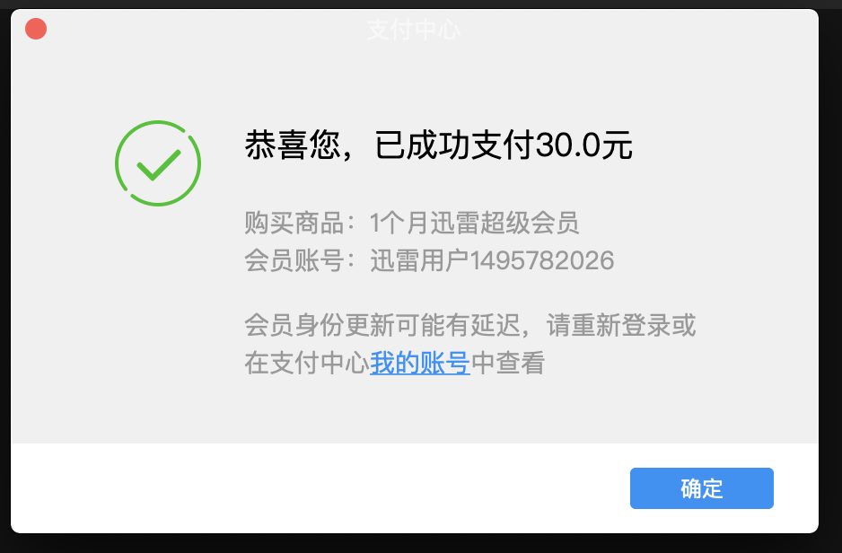

重庆市南岸区公安局车辆大数据平台，今日赴现场升级视频结构化平台，由于需要重新安装服务器操作系统，所以需要申请进入机房，在找局方负责该项目的支队长刘立签字时，支队长刘立对我们表达了一些不满，主要意思是说我们一直在闭门造车，没有与他们好好沟通过，标书上提到的只是他们最基本的要求，他们其实还有一些其他的需求，我们没有与他们沟通过，说我们没有当成一个工程来推进。此外还说到：我们现在对接大华的1400视图库是不对的，大华的1400视图库存在问题，数据不全，我们应该对接易华录的一个平台来接入数据。

刘立支队长说的这些问题确实是存在的，我们一直都是与时代云英进行对接，缺少与局方的沟通，而且我们没有人驻场，时代云英也没有人驻场，局方领导和紫光经理完全感觉不到我们的存在，感觉不到车辆大数据平台这个项目在做什么，所以对我们的项目感到担心。

看看后续怎么能推进一下，是否可以与时代云英一起找局方一起交流一下需求，不过这样势必也会带来一些问题，可能需要我们有人驻场，需要频繁应对局方提出的一些需求，从而带来项目成本的增加。另外一个方案就是，我们还是只对接时代云英，让时代云英去与局方沟通。今天刘队提出这些问题时，时代云英工程师也在场。

关于对接大华1400视图库，之前是经过局方确认的，现在又说应该对接易华录，这对项目进度会带来很大影响，需要投入很大人力进行接口开发。从当时刘队说话的场景，说这件事也主要是想表达我们没有好好与他们沟通过。我们是不是可以暂时不动。

不过无论如何与局方的沟通看来是有必要的，无论是我们和时代云英一起，还是让时代云英独自去与局方沟通。

沧州向日葵验证码：9549