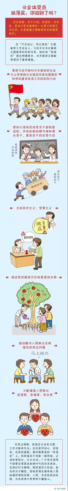

```tex
习近平在“不忘初心、牢记使命”主题教育工作会议上的讲话

（2019年5月31日）

习近平


　　2019年5月31日，“不忘初心、牢记使命”主题教育工作会议在北京召开。中共中央总书记、国家主席、中央军委主席习近平出席会议并发表重要讲话。 

　　党的十九大决定，以县处级以上领导干部为重点，在全党开展“不忘初心、牢记使命”主题教育。今年是中华人民共和国成立70周年，也是我们党在全国执政第70个年头，在这个时刻开展这次主题教育，正当其时。党中央已经印发了关于在全党开展“不忘初心、牢记使命”主题教育的意见。今天会议就是对全党开展这次主题教育进行动员部署。

　　下面，我讲3个问题。

　　一、充分认识开展主题教育的重大意义

　　为中国人民谋幸福，为中华民族谋复兴，是中国共产党人的初心和使命，是激励一代代中国共产党人前赴后继、英勇奋斗的根本动力。开展这次主题教育，是党中央统揽伟大斗争、伟大工程、伟大事业、伟大梦想作出的重大部署，对统筹推进“五位一体”总体布局、协调推进“四个全面”战略布局，决胜全面建成小康社会、夺取新时代中国特色社会主义伟大胜利、实现中华民族伟大复兴的中国梦，具有重大而深远的意义。
　　第一，
　　第二，
　　第三，
　　第四，

　　二、准确把握主题教育的目标要求

　　党中央对这次主题教育的总要求、目标任务、方法步骤作出了明确规定，要准确把握党中央精神，结合本地区本部门本单位实际，对准目标，积极推进，确保取得预期效果。

　　第一，认真贯彻总要求。“守初心、担使命，找差距、抓落实”的总要求，是根据新时代党的建设任务、针对党内存在的突出问题、结合这次主题教育的特点提出来的。

　　守初心，就是要牢记全心全意为人民服务的根本宗旨，以坚定的理想信念坚守初心，牢记人民对美好生活的向往就是我们的奋斗目标；以真挚的人民情怀滋养初心，时刻不忘我们党来自人民、根植人民，人民群众的支持和拥护是我们胜利前进的不竭力量源泉；以牢固的公仆意识践行初心，永远铭记人民是共产党人的衣食父母，共产党人是人民的勤务员，永远不能脱离群众、轻视群众、漠视群众疾苦。

　　担使命，就是要牢记我们党肩负的实现中华民族伟大复兴的历史使命，勇于担当负责，积极主动作为，用科学的理念、长远的眼光、务实的作风谋划事业；保持斗争精神，敢于直面风险挑战，知重负重、攻坚克难，以坚忍不拔的意志和无私无畏的勇气战胜前进道路上的一切艰难险阻；在实践历练中增长经验智慧，在经风雨、见世面中壮筋骨、长才干。

　　找差距，就是要对照新时代中国特色社会主义思想和党中央决策部署，对照党章党规，对照人民群众新期待，对照先进典型、身边榜样，坚持高标准、严要求，找一找在增强“四个意识”、坚定“四个自信”、做到“两个维护”方面存在哪些差距，找一找在知敬畏、存戒惧、守底线方面存在哪些差距，找一找在群众观点、群众立场、群众感情、服务群众方面存在哪些差距，找一找在思想觉悟、能力素质、道德修养、作风形象方面存在哪些差距，有的放矢进行整改。

　　抓落实，就是要把新时代中国特色社会主义思想转化为推进改革发展稳定和党的建设各项工作的实际行动，把初心使命变成党员干部锐意进取、开拓创新的精气神和埋头苦干、真抓实干的自觉行动，力戒形式主义、官僚主义，推动党的路线方针政策落地生根，推动解决人民群众反映强烈的突出问题，不断增强人民群众获得感、幸福感、安全感。

　　“守初心、担使命，找差距、抓落实”是一个相互联系的整体，要全面把握，贯穿主题教育全过程。

　　第二，
　　第三，
```


守初心解读：


担使命解读：


找差距解读：


抓落实解读：

