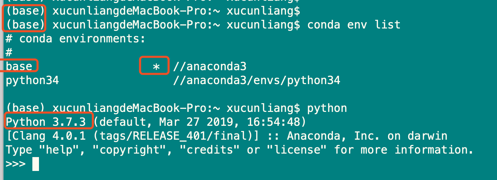
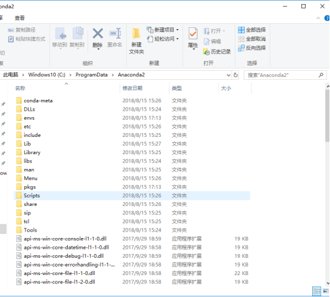
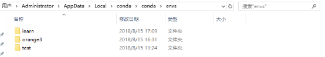
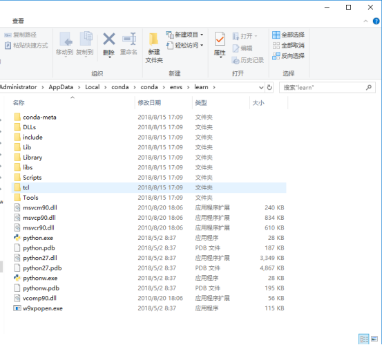
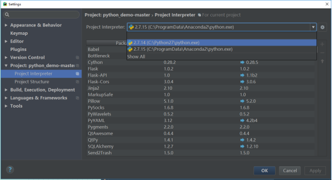
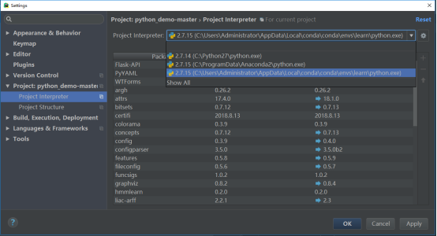
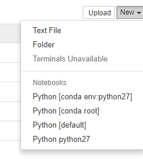
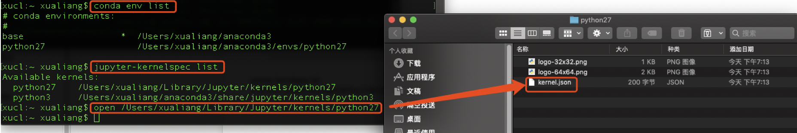

# 官网下载并安装Anaconda

# **配置环境变量**

环境变量配置：C:\ProgramData\Anaconda2\Scripts，之后就可以打开命令行输入 conda --version，如果输出conda 4.5.4之类的就说明环境变量设置成功了.

为了避免可能发生的错误, 我们在命令行输入conda upgrade --all 先把所有工具包进行升级

# **管理虚拟环境**

接下来我们就可以用anaconda来创建我们一个个独立的python环境了

## **activate**

activate 能将我们引入anaconda设定的虚拟环境中, 如果你后面什么参数都不加那么会进入anaconda自带的base环境,

你可以输入python试试, 这样会进入base环境的python解释器, *如果你把原来环境中的python环境去除掉会更能体会到*, 这个时候在命令行中使用的已经不是你原来的python而是base环境下的python.而命令行前面也会多一个(base) 说明当前我们处于的是base环境下。

### 设置conda的国内软件源

conda config --set show_channel_urls yes

conda config --add channels https://mirrors.tuna.tsinghua.edu.cn/anaconda/pkgs/free/

conda config --add channels https://mirrors.tuna.tsinghua.edu.cn/anaconda/cloud/conda-forge/

conda config --add channels https://mirrors.tuna.tsinghua.edu.cn/anaconda/cloud/msys2/

conda config --add channels https://mirrors.tuna.tsinghua.edu.cn/anaconda/pkgs/main/

### 创建自己的虚拟环境

我们当然不满足一个base环境, 我们应该为自己的程序安装单独的虚拟环境.创建一个名称为python34的虚拟环境并指定python版本为3.4(这里conda会自动找3.4中最新的版本下载)

conda  create -n python34  python=3.4

或者conda  create  --name  python34   python=3.4

## **切换环境**

activate python34

如果忘记了名称我们可以先用

conda env list

现在的python34环境除了python自带的一些官方包之外是没有其他包的, 一个比较干净的环境我们可以试试

先输入python打开python解释器然后输入

\>>> import requests

会报错找不到requests包, 很正常.接下来我们就要演示如何去安装requests包

exit()

退出python解释器

## **卸载环境**

conda remove --name python34 --all

## **安装第三方包**

输入

conda install requests

或者

pip install requests

来安装requests包.

安装完成之后我们再输入python进入解释器并import requests包, 这次一定就是成功的了.

# **卸载第三方包**

那么怎么卸载一个包呢

conda remove requests

或者

pip uninstall requests

就行啦.

# **查看环境包信息**

要查看当前环境中所有安装了的包可以用

conda list

# **导入导出环境**

如果想要导出当前环境的包信息可以用

conda env export > environment.yaml

将包信息存入yaml文件中.

当需要重新创建一个相同的虚拟环境时可以用

conda env create -f environment.yaml

## 命令总结

activate // 切换到base环境

activate learn // 切换到learn环境

conda create -n learn python=3 // 创建一个名为learn的环境并指定python版本为3(的最新版本)

conda env list // 列出conda管理的所有环境

conda list // 列出当前环境的所有包

conda install requests 安装requests包

conda remove requests 卸载requets包

conda remove -n learn --all // 删除learn环境及下属所有包

conda update requests 更新requests包

conda env export > environment.yaml // 导出当前环境的包信息

conda env create -f environment.yaml // 用配置文件创建新的虚拟环境

## **深入一下**

或许你会觉得奇怪为啥anaconda能做这些事, 他的原理到底是什么, 我们来看看anaconda的安装目录

这里只截取了一部分, 但是我们和本文章最开头的python环境目录比较一下, 可以发现其实十分的相似, 其实这里就是base环境. 里面有着一个基本的python解释器, lLib里面也有base环境下的各种包文件.

那我们自己创建的环境去哪了呢, 我们可以看见一个envs, 这里就是我们自己创建的各种虚拟环境的入口, 点进去看看

可以发现我们之前创建的learn目录就在下面, 再点进去

 

这不就是一个标准的python环境目录吗?

这么一看, anaconda所谓的创建虚拟环境其实就是安装了一个真实的python环境, 只不过我们可以通过activate,conda等命令去随意的切换我们当前的python环境, 用不同版本的解释器和不同的包环境去运行python脚本.

# **与PyCharm集成**

在工作环境中我们会集成开发环境去编码, 这里推荐JB公司的PyCharm, 而PyCharm也能很方便的和anaconda的虚拟环境结合

在Setting => Project => Project Interpreter 里面修改 Project Interpreter , 点击齿轮标志再点击Add Local为你某个环境的python.exe解释器就行了

 

比如你要在learn环境中编写程序, 那么就修改为C:\Users\Administrator\AppData\Local\conda\conda\envs\learn, 可以看到这时候下面的依赖包也变成了learn环境中的包了.接下来我们就可以在pycharm中愉快的编码了。

 

conda install ipykernel

 

python -m ipykernel install --user --name tensorflow --display-name "Python tensorflow"

 

 

jupyter-kernelspec list 

\# 使用这个命令检查conda创建的py环境关联的路径是否正确，如下：

