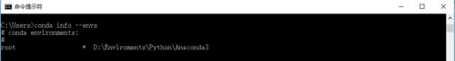
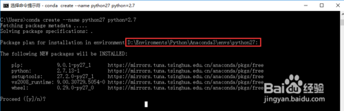
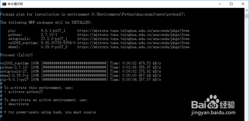
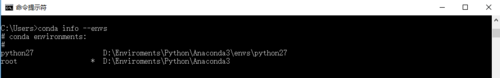
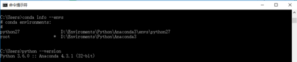
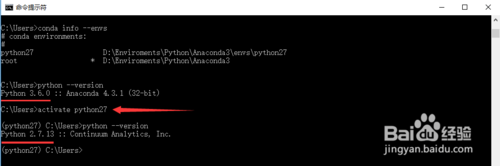
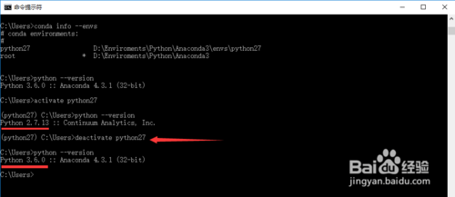

- 通过Conda的环境管理功能，我们能同时安装多个不同版本的Python，并能根据需要自由切换。下面我将给大家分享一下，新增Python版本，切换，再切回主版本的详细过程。

- 方法/步骤

- 1. 首先确保你的系统里已经安装了Conda，打开CMD窗口，执行命令：**conda --version**

- [

- 1. 查看你的系统当前已有的Python环境，执行命令：**conda       info --envs，**从图中我们看到，我的机器里目前只有安装Anaconda时创建的默认Python环境，环境名称叫root，对应的Python版本是3.6

- [

- 1. 现在，我想添加一个Python2.7的环境，执行命令：**conda create --name python27 python=2.7**，命令中我制定了环境名称是python27，指定了Python版本是2.7，执行命令后，Conda会自动下载最新版的Python2.7，并自动部署

- [

-  

- [

- 1. 此时，再次查看你的系统当前已有的Python环境，执行命令：**conda info --envs**，从图中我们看到，这里多了一个名字为python27的Python环境

- [

- 1. 查看我们当前使用的Python版本，执行命令：**python       --version**，从图中看到当前的Python环境是3.6版本

- [

- 1. 切换Python环境到刚才新添加的Python2.7，执行命令：**activate python27**，然后执行命令：**python --version**，查看是否切换成功

- [

- 1. 在Python27环境下，完成工作后，切回原来的Python环境，执行命令：**deactivate python27**

- [

- 1. 8
                  如果刚才添加的Python27环境，不再使用，可通过执行命令：**conda remove --name python27 --all**，进行删除