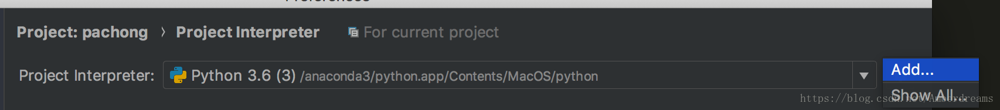
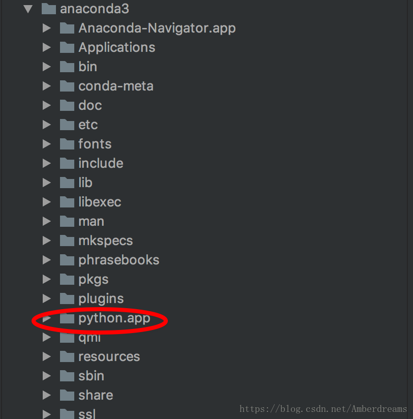

第一步打开PyCharm，进入偏好设置中，Mac 中的快捷键是command+,，如下图所示：

第二步: 选择Project Interprete

第三步：点击右上角的齿轮，如图所示：

第四步：这一步最为关键，也是最容易出错的。点击第三步出现的 Add，将进入下图所示：

当我们看到上图所示的内容之后，第一反应就是点击 Conda Environmenr，这是不正确的，也是很多人都会遇到的困惑。正确的选择应该是 System Interpreter。

第五步：选择System Interpreter，点击右上角的齿轮，选择 Add，将会出现如下页面：

我们选择anaconda3文件夹，并打开，找到 python.app文件夹，并打开。

第六步：选择 python.app文件夹中的 Mac OS 文件夹，并打开，选中 python，并点击右下角的ok

到此为止PyCharm 配置 Anaconda环境就已经完成了，耐心等待加载，就会看到常用第三方库配置到了PyCharm中，由于Anaconda中配置了常用的第三方库，你只需要认真的开发程序就可以了。

第一次配置完成后，可能需要重启一次pyCharm，然后在创建project时才能发现已配置的环境。

