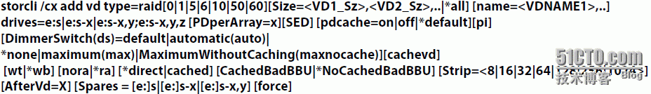
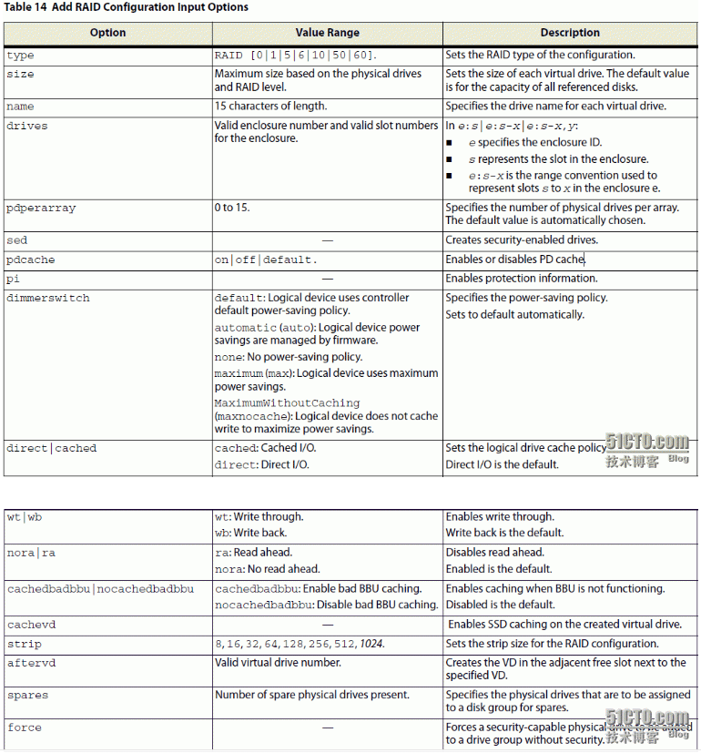
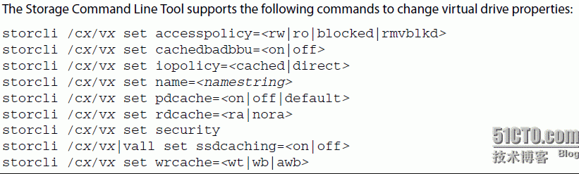
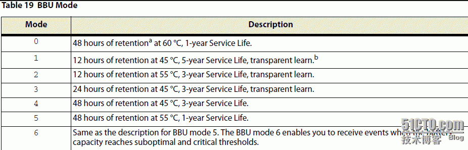

## 常用命令

### 操作Raid控制器

```sh
./storcli64 -v                             # storcli版本
./storcli64 -h                             # storcli帮助

./storcli64 show [all]                     # 显示所有raid卡相关信息、raid卡高级软件信息
./storcli64 /cx show all                   # 显示某一块raid卡的版本、功能、状态、以及raid卡下的物理磁、逻辑盘信息

./storcli64 /cx show freespace             # 显示剩下的磁盘空间

./storcli64 /cx set rebuildrate=x          # 整数，设置rebuildrate速度
./storcli64 /cx show rebuildrate

./storcli64 /cx set patrolread=on or off   # 开启或关闭patrolread
./storcli64 /cx show patrolread

./storcli64 /cx set cc=on or off           # 开启或关闭rate
./storcli64 /cx show cc
./storcli64 /cx show ccrate

./storcli64 /cx download file=filepath     # 升级raid卡固件，需要重启

./storcli64 /cx flushcache                 # 清除raid卡、物理磁盘cache

./storcli64 /cx set jbod=on/off            # 启用或禁用Raid控制器的JBOD功能（硬盘直通功能）
```

### 操作物理盘

```sh
./storcli64 /cx/eall/sall show [all]                   # 显示物理磁盘信息

./storcli64 /cx/ex/sx set good/offline/online/missing  # 设置某块磁盘的状态

./storcli64 /cx/ex/sx start locate                     # 定位某块磁盘
./storcli64 /cx/ex/sx stop locate

./storcli64 /cx/ex/sx start rebuild                    # rebuild
./storcli64 /cx/ex/sx show rebuild                     # 查看rebild

./storcli /c0/e252/s0 start erase simple               # 擦除硬盘
./storcli /c0/e252/s0 show erase

./storcli64 /cx/ex/sx add hostsparedrive dgs=x         # 设置模块磁盘为diskgroup x 的热备盘
./storcli64 /cx/ex/sx delete hostsparedrive

./storcli /c0/e9/s0 set jbod                           # 设置一块硬盘为JBOD模式
```

### 逻辑磁盘命令

命令：



参数：



设置VD属性命令：



举例：

```sh
./storcli64 /cx/vx/vall show [all]    # 显示逻辑磁盘信息
./storcli64 /cx/vx/vall del           # 删除逻辑磁盘，此命令会等待cache中的数据写入磁盘
./storcli64 /cx/vx/vall del force     # 删除逻辑磁盘，此命令不会等待cache中的数据写入磁盘

./storcli64 /c0 add vd type=raid0 drives=252:0               # 使用0号盘做raid0
./storcli64 /c0 add vd each type=raid0 drives=252:0,1,2,3    # 每块硬盘单独做Raid0
./storcli64 /c0 add vd type=raid5 size=all names=tmp1 drives=32:2-4  # 2-4三块盘组成raid5

./storcli64 /c0 add vd type=raid10 size=all names=tmp1 drives=32:2-7 pdperarray=2 # 创建10/50/60时，必须制定pdperarray参数

# 创建多个逻辑分区：
./storcli64 /c0 add vd type=raid10 size=100GB,200GB names=tmp1,tmp2 drives=32:2-7 pdperarray=2
./storcli64 /c0 add vd type=raid10 size=all names=tmp3 drives=32:2-7 pdperarray=2 #需要注意，此时其余的参数要和之前的一致，否则报错

# Raid 转换命令：（集成的raid卡不支持该命令）
./storcli64 /cx/vx/vall show migrate
./storcli64 /cx/vx/vall start migrate type=raid x [option=add/removedisk=xx]
Eg: ./storcli64 /c0/v1 start migrate type=r5 option=removedisk=e32:s6,e32:s7

# 一致性检查
./storcli64 /cx/vx/vall show cc   
./storcli64 /cx/vx/vall start cc
./storcli64 /cx/vx/vall stop cc

./storcli64 /cx/vx/vall set wrcache=wt/wb/awb   # 设置写策略
```

### 操作外部磁盘

```sh
./storcli64 /cx/fx/fall del
./storcli64 /cx/fx/fall import
./storcli64 /cx/fx/fall show [all]
```

举例：

遇到一个DG状态为Frgn，导致无法使用这块硬盘创建Raid，提示already in use，解决方法：

```sh
$ ./storcli64 /c0 show                     
Product Name = AVAGO MegaRAID SAS 9361-8i
Serial Number = SK92172864
...

FOREIGN CONFIGURATION :
=====================
---------------------------------------
DG EID:Slot Type  State     Size NoVDs 
---------------------------------------
 0 -        RAID5 Frgn  1.818 TB     1 
---------------------------------------

...

Total foreign Drive Groups = 1
Physical Drives = 4

PD LIST :
=======
------------------------------------------------------------------------------
EID:Slt DID State DG       Size Intf Med SED PI SeSz Model            Sp Type 
------------------------------------------------------------------------------
252:0    10 UGood F  931.000 GB SAS  HDD N   N  512B ST1000NX0333     U  -    
252:1     9 UGood -  931.000 GB SAS  HDD N   N  512B ST1000NX0333     D  -    
252:2     8 UGood -  931.000 GB SAS  HDD N   N  512B ST1000NX0333     D  -    
252:3    13 UGood -  931.000 GB SAS  HDD N   N  512B ST1000NX0333     D  -    
------------------------------------------------------------------------------
./storcli64 /c0/fall show       # 查看所有的外部Raid配置
./storcli64 /c0/fall del        # 清除所有的外部Raid配置
./storcli64 /c0 add vd type=raid0 drives=252:0  # 清除后，可以创建raid了
```

### BBU命令

```sh
./storcli64 /cx/bbu show [all]
./storcli64 /cx/bbu set bbumode=x   #（默认为0）
```



### 蜂鸣器

```sh
./storcli64 /c0 show alarm                   # 查看蜂鸣器状态
./storcli64 /c0 set alarm=silence            # 临时关闭蜂鸣器
./storcli64 /c0 set alarm=off                # 永久关闭蜂鸣器
```

## 参考链接

https://blog.csdn.net/weixin_30724853/article/details/98199409

https://blog.51cto.com/mofesi/1309251