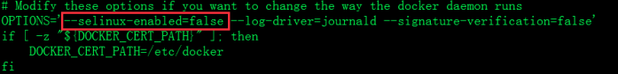

首先安装一个能够连接互联网的centos7.2的虚拟机，然后使用如下命令下载rpm安装包及依赖包：

```bash
yum install --downloadonly --downloaddir=/tmp/docker docker
```

注意：/tmp/docker目录必须提前创建，否则下载的安装包找不到 

 

将所有rpm包上传到服务器，使用createrepo创建yum源

然后使用yum install docker安装


环境：centos7

命令：systemctl start docker

​          systemctl status docker -l

报错：Error starting daemon: SELinux is not supported with the overlay2 graph driver on this kernel. Either boot into a newer kernel or disable selinux in docker (--selinux-enabled=false)

解决方案：

意思是说：此linux的内核中的SELinux不支持 overlay2 graph driver ，解决方法有两个，要么启动一个新内核，要么就在docker里禁用selinux，--selinux-enabled=false

重新编辑docker配置文件：

vi /etc/sysconfig/docker


改为：



然后systemctl start docker 就好啦

 

```bash
[root@vbdstest05 ~]# umount /var/lib/docker/containers

[root@vbdstest05 ~]# umount /var/lib/docker/overlay2
```

 