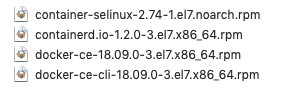

<https://docs.docker.com/install/linux/docker-ce/centos/>

**Install from a package**

**从软件包中安装**

If you cannot use Docker’s repository to install Docker, you can download the .rpm file for your release and install it manually. You need to download a new file each time you want to upgrade Docker CE.

如果不能使用 Docker 的存储库安装 Docker，可以下载。 Rpm 文件，然后手动安装。 每次升级 dockerce 时都需要下载一个新文件。

1. Go to <https://download.docker.com/linux/centos/7/x86_64/stable/Packages/> and download the .rpm file for the Docker version you want      to install.
              访问 https: / / download.docker. com / linux / centos / 7 / x8664 /      stable / packages / 并下载。 你想安装的 Docker 版本的 rpm 文件。
              **Note: To install      a nightly or test (pre-release) package, change the      word** **stable** **in the above URL to** **nightly** **or** **test****.** [**Learn      about nightly and test channels**](https://docs.docker.com/install/)**.**           

   ​	注意:      要安装一个夜间或测试(预发布)包，请将上面 URL 中的 stable 更改为 nightly 或 test。 了解夜间和测试频道。

2. Install      Docker CE, changing the path below to the path where you downloaded the      Docker package.
              安装 dockerce，将下面的路径更改为下载 dockerpackage 的路径。
              $ sudo yum install /path/to/package.rpm

 Docker is installed but not started. The docker group is created, but no users are added to the group.
 已安装但未启动 Docker。 创建了 docker 组，但是没有向该组添加任何用户。

1. Start Docker.
              启动 Docker。
              $ sudo systemctl start docker
2. Verify      that Docker CE is installed correctly by running the hello-world image.
              通过运行 hello-world 映像来验证 dockerce 是否安装正确。
              $ sudo docker run hello-world
              
              This command downloads a test image and runs it in a      container. When the container runs, it prints an informational message and      exits.
              此命令下载测试映像并在容器中运行它。 当容器运行时，它打印一条信息消息并退出。

Docker CE is installed and running. You need to use sudo to run Docker commands. Continue to [Post-installation steps for Linux](https://docs.docker.com/install/linux/linux-postinstall/) to allow non-privileged users to run Docker commands and for other optional configuration steps.

已安装并运行 dockerce。 您需要使用 sudo 来运行 Docker 命令。 继续 Linux 的安装后步骤，以允许非特权用户运行 Docker 命令和其他可选配置步骤。

**UPGRADE DOCKER CE**

**升级 DOCKER CE**

To upgrade Docker CE, download the newer package file and repeat the [installation procedure](https://docs.docker.com/install/linux/docker-ce/centos/#install-from-a-package), using yum -y upgrade instead of yum -y install, and pointing to the new file.

要升级 Docker CE，请下载较新的包文件并重复安装过程，使用 yum -y upgrade代替 yum -y install，并指向新文件。

**Install using the convenience script**

**使用方便的脚本进行安装**

Docker provides convenience scripts at [get.docker.com](https://get.docker.com/) and [test.docker.com](https://test.docker.com/) for installing edge and testing versions of Docker CE into development environments quickly and non-interactively. The source code for the scripts is in the [docker-install repository](https://github.com/docker/docker-install). **Using these scripts is not recommended for production environments**, and you should understand the potential risks before you use them:

Docker 在 get.Docker. com 和 test.Docker. com 上提供了便利的脚本，用于快速和非交互式地安装和测试 Docker CE 的边缘版本。 脚本的源代码在 docker-install 存储库中。 不建议在生产环境中使用这些脚本，在使用它们之前，您应该了解潜在的风险:

- The scripts require 这些脚本需要root or 或sudo privileges to run. Therefore, you should carefully examine      and audit the scripts before running them. 可以运行的特权。      因此，在运行脚本之前，应该仔细检查和审核脚本
- The      scripts attempt to detect your Linux distribution and version and      configure your package management system for you. In addition, the scripts      do not allow you to customize any installation parameters. This may lead      to an unsupported configuration, either from Docker’s point of view or      from your own organization’s guidelines and standards. 这些脚本试图检测您的      Linux 发行版和版本，并为您配置包管理系统。 此外，脚本不允许您自定义任何安装参数。 这可能导致不支持的配置，无论是从 Docker      的角度还是从您自己组织的指导方针和标准来看
- The      scripts install all dependencies and recommendations of the package      manager without asking for confirmation. This may install a large number      of packages, depending on the current configuration of your host      machine. 这些脚本安装包管理器的所有依赖项和推荐，而不需要确认。 这可能会根据主机的当前配置安装大量的包
- The      script does not provide options to specify which version of Docker to      install, and installs the latest version that is released in the “edge”      channel. 该脚本没有提供选项来指定安装哪个版本的 Docker，并安装在"edge"通道中发布的最新版本
- Do not      use the convenience script if Docker has already been installed on the      host machine using another mechanism. 如果已经使用其他机制在主机上安装了      Docker，则不要使用方便脚本

This example uses the script at [get.docker.com](https://get.docker.com/) to install the latest release of Docker CE on Linux. To install the latest testing version, use [test.docker.com](https://test.docker.com/) instead. In each of the commands below, replace each occurrence of get with test.

这个示例使用 get.Docker. com 上的脚本在 Linux 上安装 Docker CE 的最新版本。 要安装最新的测试版本，请使用 test.docker. com。 在下面的每个命令中，用 test 替换 get 的每次出现。

**Warning**:

警告:

Always examine scripts downloaded from the internet before running them locally.

在本地运行脚本之前，始终检查从互联网上下载的脚本。

$ curl -fsSL <https://get.docker.com> -o get-docker.sh
 $ sudo sh get-docker.sh

<output truncated>

If you would like to use Docker as a non-root user, you should now consider adding your user to the “docker” group with something like:

如果您希望使用 Docker 作为非根用户，您现在应该考虑将您的用户添加到"Docker"组，如下所示:

  sudo usermod -aG docker your-user

Remember to log out and back in for this to take effect!

请记得退出并重新登录，这样才能生效！

**Warning**:

警告:

Adding a user to the “docker” group grants them the ability to run containers which can be used to obtain root privileges on the Docker host. Refer to [Docker Daemon Attack Surface](https://docs.docker.com/engine/security/security/#docker-daemon-attack-surface) for more information.

将用户添加到"Docker"组使他们能够运行容器，这些容器可用于获得 Docker 主机上的根特权。 有关更多信息，请参考 Docker 守护进程攻击面。

Docker CE is installed. It starts automatically on DEB-based distributions. On RPM-based distributions, you need to start it manually using the appropriate systemctl or service command. As the message indicates, non-root users can’t run Docker commands by default.

安装了 dockerce。 它自动从基于 deb 的发行版开始。 在基于 rpm 的发行版上，您需要使用适当的 systemctl 或 service 命令手动启动它。 如消息所示，非 root 用户默认情况下不能运行 Docker 命令。

**UPGRADE DOCKER AFTER USING THE CONVENIENCE SCRIPT**

**使用方便脚本升级 DOCKER**

If you installed Docker using the convenience script, you should upgrade Docker using your package manager directly. There is no advantage to re-running the convenience script, and it can cause issues if it attempts to re-add repositories which have already been added to the host machine.

如果您使用方便的脚本安装了 Docker，那么您应该直接使用包管理器升级 Docker。 重新运行方便脚本没有任何好处，而且如果它试图重新添加已经添加到主机上的存储库，可能会导致问题。

**Uninstall Docker CE**

**卸载 Docker CE**

1. Uninstall the Docker package:
              卸载 Docker 包:
              $ sudo yum remove docker-ce
2. Images,      containers, volumes, or customized configuration files on your host are      not automatically removed. To delete all images, containers, and      volumes:
              不会自动删除主机上的映像、容器、卷或自定义配置文件。 删除所有图像、容器和卷:
              $ sudo rm -rf /var/lib/docker

You must delete any edited configuration files manually.

您必须手动删除任何已编辑的配置文件。