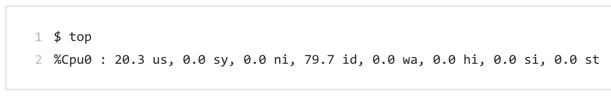
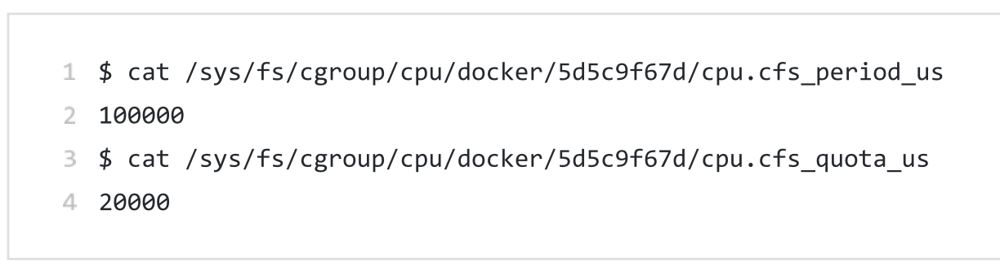

### 已经通过namespace进行了进程隔离，为什么还需要限制：

虽然容器内的第1号进程在“障眼法”的干扰下只能看到容器里的情况，但是宿主机上，它作为第100号进程与其他所有进程之间依然是平等的竞争关系。这就意味着，虽然第100号进程表面上被隔离了起来，但是它所能够使用到的资源(比如CPU、内存)，却是可以随时被宿主机上的其他进程(或者其他容器)占用的。当然，这个100号进程自己也可能把所有资源吃光。这些情况，显然都不是一个“沙盒”应该表现出来的合理行为。

**一句话：与其他进程资源竞争**

### 资源限制的方法：

Linux Cgroups的全称是Linux Control Group。它最主要的作用，就是限制一个进程组能够使用的资源上限，包括CPU、内存、磁盘、网络带宽等等。此外, Cgroups 还能够对进程进行优先级设置、审计，以及将进程挂起和恢复等操作。在今天的分享中，我只和你重点探讨它与容器关系最紧密的"限制” 能力，并通过一组实践来带你认识一下Cgroups。
在Linux中, Cgroups给用户暴露出来的操作接口是文件系统，即它以文件和目录的方式组织在操作系统的/sys/fs/cgroup路径下。在Ubuntu 16.04 机器里,我可以用mount指令把它们展示出来，这条命令是:

```sh
$ mount -t cgroup
cpuset on /sys/fs/cgroup/cpuset type cgroup (rw, nosuid, nodev , noexec, relatime, cpuset)
cpu on /sys/fs/cgroup/cpu type cgroup (rw, nosuid, nodev , noexec , relat ime, cpu)
cpuacct on /sys/fs/cgroup/cpuacct type cgroup (rw, nosuid, nodev, noexec, relatime, cpuacct)
blkio on /sys/fs/cgroup/blkio type cgroup (rw, nosuid, nodev , noexec , relatime , blkio)
memory on /sys/fs/ cgroup/memory type cgroup (rw, nosuid, nodev, noexec, relatime , memory)
```

它的输出结果，是一系列文件系统目录。如果你在自己的机器上没有看到这些目录,那你就需要自己去挂载Cgroups,具体做法可以自行Google。
可以看到，在/sys/fs/cgroup下面有很多诸如cpuset、cpu、memory 这样的子目录，也叫子系统。这些都是我这台机器当前可以被Cgroups进行限制的资源种类。而在子系统对应的资源种类下，你就可以看到该类资源具体可以被限制的方法。比如，对CPU子系统来说，我们可以看到如下几个配置文件：

```sh
ls /sys/fs/cgroup/cpu
cgroup.clone_children  cpuacct.stat          cpuacct.usage_percpu_sys   cpu.cfs_period_us  
cgroup.procs           cpuacct.usage         cpuacct.usage_percpu_user  cpu.cfs_quota_us             tasks
cgroup.sane_behavior   cpuacct.usage_all     cpuacct.usage_sys          cpu.shares         
cpuacct.usage_percpu  cpuacct.usage_user         cpu.stat     
```

如果熟悉Linux CPU管理的话,你就会在它的输出里注意到cfs_period 和cfs_quota 这样的关键词。这两个参数需要组合使用，可以用来限制进程在长度为cfs_period 的一段时间内，只能被分配到总量为cfs_quota的CPU时间。

### 限制的进程的CPU时间实例演示：

你需要在对应的子系统下面创建一个目录，比如，我们现在进入/sys/fs/cgroup/cpu目录下:

```sh
root@ubuntu:/sys/fs/cgroup/cpu$ mkdir container
root@ubuntu:/sys/fs/cgroup/cpu$ ls container/
cgroup.clone_children cpu.cfs_period_us cpu.rt_period_us cpu.shares notify_on_release
cgroup.procs cpu.cfs_quota_us cpu.rt_runtime_us cpu.stat tasks
```

这个目录就称为一个”控制组”。你会发现，操作系统会在你新创建的container目录下，自动生成该子系统对应的资源限制文件。
现在，我们在后台执行这样一条脚本:

```sh
$while : ; do : ; done &
[1] 226
```

显然，它执行了一个死循环，可以把计算机的CPU吃到100%，根据它的输出，我们可以看到进程号是226.

用top命令确认一下CPU有没有打满：


可以看到CPU已经100%了。

而此时，查看Container目录下的文件，看到CPU quota还没有任何限制（即-1），CPU period则是默认的100ms（100000us）：


接下来，我们通过修改这些文件来设置限制。

比如，向Container组里的cfs_quota文件写入20ms（20000us）：

```sh
$ echo 20000 > /sys/fs/cgroup/cpu/container/cpu.cfs_quota_us
```

这意味着在每100ms的CPU时间里，被该控制组限制的进程只能使用20ms的CPU时间，也就说这个进程只能使用到20%的CPU带宽。

接下来，我们把要限制的进程的PID写入tasks文件，上面的设置就会到该进程生效了：

```sh
$ echo 226 > /sys/fs/cgroup/cpu/container/tasks
```

我们可以用top命令查看一下：



可以看到CPU使用率立刻降到了20%。

### 其他资源限制功能：

除CPU子系统外，Cgroups 的每一项子系统都有其独有的资源限制能力，比如:
●blkio, 为块设备设定I/O限制，一般用于磁盘等设备;
●cpuset, 为进程分配单独的CPU核和对应的内存节点;
●memory,为进程设定内存使用的限制。

### docker是如何使用Cgroup的：

对于Docker等Linux容器项目来说，它们只需要在每个子系统下面，为每个容器创建一个控制组 (即创建一个新目录)，然后在启动容器进程之后，把这个进程的PID填写到对应控制组的tasks文件中就可以了。

而至于在这些控制组下面的资源文件里填上什么值，就靠用户执行docker run时的参数指定了，比如这样一条命令 : 

```sh
$ docker run -it --cpu-period=100000 --cpu-quota=20000 ubuntu /bin/bash
```

在启动这个容器后，我们可以通过查看Cgroups文件系统下，CPU子系统中，"docker" 这个控制组里的咨源限制文件的内容来确认.



