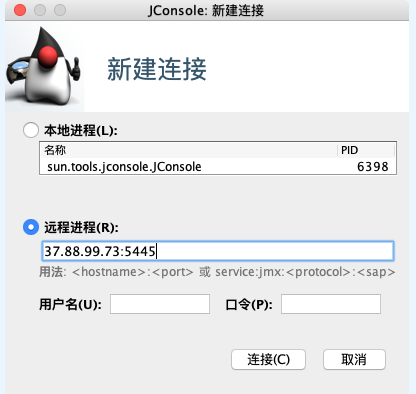
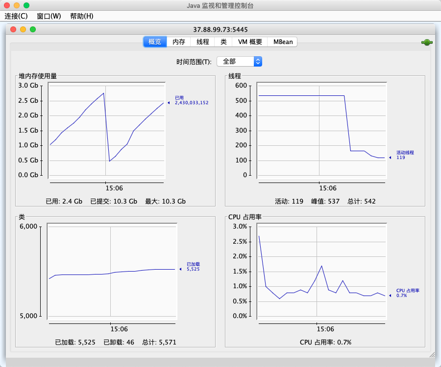

## 修改Flume-env并重启agent

```sh
export JAVA_OPTS="-Xms1024m 
			-Xmx2048m 
			-Dcom.sun.management.jmxremote 
      -Dcom.sun.management.jmxremote.authenticate=false 
      -Dcom.sun.management.jmxremote.ssl=false
      -Dcom.sun.management.jmxremote.port=5445
		  -Dflume.monitoring.type=http 
      -Dflume.monitoring.port=34545"
```

## 使用jconsole监控进程

在本机启动jconsole：

```sh
$ jconsole
```

配置被监控的进程：



观察监控界面：

