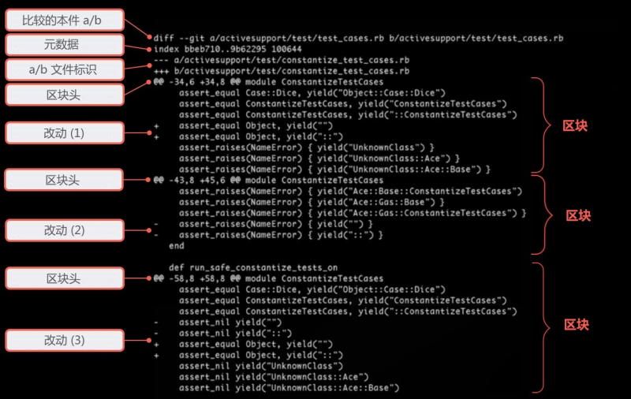

- ### 用 diff 来检查改动

- 项目的开发是由无数个微小的改动组成的。了解项目开发过程的关键就是要搞清楚每一个改动。

- 当然你可以使用 “git status”  命令或更简单的 “git log”  命令来打印出项目的状态和历史记录，但是这些命令仅仅只能为你提供一个非常简单的信息概要，想要显示一个详细的修改信息就必须使用另外一个命令。

- ### 读懂 Diffs

- 在版本控制系统中用来显示两个版本之间差别的操作我们称之为  “diff”，或者 “patch”。现在就让我们来详细地学习一下这个操作吧！首先要学习如何读懂 diff 信息。

- 

- **比较文件 a/b**

- 这个 diff  操作会对两个对象进行相互比较。比如对象 A 和对象 B 。在大多数情况下 A 和 B 会是项目中的同一个文件，但它们是基于不同的版本。当然 diff  操作也可以比较两个完全没有关联的文件，并显示出它们之间的差别，但是这种操作并不会被经常使用到。

- 为了清楚地显示比较信息， diff  操作总是会把要比较的文件定义成 “A” 和 “B”。

- **文件的元数据 （Metadata）**

- 这所说的文件元数据是非常技术性的，在实践中你可能永远不需要搞明白它。最开始的两串数字表示两个文件的  hashes（简单点说就是它们的 “ID”）。不仅仅是整个项目，Git 还会把每一个文件当作对象来保存。这个 hash ID  就代表了一个文件对象的特定版本。最后的一串数字代表了一个文件的模式（100644 代表它是一个普通的文件，100755 表示一个可执行文件，120000  仅仅是一符号链接）。

- **标记 a/b**

- 继续向下观察这些输出信息，A 与 B  的真正差别会被显示在这里。为了区分它们，A 和 B 都被赋予了它们特有的符号：对于版本 A，它的符号是一个减号（“-”）；而对于版本 B  ，它会使用一个加号（“+”）。

- **区块（Chunk）**

- diff  操作不会显示完整的文件内容。如果两个版本仅仅存在两行代码的差别，你也不会想要去逐行地审视这个拥有上万行代码的文件吧。因此，Git  在这里只会标记出那些实际上修改的部分，在这里一段连续的改动被称之为区块（chunk 或者 hunk）。除了包括实际更改的代码行，一个区块还包括一个特定的  “上下文环境”，例如那些改变之前和之后的差别，能让你更容易地明白在特定的上下文环境中这个改变的具体含义。

- **区块标头（Chunk Header）**

- 每个这样的区块都有一个标头，它被显示在两个  “@@” 符号中。在这里 Git 会告诉你哪些行存在差异。在我们的例子里这些行被标记成为第一个改动区块：

- - 来自文件 A （标记为 “-”），从第34行开始之后的6行代码。
  - 来自文件 B （标记为 “+”），从第34行开始之后的8行代码。

- 在那个 “@@”  结束符号之后的信息是用来表明上下文环境的，例如 Git 会尝试着为这个区块赋予一个方法名称或是其他的上下文信息。然而 Git  不能支持所有的文件内容，这很大程度上都要取决于项目所使用的开发语言。

- **改动**

- 在每一个被改动过的代码行之前都会前置一个 “+”  或是 “-” 符号。就像前面所讲到的，这些符号可以帮助你准确了解版本 A 和 版本 B 。例如前置了 “-” 符号的行就代表来自版本 A，反之带有符号  “+” 的行就代表来自于版本 B。

- 大多数情况下，在 Git 中都使用 A 和 B  这样的方式，你可以认为 A/- 代表老的内容，而 B/+ 代表新的内容。

- 现在就让我们来看一下我们的例子：

- - 改动 #1 包括两行 “+” ，而在相对应的版本 A       中却不存在这些行（没有任何被前置 “-” 的行），这就表示这两行是新被添加的。
  - 改动 #2 则恰恰相反。在版本 A 中，可以看到有两行被前置上了符号       “-”。然而版本 B 却不存在对应的行（没有 “+” 行），这就表明这两行被删除了。
  - 在改动 #3 中，这些代码行发生了一些改动，前置上符号 “-”       的两行被修改了，新的改动就是在它的下面被标记了符号 “+” 的内容。

- 现在我们知道了如何读懂 diff  的输出信息了，来做一些练习吧！

- ### 检查本地改动

- 在之前的章节里，我们经常会使用 “git  status” 命令来查看在本地副本（working copy）中有哪些文件被改动了。如果要想清楚地了解这些改动的细节，我们就必须使用 “ git  diff” 命令：

- $ git diff
     diff --git a/about.html b/about.html
     index d09ab79..0c20c33 100644
     --- a/about.html
     +++ b/about.html
     @@ -19,7 +19,7 @@
        

- 在不带任何参数的情况下，“git diff”  会为我们给所有在本地副本中还未被打包（unstaged）的变化做个比较，并显示出来。

- 如果你仅仅是想要查看那些对于已被打包的改动的比较结果，你可以选择使用  “git diff --staged” 命令。

- ### 检查暂存区和版本库

- Git diff --cached

- ### 检查已提交的改动

- 你已经学习过了 “git log”  命令，它会打印出那些最新提交的概要。但是它仅仅显示一些最基础的信息（hash，作者，时间，注释）。如果你想要查看那些改动的细节，你就可以加上 “-p”  参数来得到一个更详细的修改信息。

- ### 比较分支和版本

- 最后，你可能想要知道如何比较两个分支，或是两个特定项目版本。来让我们看看在  “contact-form” 分支的哪些改动并不存在于 “master” 上：

- $ git diff master..contact-form

- 相反，这些比较信息仅仅是在分支层面上的，你也可以比较任意的两个项目版本之间的内容：

- $ git diff 0023cdd..fcd6199