## HDFS 异构存储实战

[Hadoop技术博文](javascript:void(0);) *2018-12-24*

Hadoop 从 2.4 后开始支持异构存储，异构存储是为了解决爆炸式的存储容量增长以及计算能力增长所带来的数据存储需求，一份热数据经历相关计算产生出新的数据，那么原始的热数据有可能变为冷数据，随着数据不断增长差异化存储变的非常迫切，需要经常被计算或者读取的热数据为了保证性能需要存储在高速存储设备上，当一些数据变为冷数据后不经常会用到的数据会变为归档数据，可以使用大容量性能要差一些的存储设备来存储来减少存储成本，HDFS 可以按照一定的规则来存储这些数据，具体架构如下：

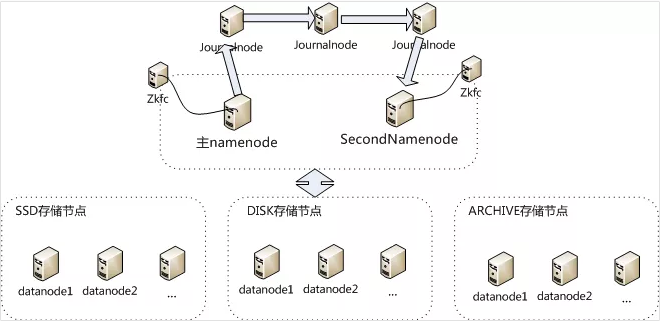

## 存储类型&存储策略

### 存储类型

- RAM_DISK ：内存镜像文件系统
- SSD：SSD 盘
- DSIK： 普通磁盘
- ARCHIVE ：归档

### 存储策略

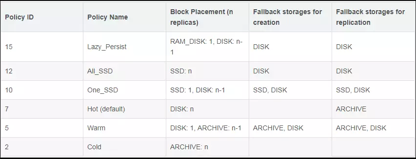

存储策略名称分别从 Lazy_Persist 到 Clod，分别代表了设备的访问速度从快到慢，访问速度最快的为内存文件系统，其次是 SSD，再是普通盘，最后是归档性存储，我们可以利用上面的策略来控制数据的分布以达到降低成本的目的。

**creationFallbacks**

对于第一个创建的 block 块的 fallback 情况时的可选存储类型

**replicationFallbacks**

对于的 block 块的其余副本的 fallback 情况时的可选存储类型，这里出现了 fallback 的情况,什么叫做 fallback 的情况呢，当前存储类型不可用的时候,退一级所选择使用的存储类型

## 测试环境验证

### 环境信息准备

- 数据拷贝数 2
- datanode 节点信息

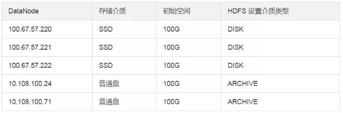

初始集群只有 220、221、222 三个存储节点，默认的存储类型没有设置即为 DISK 类型（实际盘是 SSD）,24 和 71 节点为新扩节点实际磁盘为机械盘在 hdfs 里设置的存储类型为 ARCHIVE

**初始文件信息**

bin/hadoop fs -ls / |awk '{print $8}'|xargs bin/hadoop fs -du -s -h

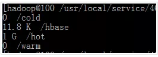

在 HDFS 默认策略下有一个 hot 目录下面有 1G 的文件

**初始块分布**

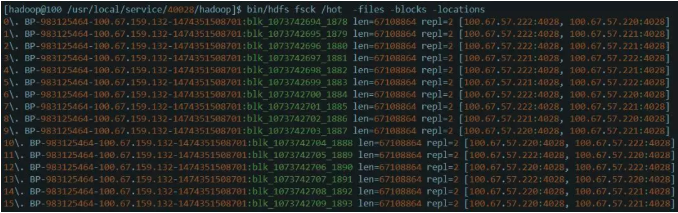

可以确认 16 个块均匀的分布在 220 到 222 三个存储节点上

**设置不同的目录不同的策略**

hot 目录是默认策略不用修改

**设置 warm 目录策略为 warm**

[hadoop@100 /usr/local/service/40028/hadoop]$ bin/hdfs dfsadmin -setStoragePolicy /warm Warm

Set storage policy Warm on /warm

**设置 cold 目录策略为 clod**

[hadoop@100 /usr/local/service/40028/hadoop]$ bin/hdfs dfsadmin -setStoragePolicy /cold Cold

Set storage policy Cold on /cold

此时在集群还未加入存储类型为 ARCHIVE 类型的几点的时候如果向/cold 目录写入数据会抛出异常

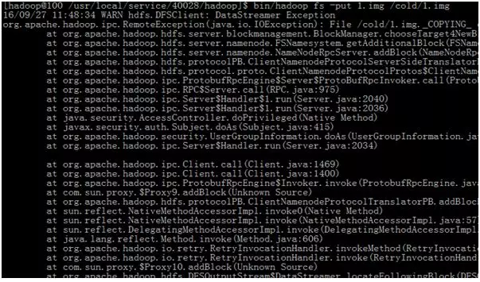

### 数据降冷 Hot 到 Warm

#### 查看 Warm 目录的存储策略

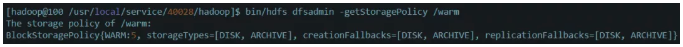

#### 移动数据到 warm 目录

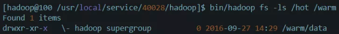

#### 执行 mover

```
[hadoop@100 /usr/local/service/40028/hadoop]$ bin/hdfs mover /warm  /hot
16/09/28 10:24:20 INFO mover.Mover: namenodes = {hdfs://HDFS40028=null}
16/09/28 10:24:21 INFO net.NetworkTopology: Adding a new node: /default-rack/100.67.57.220:4028
16/09/28 10:24:21 INFO net.NetworkTopology: Adding a new node: /default-rack/100.67.57.222:4028
16/09/28 10:24:21 INFO net.NetworkTopology: Adding a new node: /default-rack/10.108.100.24:4000
16/09/28 10:24:21 INFO net.NetworkTopology: Adding a new node: /default-rack/100.67.57.221:4028
16/09/28 10:24:21 INFO net.NetworkTopology: Adding a new node: /default-rack/10.108.100.71:4000
16/09/28 10:24:46 INFO balancer.Dispatcher: Successfully moved blk_1073742694_1878 with size=67108864 from 100.67.57.220:4028:DISK to 10.108.100.24:4000:ARCHIVE through 100.67.57.220:4028
16/09/28 10:24:50 INFO balancer.Dispatcher: Successfully moved blk_1073742703_1887 with size=67108864 from 100.67.57.220:4028:DISK to 10.108.100.71:4000:ARCHIVE through 100.67.57.220:4028
16/09/28 10:24:50 INFO balancer.Dispatcher: Successfully moved blk_1073742702_1886 with size=67108864 from 100.67.57.221:4028:DISK to 10.108.100.71:4000:ARCHIVE through 100.67.57.221:4028
16/09/28 10:24:50 INFO balancer.Dispatcher: Successfully moved blk_1073742700_1884 with size=67108864 from 100.67.57.222:4028:DISK to 10.108.100.71:4000:ARCHIVE through 100.67.57.222:4028
16/09/28 10:24:52 INFO balancer.Dispatcher: Successfully moved blk_1073742697_1881 with size=67108864 from 100.67.57.222:4028:DISK to 10.108.100.24:4000:ARCHIVE through 100.67.57.222:4028
16/09/28 10:24:52 INFO balancer.Dispatcher: Successfully moved blk_1073742701_1885 with size=67108864 from 100.67.57.221:4028:DISK to 10.108.100.71:4000:ARCHIVE through 100.67.57.221:4028
16/09/28 10:24:52 INFO balancer.Dispatcher: Successfully moved blk_1073742698_1882 with size=67108864 from 100.67.57.221:4028:DISK to 10.108.100.24:4000:ARCHIVE through 100.67.57.221:4028
16/09/28 10:24:52 INFO balancer.Dispatcher: Successfully moved blk_1073742696_1880 with size=67108864 from 100.67.57.222:4028:DISK to 10.108.100.24:4000:ARCHIVE through 100.67.57.222:4028
16/09/28 10:24:53 INFO balancer.Dispatcher: Successfully moved blk_1073742695_1879 with size=67108864 from 100.67.57.221:4028:DISK to 10.108.100.24:4000:ARCHIVE through 100.67.57.221:4028
16/09/28 10:24:53 INFO balancer.Dispatcher: Successfully moved blk_1073742699_1883 with size=67108864 from 100.67.57.221:4028:DISK to 10.108.100.71:4000:ARCHIVE through 100.67.57.221:4028
16/09/28 10:25:21 WARN hdfs.DFSClient: Slow ReadProcessor read fields took 60116ms (threshold=30000ms); ack: seqno: 1 status: SUCCESS status: SUCCESS downstreamAckTimeNanos: 146874, targets: [100.67.57.221:4028, 100.67.57.220:4028]
Sep 28, 2016 10:25:29 AM Mover took 1mins, 8sec
```

#### 检查数据块分布

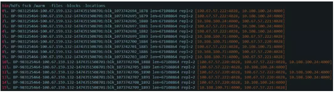

可以看出数据分布已经是一半的块在 ssd，一半的块在普通盘

## 数据降冷 Warm 到 Clod

### 查看 Clod 目录存储策略

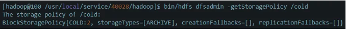

### 移动数据到 cold 目录

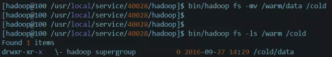

### 执行 mover

bin/hdfs mover /warm /cold

### 检查数据块分布

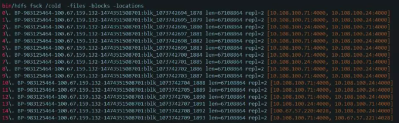

可以看出数据已经完全分布在冷设备上

## 数据生热 cold 到 warm

### 移动数据到 hot 目录

```
bin/hadoop fs -mv /cold/data /warm
```

### 执行 mover

```
bin/hdfs mover
```

### 检查数据块分布

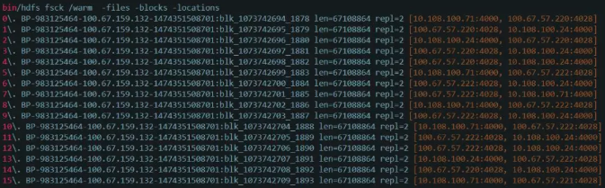

可以看出数据块分布已经是一半在 SSD，一半在普通盘。