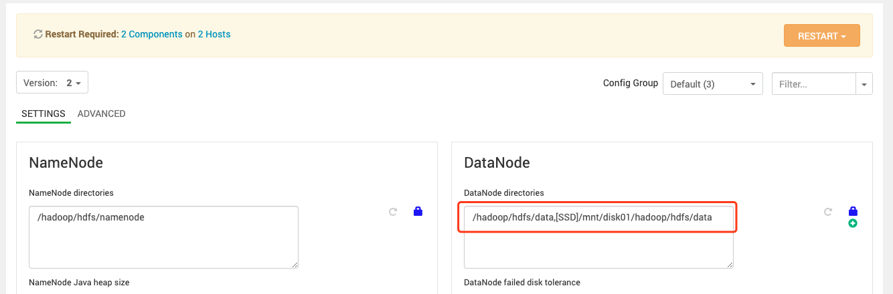

### 存储类型配置

如下所示：为datanode增加SSD硬盘目录，修改配置后重启HDFS服务



### 存储策略配置

1. 创建HDFS目录

```shell
[hdfs@ssd01 ~]$ hdfs dfs -mkdir -p /tmp/2019-04-30
```

2. 列出所有可用的存储策略

```shell
[hdfs@ssd01 ~]$ hdfs storagepolicies -listPolicies
Block Storage Policies:
        BlockStoragePolicy{PROVIDED:1, storageTypes=[PROVIDED, DISK], creationFallbacks=[PROVIDED, DISK], replicationFallbacks=[PROVIDED, DISK]}
        BlockStoragePolicy{COLD:2, storageTypes=[ARCHIVE], creationFallbacks=[], replicationFallbacks=[]}
        BlockStoragePolicy{WARM:5, storageTypes=[DISK, ARCHIVE], creationFallbacks=[DISK, ARCHIVE], replicationFallbacks=[DISK, ARCHIVE]}
        BlockStoragePolicy{HOT:7, storageTypes=[DISK], creationFallbacks=[], replicationFallbacks=[ARCHIVE]}
        BlockStoragePolicy{ONE_SSD:10, storageTypes=[SSD, DISK], creationFallbacks=[SSD, DISK], replicationFallbacks=[SSD, DISK]}
        BlockStoragePolicy{ALL_SSD:12, storageTypes=[SSD], creationFallbacks=[DISK], replicationFallbacks=[DISK]}
        BlockStoragePolicy{LAZY_PERSIST:15, storageTypes=[RAM_DISK, DISK], creationFallbacks=[DISK], replicationFallbacks=[DISK]}
```

3. 查看目录当前的存储策略

```shell
[hdfs@ssd01 ~]$ hdfs storagepolicies -getStoragePolicy -path /tmp/2019-04-30
The storage policy of /tmp/2019-04-30 is unspecified
```

4. 设置目录的存储策略为ALL_SSD

```shell
[hdfs@ssd01 ~]$ hdfs storagepolicies -setStoragePolicy -path /tmp/2019-04-30 -policy ALL_SSD
Set storage policy ALL_SSD on /tmp/2019-04-30
```

### 向HDFS上传文件并检查文件存储情况

```shell
[root@ssd01 Tool]# sudo -u hdfs hdfs dfs -copyFromLocal /software/Tool/ambari-2.7.3.0-centos7.tar.gz /tmp/2019-04-30/
[root@ssd01 Tool]# sudo -u hdfs hdfs fsck /tmp/2019-04-30/ -files -blocks -locations
Connecting to namenode via http://ssd01.lan:50070/fsck?ugi=hdfs&files=1&blocks=1&locations=1&path=%2Ftmp%2F2019-04-30
FSCK started by hdfs (auth:SIMPLE) from /10.10.51.36 for path /tmp/2019-04-30 at Tue Apr 30 17:54:48 CST 2019
/tmp/2019-04-30 <dir>
/tmp/2019-04-30/ambari-2.7.3.0-centos7.tar.gz 1947685893 bytes, replicated: replication=3, 15 block(s):  OK
0. BP-787296066-10.10.51.36-1556613788382:blk_1073742033_1216 len=134217728 Live_repl=3  [DatanodeInfoWithStorage[10.10.51.37:50010,DS-e66e26a5-c5dc-4e45-8cef-ea95876b52ee,SSD], DatanodeInfoWithStorage[10.10.51.38:50010,DS-c4655a76-c254-414c-b1c0-5295e1053538,SSD], DatanodeInfoWithStorage[10.10.51.36:50010,DS-ee40c589-035c-4ca6-a28a-84c3bb00481d,SSD]]
1. BP-787296066-10.10.51.36-1556613788382:blk_1073742034_1217 len=134217728 Live_repl=3  [DatanodeInfoWithStorage[10.10.51.38:50010,DS-c4655a76-c254-414c-b1c0-5295e1053538,SSD], DatanodeInfoWithStorage[10.10.51.37:50010,DS-e66e26a5-c5dc-4e45-8cef-ea95876b52ee,SSD], DatanodeInfoWithStorage[10.10.51.36:50010,DS-ee40c589-035c-4ca6-a28a-84c3bb00481d,SSD]]
2. BP-787296066-10.10.51.36-1556613788382:blk_1073742035_1218 len=134217728 Live_repl=3  [DatanodeInfoWithStorage[10.10.51.37:50010,DS-e66e26a5-c5dc-4e45-8cef-ea95876b52ee,SSD], DatanodeInfoWithStorage[10.10.51.38:50010,DS-c4655a76-c254-414c-b1c0-5295e1053538,SSD], DatanodeInfoWithStorage[10.10.51.36:50010,DS-ee40c589-035c-4ca6-a28a-84c3bb00481d,SSD]]
3. BP-787296066-10.10.51.36-1556613788382:blk_1073742036_1219 len=134217728 Live_repl=3  [DatanodeInfoWithStorage[10.10.51.37:50010,DS-e66e26a5-c5dc-4e45-8cef-ea95876b52ee,SSD], DatanodeInfoWithStorage[10.10.51.38:50010,DS-c4655a76-c254-414c-b1c0-5295e1053538,SSD], DatanodeInfoWithStorage[10.10.51.36:50010,DS-ee40c589-035c-4ca6-a28a-84c3bb00481d,SSD]] 
```

可以看到block存储到了SSD类型的硬盘中。

### 检查硬盘占用

```shell
[root@ssd01 Tool]# cexec du -sh /hadoop/hdfs/data/current/
************************* hdp *************************
--------- ssd01.lan---------
392M    /hadoop/hdfs/data/current/
--------- ssd02.lan---------
392M    /hadoop/hdfs/data/current/
--------- ssd03.lan---------
392M    /hadoop/hdfs/data/current/
[root@ssd01 Tool]# cexec du -sh /mnt/disk01/hadoop/hdfs/data/current/
************************* hdp *************************
--------- ssd01.lan---------
1.9G    /mnt/disk01/hadoop/hdfs/data/current/
--------- ssd02.lan---------
1.9G    /mnt/disk01/hadoop/hdfs/data/current/
--------- ssd03.lan---------
1.9G    /mnt/disk01/hadoop/hdfs/data/current/
```

也可以看出确实是占用的SSD硬盘/mnt/disk01的空间。

### 数据降冷（从ALL_SSD降为ONE_SSD）

1. 重新设置目录的存储策略为ONE_SSD

```shell
[root@ssd01 Tool]# sudo -u hdfs hdfs storagepolicies -setStoragePolicy -path /tmp/2019-04-30 -policy ONE_SSD
Set storage policy ONE_SSD on /tmp/2019-04-30
```

2. 执行mover命令进行数据迁移（从SSD迁移两个副本到Disk）

```shell
[root@ssd01 Tool]# sudo -u hdfs hdfs mover -p /tmp/2019-04-30
19/04/30 18:09:09 INFO mover.Mover: namenodes = {hdfs://ssd01.lan:8020=[/tmp/2019-04-30]}
19/04/30 18:09:10 INFO balancer.KeyManager: Block token params received from NN: update interval=10hrs, 0sec, token lifetime=10hrs, 0sec
19/04/30 18:09:10 INFO block.BlockTokenSecretManager: Setting block keys
19/04/30 18:09:10 INFO balancer.KeyManager: Update block keys every 2hrs, 30mins, 0sec
19/04/30 18:09:10 INFO block.BlockTokenSecretManager: Setting block keys
19/04/30 18:09:10 INFO net.NetworkTopology: Adding a new node: /default-rack/10.10.51.38:50010
19/04/30 18:09:10 INFO net.NetworkTopology: Adding a new node: /default-rack/10.10.51.37:50010
19/04/30 18:09:10 INFO net.NetworkTopology: Adding a new node: /default-rack/10.10.51.36:50010
19/04/30 18:09:10 INFO balancer.Dispatcher: Start moving blk_1073742040_1223 with size=134217728 from 10.10.51.38:50010:SSD to 10.10.51.38:50010:DISK through 10.10.51.38:50010
19/04/30 18:09:10 INFO balancer.Dispatcher: Start moving blk_1073742033_1216 with size=134217728 from 10.10.51.36:50010:SSD to 10.10.51.36:50010:DISK through 10.10.51.36:50010
....
....
19/04/30 18:10:13 INFO net.NetworkTopology: Adding a new node: /default-rack/10.10.51.37:50010
19/04/30 18:10:13 INFO net.NetworkTopology: Adding a new node: /default-rack/10.10.51.38:50010
19/04/30 18:10:13 INFO net.NetworkTopology: Adding a new node: /default-rack/10.10.51.36:50010
19/04/30 18:10:13 INFO balancer.Dispatcher: Start moving blk_1073742033_1216 with size=134217728 from 10.10.51.38:50010:SSD to 10.10.51.38:50010:DISK through 10.10.51.38:50010
19/04/30 18:10:13 INFO balancer.Dispatcher: Start moving blk_1073742038_1221 with size=134217728 from 10.10.51.37:50010:SSD to 10.10.51.37:50010:DISK through 10.10.51.37:50010
Mover Successful: all blocks satisfy the specified storage policy. Exiting...
Apr 30, 2019 6:11:36 PM  Mover took 2mins, 27sec
```

3. 再次查看HDFS文件存储情况

   ```shell
   [root@ssd01 Tool]# sudo -u hdfs hdfs fsck /tmp/2019-04-30/ -files -blocks -locations
   Connecting to namenode via http://ssd01.lan:50070/fsck?ugi=hdfs&files=1&blocks=1&locations=1&path=%2Ftmp%2F2019-04-30
   FSCK started by hdfs (auth:SIMPLE) from /10.10.51.36 for path /tmp/2019-04-30 at Tue Apr 30 18:16:58 CST 2019
   /tmp/2019-04-30 <dir>
   /tmp/2019-04-30/ambari-2.7.3.0-centos7.tar.gz 1947685893 bytes, replicated: replication=3, 15 block(s):  OK
   0. BP-787296066-10.10.51.36-1556613788382:blk_1073742033_1216 len=134217728 Live_repl=3  [DatanodeInfoWithStorage[10.10.51.37:50010,DS-e66e26a5-c5dc-4e45-8cef-ea95876b52ee,SSD], DatanodeInfoWithStorage[10.10.51.36:50010,DS-e5d750b5-fae2-47c7-8a42-7c8d3a679bc5,DISK], DatanodeInfoWithStorage[10.10.51.38:50010,DS-783412e4-0f07-44fb-86ee-dae12df9c419,DISK]]
   1. BP-787296066-10.10.51.36-1556613788382:blk_1073742034_1217 len=134217728 Live_repl=3  [DatanodeInfoWithStorage[10.10.51.36:50010,DS-e5d750b5-fae2-47c7-8a42-7c8d3a679bc5,DISK], DatanodeInfoWithStorage[10.10.51.37:50010,DS-e66e26a5-c5dc-4e45-8cef-ea95876b52ee,SSD], DatanodeInfoWithStorage[10.10.51.38:50010,DS-783412e4-0f07-44fb-86ee-dae12df9c419,DISK]]
   2. BP-787296066-10.10.51.36-1556613788382:blk_1073742035_1218 len=134217728 Live_repl=3  [DatanodeInfoWithStorage[10.10.51.36:50010,DS-ee40c589-035c-4ca6-a28a-84c3bb00481d,SSD], DatanodeInfoWithStorage[10.10.51.37:50010,DS-86609939-5863-4862-8635-dad71564e986,DISK], DatanodeInfoWithStorage[10.10.51.38:50010,DS-783412e4-0f07-44fb-86ee-dae12df9c419,DISK]]
   3. BP-787296066-10.10.51.36-1556613788382:blk_1073742036_1219 len=134217728 Live_repl=3  [DatanodeInfoWithStorage[10.10.51.36:50010,DS-ee40c589-035c-4ca6-a28a-84c3bb00481d,SSD], DatanodeInfoWithStorage[10.10.51.37:50010,DS-86609939-5863-4862-8635-dad71564e986,DISK], DatanodeInfoWithStorage[10.10.51.38:50010,DS-783412e4-0f07-44fb-86ee-dae12df9c419,DISK]]
   ```

   可以看到每个block，有一个副本在SSD中，两个在Disk中。

4. 再次检查硬盘空间占用情况

   ```shell
   [root@ssd01 Tool]# cexec du -sh /hadoop/hdfs/data/current/                                                  
   ************************* hdp *************************
   --------- ssd01.lan---------
   1.5G    /hadoop/hdfs/data/current/
   --------- ssd02.lan---------
   1.4G    /hadoop/hdfs/data/current/
   --------- ssd03.lan---------
   2.0G    /hadoop/hdfs/data/current/
   [root@ssd01 Tool]# cexec du -sh /mnt/disk01/hadoop/hdfs/data/current/                                       
   ************************* hdp *************************
   --------- ssd01.lan---------
   775M    /mnt/disk01/hadoop/hdfs/data/current/
   --------- ssd02.lan---------
   841M    /mnt/disk01/hadoop/hdfs/data/current/
   --------- ssd03.lan---------
   259M    /mnt/disk01/hadoop/hdfs/data/current/
   ```

   可以看到三分之二的数据占用了Disk目录，三分之一占用了SSD硬盘。

### 继续降冷（从ONE_SSD到HOT）

1. 重新设置目录的存储策略为HOT

```shell
[root@ssd01 Tool]# sudo -u hdfs hdfs storagepolicies -setStoragePolicy -path /tmp/2019-04-30 -policy HOT
Set storage policy HOT on /tmp/2019-04-30
```

2. 执行mover命令进行数据迁移

```shell
[root@ssd01 Tool]# sudo -u hdfs hdfs mover -p /tmp/2019-04-30
19/04/30 18:26:44 INFO mover.Mover: namenodes = {hdfs://ssd01.lan:8020=[/tmp/2019-04-30]}
19/04/30 18:26:45 INFO balancer.KeyManager: Block token params received from NN: update interval=10hrs, 0sec, token lifetime=10hrs, 0sec
19/04/30 18:26:45 INFO block.BlockTokenSecretManager: Setting block keys
19/04/30 18:26:45 INFO balancer.KeyManager: Update block keys every 2hrs, 30mins, 0sec
19/04/30 18:26:45 INFO block.BlockTokenSecretManager: Setting block keys
19/04/30 18:26:45 INFO net.NetworkTopology: Adding a new node: /default-rack/10.10.51.37:50010
19/04/30 18:26:45 INFO net.NetworkTopology: Adding a new node: /default-rack/10.10.51.38:50010
19/04/30 18:26:45 INFO net.NetworkTopology: Adding a new node: /default-rack/10.10.51.36:50010
19/04/30 18:26:45 INFO balancer.Dispatcher: Start moving blk_1073742033_1216 with size=134217728 from 10.10.51.37:50010:SSD to 10.10.51.37:50010:DISK through 10.10.51.37:50010
......
......
19/04/30 18:27:50 INFO balancer.Dispatcher: Start moving blk_1073742047_1230 with size=68637701 from 10.10.51.37:50010:SSD to 10.10.51.37:50010:DISK through 10.10.51.37:50010
19/04/30 18:27:53 INFO balancer.Dispatcher: Successfully moved blk_1073742047_1230 with size=68637701 from 10.10.51.37:50010:SSD to 10.10.51.37:50010:DISK through 10.10.51.37:50010
Mover Successful: all blocks satisfy the specified storage policy. Exiting...
Apr 30, 2019 6:28:02 PM  Mover took 1mins, 18sec
```

可以看到数据从SSD迁移到了Disk。

3. 检查HDFS存储情况

```shell
[root@ssd01 Tool]# sudo -u hdfs hdfs fsck /tmp/2019-04-30/ -files -blocks -locations                    
Connecting to namenode via http://ssd01.lan:50070/fsck?ugi=hdfs&files=1&blocks=1&locations=1&path=%2Ftmp%2F2019-04-30
FSCK started by hdfs (auth:SIMPLE) from /10.10.51.36 for path /tmp/2019-04-30 at Tue Apr 30 18:30:09 CST 2019
/tmp/2019-04-30 <dir>
/tmp/2019-04-30/ambari-2.7.3.0-centos7.tar.gz 1947685893 bytes, replicated: replication=3, 15 block(s):  OK
0. BP-787296066-10.10.51.36-1556613788382:blk_1073742033_1216 len=134217728 Live_repl=3  [DatanodeInfoWithStorage[10.10.51.38:50010,DS-783412e4-0f07-44fb-86ee-dae12df9c419,DISK], DatanodeInfoWithStorage[10.10.51.36:50010,DS-e5d750b5-fae2-47c7-8a42-7c8d3a679bc5,DISK], DatanodeInfoWithStorage[10.10.51.37:50010,DS-86609939-5863-4862-8635-dad71564e986,DISK]]
1. BP-787296066-10.10.51.36-1556613788382:blk_1073742034_1217 len=134217728 Live_repl=3  [DatanodeInfoWithStorage[10.10.51.36:50010,DS-e5d750b5-fae2-47c7-8a42-7c8d3a679bc5,DISK], DatanodeInfoWithStorage[10.10.51.38:50010,DS-783412e4-0f07-44fb-86ee-dae12df9c419,DISK], DatanodeInfoWithStorage[10.10.51.37:50010,DS-86609939-5863-4862-8635-dad71564e986,DISK]]
2. BP-787296066-10.10.51.36-1556613788382:blk_1073742035_1218 len=134217728 Live_repl=3  [DatanodeInfoWithStorage[10.10.51.38:50010,DS-783412e4-0f07-44fb-86ee-dae12df9c419,DISK], DatanodeInfoWithStorage[10.10.51.37:50010,DS-86609939-5863-4862-8635-dad71564e986,DISK], DatanodeInfoWithStorage[10.10.51.36:50010,DS-e5d750b5-fae2-47c7-8a42-7c8d3a679bc5,DISK]]
```

 可以看到所有的block都存储在了Disk类型的硬盘中。

4. 检查硬盘空间占用情况

```shell
[root@ssd01 Tool]# cexec du -sh /hadoop/hdfs/data/current/                                              
************************* hdp *************************
--------- ssd01.lan---------
2.3G    /hadoop/hdfs/data/current/
--------- ssd02.lan---------
2.3G    /hadoop/hdfs/data/current/
--------- ssd03.lan---------
2.3G    /hadoop/hdfs/data/current/
[root@ssd01 Tool]# cexec du -sh /mnt/disk01/hadoop/hdfs/data/current/                                   
************************* hdp *************************
--------- ssd01.lan---------
12K     /mnt/disk01/hadoop/hdfs/data/current/
--------- ssd02.lan---------
12K     /mnt/disk01/hadoop/hdfs/data/current/
--------- ssd03.lan---------
12K     /mnt/disk01/hadoop/hdfs/data/current/
```

可以看到全部占用Disk硬盘，SSD硬盘没有空间占用。