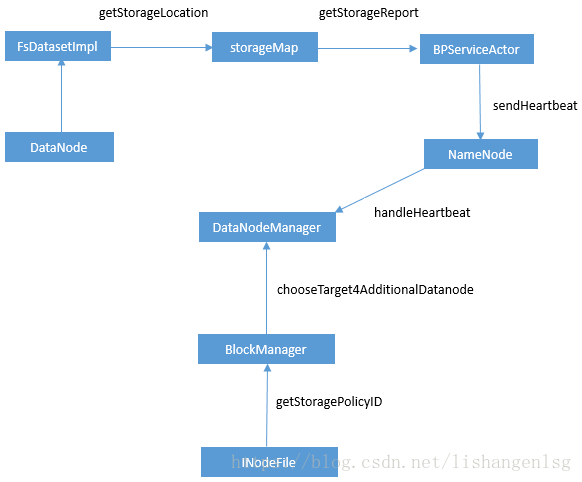

## HDFS异构存储机制研究

三、HDFS异构存储的原理

1. DataNode通过心跳汇报自身数据存储目录的StorageType给NameNode（数据存储目录的解析/心跳汇报过程）
2. 随后NameNode进行汇总并更新集群内各个节点的存储类型情况
3. 待存储文件根据自身设定的存储策略信息向NameNode请求拥有此类型存储介质的DataNode作为候选节点

四、HDFS异构存储流程
HDFS异构存储过程调用的流程图


1、数据存储目录解析流程

- FsDatasetImpl类的构造方法FsDatasetImpl(DataNode, DataStorage,Configuration)实现数据目录解析的功能，该方法调用DataNode类的getStorageLocation方法实现此功能
- DataNode类的getStorageLocation方法中调用StorageLocation类的parse方法
- StorageLocation类的parse方法采用正则匹配的方式将数据存储目录对应的字符串解析成StorageLocation对象
- FsDatasetImpl类的addVolume方法将数据存储目录标识符和数据存储目录对应的DataNodeStorage实例加入storageMap

org.apache.hadoop.hdfs.server.datanode.fsdataset.impl下FsDatasetImpl类的构造方法——实现数据目录解析的功能

```java
FsDatasetImpl(DataNode datanode, DataStorage storage, Configuration conf
      ) throws IOException {
	......
    String[] dataDirs = conf.getTrimmedStrings(DFSConfigKeys.DFS_DATANODE_DATA_DIR_KEY);
    Collection<StorageLocation> dataLocations = DataNode.getStorageLocations(conf);
    List<VolumeFailureInfo> volumeFailureInfos = getInitialVolumeFailureInfos(
        dataLocations, storage);
     ......
    storageMap = new ConcurrentHashMap<String, DatanodeStorage>();
    volumeMap = new ReplicaMap(this);
    ramDiskReplicaTracker = RamDiskReplicaTracker.getInstance(conf, this);
	......
    for (int idx = 0; idx < storage.getNumStorageDirs(); idx++) {
      addVolume(dataLocations, storage.getStorageDir(idx));
    }
  }
```

org.apache.hadoop.hdfs.server.datanode下DataNode类中的getStorageLocations方法——调用StorageLocation类的parse方法

```java
  public static List<StorageLocation> getStorageLocations(Configuration conf) {
    Collection<String> rawLocations = conf.getTrimmedStringCollection(DFS_DATANODE_DATA_DIR_KEY);
    List<StorageLocation> locations = new ArrayList<StorageLocation>(rawLocations.size());
    for(String locationString : rawLocations) {
      final StorageLocation location;
      try {
        location = StorageLocation.parse(locationString);
      } catch (IOException ioe) {
        LOG.error("Failed to initialize storage directory " + locationString
            + ". Exception details: " + ioe);
        // Ignore the exception.
        continue;
      } catch (SecurityException se) {
        LOG.error("Failed to initialize storage directory " + locationString
                     + ". Exception details: " + se);
        // Ignore the exception.
        continue;
      }
      locations.add(location);
    }
    return locations;
  }
```

org.apache.hadoop.hdfs.server.datanode下的StorageLocation类中的parse方法——采用正则匹配的方式将数据存储目录对应的字符串解析成StorageLocation对象

```java
  public static StorageLocation parse(String rawLocation)
      throws IOException, SecurityException {
    Matcher matcher = regex.matcher(rawLocation);
    StorageType storageType = StorageType.DEFAULT;
    String location = rawLocation;

    if (matcher.matches()) {
      String classString = matcher.group(1);
      location = matcher.group(2);
      if (!classString.isEmpty()) {
        storageType =
            StorageType.valueOf(StringUtils.toUpperCase(classString));
      }
    }
    return new StorageLocation(storageType, new Path(location).toUri());
  }
```

org.apache.hadoop.hdfs.server.datanode.fsdataset.impl下FsDatasetImpl类的addVolume方法——数据存储目录标识符和数据存储目录对应的DataNodeStorage实例加入storageMap

```java
  private void addVolume(Collection<StorageLocation> dataLocations,
      Storage.StorageDirectory sd) throws IOException {
    final File dir = sd.getCurrentDir();
    final StorageType storageType = getStorageTypeFromLocations(dataLocations, sd.getRoot());
	......
    synchronized (this) {
      volumeMap.addAll(tempVolumeMap);
      storageMap.put(sd.getStorageUuid(),
          new DatanodeStorage(sd.getStorageUuid(),
              DatanodeStorage.State.NORMAL,
              storageType));
		......
    }
  }
```

2、心跳汇报

- FsVolumeImpl类的getStorageReports方法实现将storageMap存储的信息（数据存储目录及其存储介质类型信息）组织成StorageReport实例
- BPServiceActor类的sendHeartBeat方法调用getStorageReports方法获取数据目录存储类型的心跳汇报信息，DatanodeProtocolClientSideTranslatorPB实例调用sendHeartbeat方法发送心跳信息给NameNode

org.apache.hadoop.hdfs.server.datanode.fsdataset.impl下FsDatasetImpl类的getStorageReports方法——从storageMap中获取心跳汇报信息

```java
  public StorageReport[] getStorageReports(String bpid)
      throws IOException {
    List<StorageReport> reports;
    synchronized (statsLock) {
    //FsVolumeImpl类的getVolumes方法获取FsVolumeImpl实例列表
      List<FsVolumeImpl> curVolumes = getVolumes();
      reports = new ArrayList<>(curVolumes.size());
      for (FsVolumeImpl volume : curVolumes) {
        try (FsVolumeReference ref = volume.obtainReference()) {
        //FsVolumeImpl实例的getCapacity、getDfsUsed、getAvailable、getBlockPoolUsed方法分别获取磁盘的存储信息，利用获取的磁盘存储信息，生成StorageReport实例
        
          StorageReport sr = new StorageReport(volume.toDatanodeStorage(),
              false,
              volume.getCapacity(),
              volume.getDfsUsed(),
              volume.getAvailable(),
              volume.getBlockPoolUsed(bpid),
              volume.getNonDfsUsed());
          reports.add(sr);
        } catch (ClosedChannelException e) {
          continue;
        }
      }
    }
```

org.apache.hadoop.hdfs.server.datanode下BPServiceActor类的 sendHeartBeat方法——调用getStorageReports方法获取数据目录存储类型的心跳汇报信息，发送给NameNode

```java
  HeartbeatResponse sendHeartBeat() throws IOException {
    scheduler.scheduleNextHeartbeat();
   //获取数据存储目录存储介质类型情况的心跳汇报信息
    StorageReport[] reports =
        dn.getFSDataset().getStorageReports(bpos.getBlockPoolId());
    if (LOG.isDebugEnabled()) {
      LOG.debug("Sending heartbeat with " + reports.length +
                " storage reports from service actor: " + this);
    }
    //获取损坏磁盘的信息
    VolumeFailureSummary volumeFailureSummary = dn.getFSDataset()
        .getVolumeFailureSummary();
    int numFailedVolumes = volumeFailureSummary != null ?
        volumeFailureSummary.getFailedStorageLocations().length : 0;
    //DataNode向NameNode发送心跳汇报信息
    return bpNamenode.sendHeartbeat(bpRegistration,
        reports,
        dn.getFSDataset().getCacheCapacity(),
        dn.getFSDataset().getCacheUsed(),
        dn.getXmitsInProgress(),
        dn.getXceiverCount(),
        numFailedVolumes,
        volumeFailureSummary);
  }
```

3、存储的心跳信息更新处理

- DatanodeManager类的handleHeartbeat方法，handleHeartbeat方法处理心跳信息
- heartbeatManager类的updateHeartbeat方法，updateHeartbeat方法调用DatanodeDescriptor类的updateHeartbeat方法
- DatanodeDescriptor类的updateHeartbeatState方法更新storage的信息

org.apache.hadoop.hdfs.server.blockmanagement下的DatanodeManager类的handleHeartbeat方法——处理DataNode的心跳信息

```java
  public DatanodeCommand[] handleHeartbeat(DatanodeRegistration nodeReg,
      StorageReport[] reports, final String blockPoolId,
      long cacheCapacity, long cacheUsed, int xceiverCount, 
      int maxTransfers, int failedVolumes,
      VolumeFailureSummary volumeFailureSummary) throws IOException {
		......
        heartbeatManager.updateHeartbeat(nodeinfo, reports,
                                         cacheCapacity, cacheUsed,
                                         xceiverCount, failedVolumes,
                                         volumeFailureSummary);
        ......
```

org.apache.hadoop.hdfs.server.blockmanagement下的HeartbeatManager类的updateHeartbeat方法——调用DatanodeDescriptor类的updateHeartbeatState方法

```java
  synchronized void updateHeartbeat(final DatanodeDescriptor node,
      StorageReport[] reports, long cacheCapacity, long cacheUsed,
      int xceiverCount, int failedVolumes,
      VolumeFailureSummary volumeFailureSummary) {
    stats.subtract(node);
    node.updateHeartbeat(reports, cacheCapacity, cacheUsed,
      xceiverCount, failedVolumes, volumeFailureSummary);
    stats.add(node);
  }
```

org.apache.hadoop.hdfs.server.blockmanagement下的DatanodeDescriptor类的updateHeartbeat、updateHeartbeatState方法——更新storage的信息

```java
  //updateHeartbeat方法调用updateHeartbeatState方法根据DataNode的心跳信息更新状态
  public void updateHeartbeat(StorageReport[] reports, long cacheCapacity,
      long cacheUsed, int xceiverCount, int volFailures,
      VolumeFailureSummary volumeFailureSummary) {
    updateHeartbeatState(reports, cacheCapacity, cacheUsed, xceiverCount,
        volFailures, volumeFailureSummary);
    heartbeatedSinceRegistration = true;
  }
  //updateHeartbeatState方法是实际处理心跳信息的方法
  private void updateStorageStats(StorageReport[] reports, long cacheCapacity,
      long cacheUsed, int xceiverCount, int volFailures,
      VolumeFailureSummary volumeFailureSummary) {
    ......
    for (StorageReport report : reports) {
      DatanodeStorageInfo storage = updateStorage(report.getStorage());
      if (checkFailedStorages) {
        failedStorageInfos.remove(storage);
      }
      storage.receivedHeartbeat(report);
      totalCapacity += report.getCapacity();
      totalRemaining += report.getRemaining();
      totalBlockPoolUsed += report.getBlockPoolUsed();
      totalDfsUsed += report.getDfsUsed();
      totalNonDfsUsed += report.getNonDfsUsed();
    }
```

4、请求符合目标存储介质类型的DataNode节点

- INodeFile实例的getStoragePolicyID方法，获取待存储文件的存储策略ID
- DatanodeManager实例getDatanodeStorageInfos方法，获取已存在节点的存储目录及其存储类型信息的列表
- BlockManager实例调用chooseTarget4AdditionalDatanode方法，根据候选的数据存储目录和存储策略storagePolicyID选择满足需求的DataNode节点
- BlockManager实例调用setBlockToken方法，将目标DataNode节点的信息设置到具体块的信息中

org.apache.hadoop.hdfs.server.namenode下FSNamesystem类的getAdditionalDatanode方法——请求符合目标存储介质类型的DataNode节点

```java
  LocatedBlock getAdditionalDatanode(String src, long fileId,
      final ExtendedBlock blk, final DatanodeInfo[] existings,
      final String[] storageIDs,
      final Set<Node> excludes,
      final int numAdditionalNodes, final String clientName
      ) throws IOException {
      ......
      //INodeFile实例的getStoragePolicyID方法，获取待存储文件的存储策略ID
      final INodeFile file = checkLease(iip, clientName, fileId);
      clientMachine = file.getFileUnderConstructionFeature().getClientMachine();
      clientnode = blockManager.getDatanodeManager().getDatanodeByHost(clientMachine);
      preferredblocksize = file.getPreferredBlockSize();
      storagePolicyID = file.getStoragePolicyID();

      //DatanodeManager实例getDatanodeStorageInfos方法，获取已存在节点的存储目录及其存储类型信息的列表
      final DatanodeManager dm = blockManager.getDatanodeManager();
      chosen = Arrays.asList(dm.getDatanodeStorageInfos(existings, storageIDs,
          "src=%s, fileId=%d, blk=%s, clientName=%s, clientMachine=%s",
          src, fileId, blk, clientName, clientMachine));
    } finally {
      readUnlock("getAdditionalDatanode");
    }
     ......
    // 根据候选的数据存储目录和存储策略storagePolicyID选择满足需求的DataNode节点
    final DatanodeStorageInfo[] targets = blockManager.chooseTarget4AdditionalDatanode(
        src, numAdditionalNodes, clientnode, chosen, 
        excludes, preferredblocksize, storagePolicyID);
    //将目标DataNode节点的信息设置到具体块的信息中
    final LocatedBlock lb = new LocatedBlock(blk, targets);
    blockManager.setBlockToken(lb, AccessMode.COPY);
    return lb;
  }
```