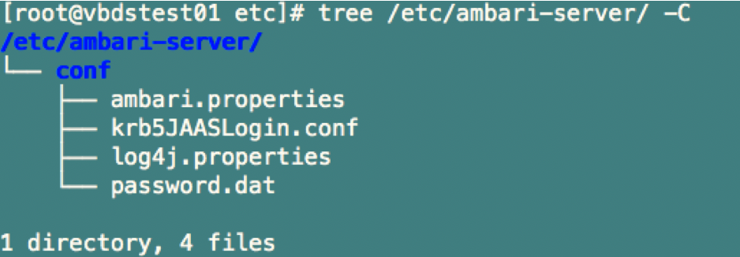
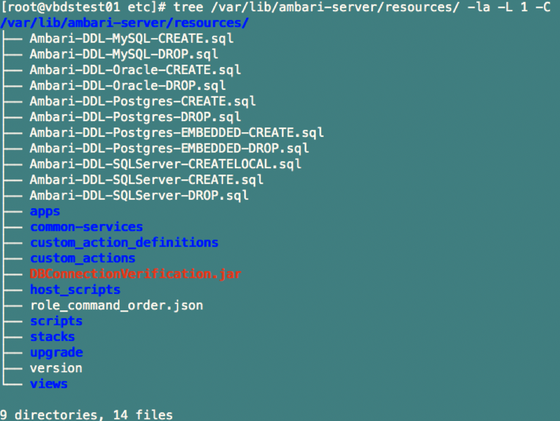
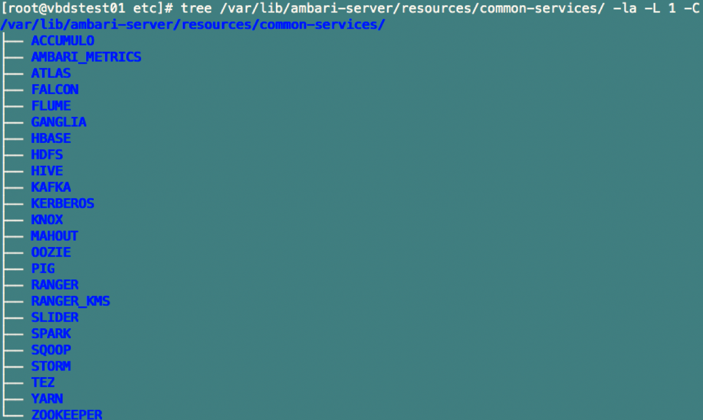
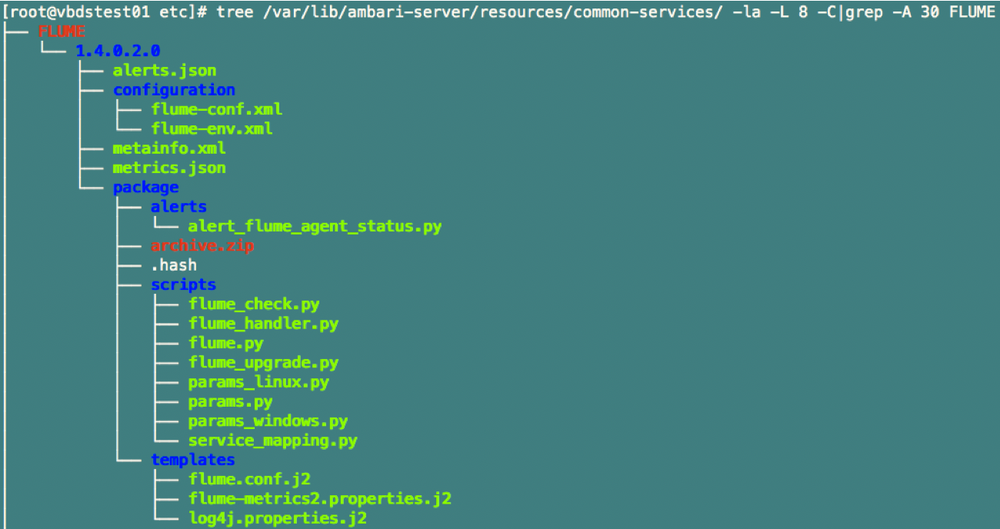
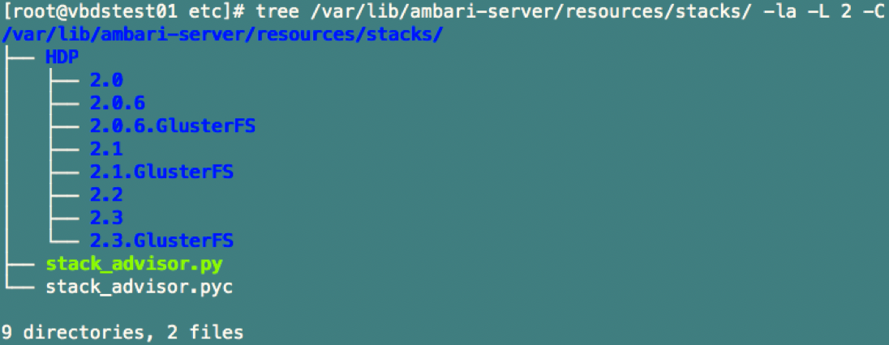
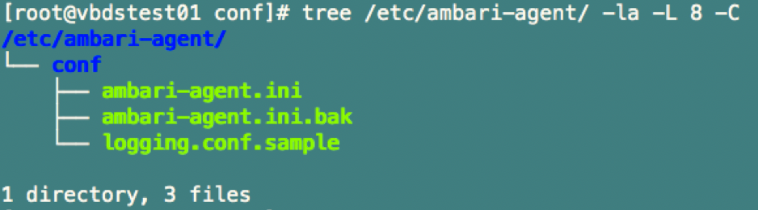
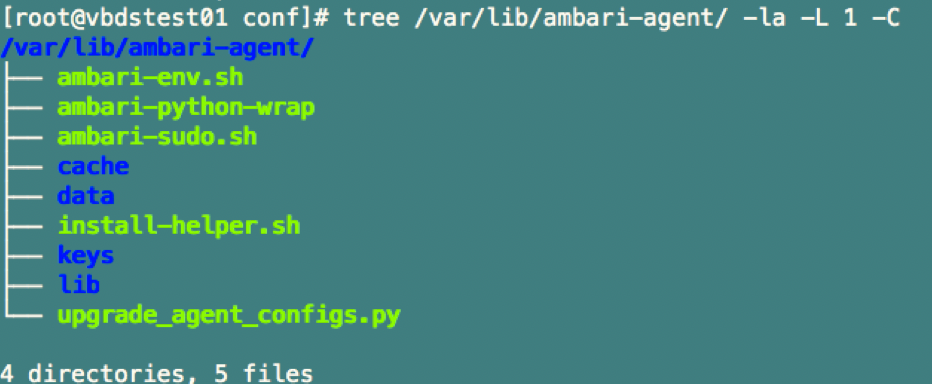
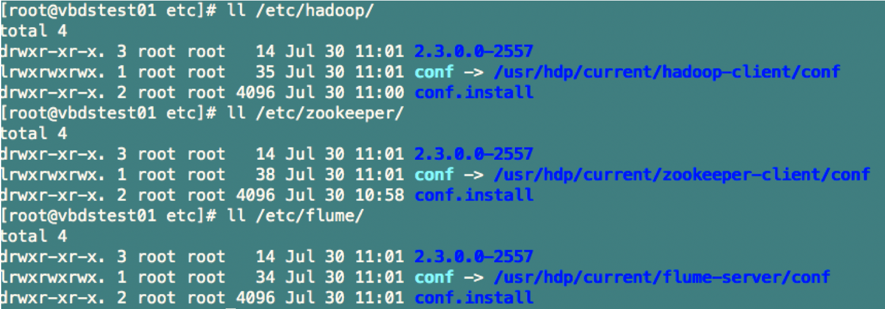
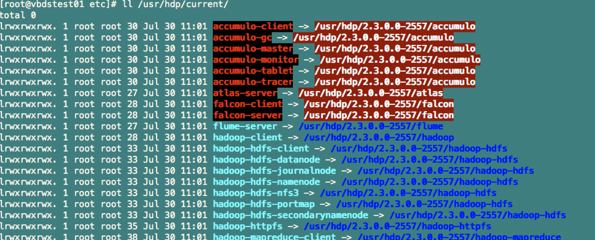
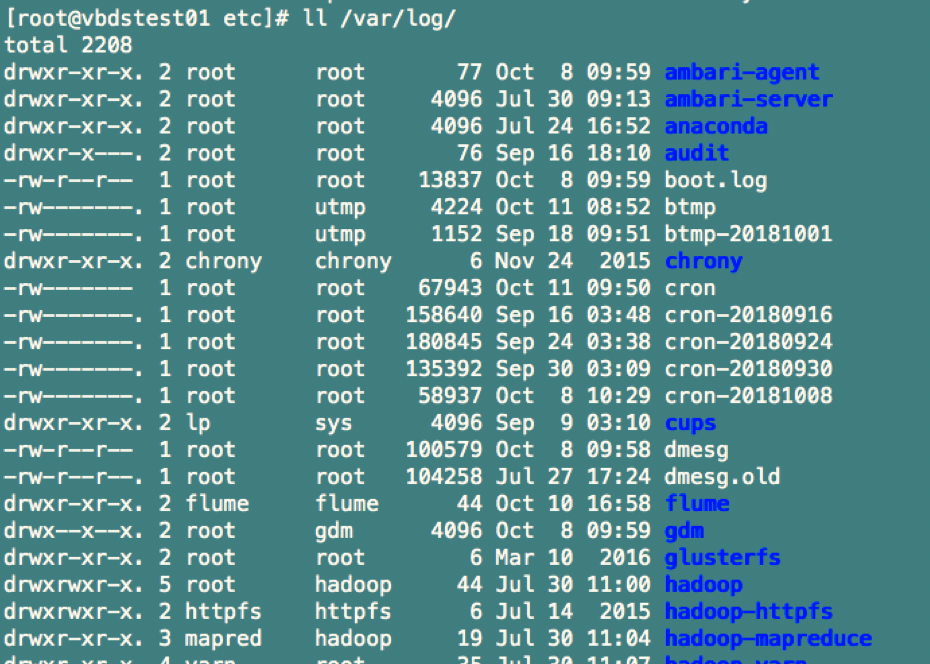

**Ambari-server相关目录****：**

Ambari-server配置文件目录如下：

Ambari-server安装目录：

Ambari-server resources目录：

Ambari-server/resources/common-services目录：

Ambari-server/resources/common-services/FLUME目录：

/var/lib/ambari-server/resources/stacks/目录：

**Ambari-agent相关目录****：**

Ambari-agent配置文件目录如下：

Ambari-Agent安装目录：

**HDP相关目录****：**

配置文件目录位于/etc下，但其实都是链接文件，指向了/usr/hdp/current/../conf,，如下所示：

/usr/hdp/current/目录下也都是软链接文件，指向了/usr/hdp/2.3.0.0/目录下的服务，如下所示：

hdp的日志文件基本都位于/var/log/目录下，如下所示：

