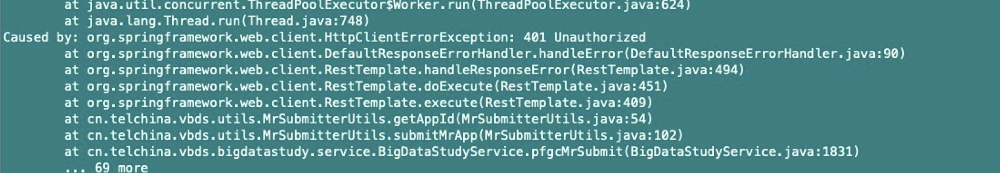

任务无法提交至yarn，应用程序后台报错如下：通过POST请求**http://hdp1.xucl.telchina:8088/ws/v1/cluster/apps/new-application****报错，****401(Unauthorized)**

解决方法：**http://hdp1.xucl.telchina:8088/ws/v1/cluster/apps/new-application?****user.name=yarn**

 

以上修改后，任务能够提交到yarn，但仍然报错：

Caused by: org.apache.hadoop.ipc.RemoteException(org.apache.hadoop.security.AccessControlException): Permission denied: user=yarn, access=WRITE, inode="/user":hdfs:hdfs:drwxr-xr-x
     at org.apache.hadoop.hdfs.server.namenode.FSPermissionChecker.check(FSPermissionChecker.java:399)
     at org.apache.hadoop.hdfs.server.namenode.FSPermissionChecker.checkPermission(FSPermissionChecker.java:255)
     at org.apache.hadoop.hdfs.server.namenode.FSPermissionChecker.checkPermission(FSPermissionChecker.java:193)
     at org.apache.hadoop.hdfs.server.namenode.FSDirectory.checkPermission(FSDirectory.java:1850)
     at org.apache.hadoop.hdfs.server.namenode.FSDirectory.checkPermission(FSDirectory.java:1834)
     at org.apache.hadoop.hdfs.server.namenode.FSDirectory.checkAncestorAccess(FSDirectory.java:1793)
     at org.apache.hadoop.hdfs.server.namenode.FSDirMkdirOp.mkdirs(FSDirMkdirOp.java:59)
     at org.apache.hadoop.hdfs.server.namenode.FSNamesystem.mkdirs(FSNamesystem.java:3150)
     at org.apache.hadoop.hdfs.server.namenode.NameNodeRpcServer.mkdirs(NameNodeRpcServer.java:1126)
     at org.apache.hadoop.hdfs.protocolPB.ClientNamenodeProtocolServerSideTranslatorPB.mkdirs(ClientNamenodeProtocolServerSideTranslatorPB.java:707)
     at org.apache.hadoop.hdfs.protocol.proto.ClientNamenodeProtocolProtos$ClientNamenodeProtocol$2.callBlockingMethod(ClientNamenodeProtocolProtos.java)
     at org.apache.hadoop.ipc.ProtobufRpcEngine$Server$ProtoBufRpcInvoker.call(ProtobufRpcEngine.java:524)
     at org.apache.hadoop.ipc.RPC$Server.call(RPC.java:1025)
     at org.apache.hadoop.ipc.Server$RpcCall.run(Server.java:876)
     at org.apache.hadoop.ipc.Server$RpcCall.run(Server.java:822)
     at java.security.AccessController.doPrivileged(Native Method)
     at javax.security.auth.Subject.doAs(Subject.java:422)
     at org.apache.hadoop.security.UserGroupInformation.doAs(UserGroupInformation.java:1730)
     at org.apache.hadoop.ipc.Server$Handler.run(Server.java:2682)

at org.apache.hadoop.ipc.Client.getRpcResponse(Client.java:1497)
     at org.apache.hadoop.ipc.Client.call(Client.java:1443)
     at org.apache.hadoop.ipc.Client.call(Client.java:1353)
     at org.apache.hadoop.ipc.ProtobufRpcEngine$Invoker.invoke(ProtobufRpcEngine.java:228)
     at org.apache.hadoop.ipc.ProtobufRpcEngine$Invoker.invoke(ProtobufRpcEngine.java:116)
     at com.sun.proxy.$Proxy9.mkdirs(Unknown Source)
     at org.apache.hadoop.hdfs.protocolPB.ClientNamenodeProtocolTranslatorPB.**mkdirs**(ClientNamenodeProtocolTranslatorPB.java:653)

检查hdfs目录权限发现，yarn用户没有/user目录的写权限，因此进行以下修改：**http://hdp1.xucl.telchina:8088/ws/v1/cluster/apps/new-application?****user.name=hdfs**

**修改后，仍然报相同的错误，根据孙运解释：用户改成hdfs，但****由于提交的是yarn任务****，所以实际启动container时还是使用yarn用户，原因是yarn中有一项配置：**

yarn.nodemanager.container-executor.class=org.apache.hadoop.yarn.server.nodemanager.DefaultContainerExecutor

 

**仔细分析得知，yarn用户想要在****/user用户下创建/user/yarn目录****，由于没有****/user目录的写权限****，所以报错。**

**解决方法：****在hdfs上****手动为yarn用户创建目录****/user/yarn**

 

**最终问题解决****！！**