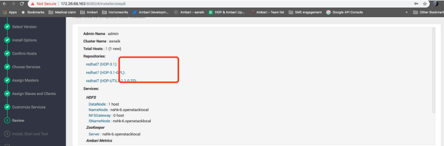
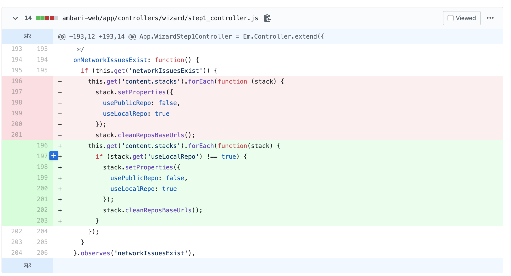

- 使用本地存储库安装时，Ambari往repo文件中写入baseurl为空，导致安装时，报错如下：

- Cannot find a valid baseurl for repo: HDP-3.1-repo-1 

- 我们可以看到Ambari UI在审核步骤中显示空的baseURL：

- 

- 根本原因：https://issues.apache.org/jira/browse/AMBARI-25069

- 解决方法：

- 这是使用本地存储库时无法访问群集的ambari中的Javascript错误

- 1) cd /usr/lib/ambari-server/web/javascripts

- 2) cp app.js      app.js_backup

- 3) edit the app.js

- find out the line(39892) : onNetworkIssuesExist: function () {

- 

- https://github.com/apache/ambari/pull/2743/files