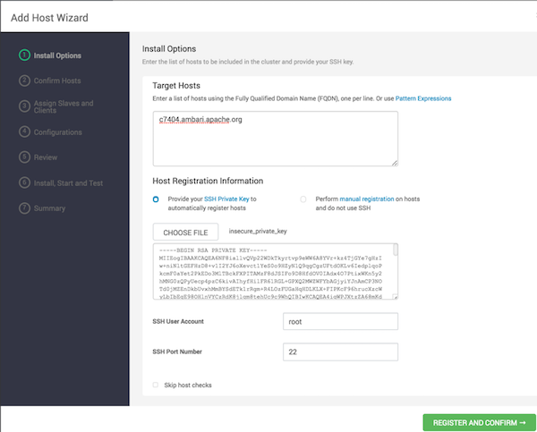

# HDP增加节点

## 指导思想

按照HDP安装过程中对于每台服务器的设置进行服务器准备，然后使用Ambari界面提供的功能将准备好的服务器加入到集群中。

## 实施过程

### 硬件准备

根据当前集群中现有的服务器配置准备新的服务器，或根据HDP建议准备服务器硬件并进行硬件相关配置，例如：raid配置等。

### 操作系统安装

1. 安装相同版本的操作系统，安装过程中采用相同的选项。
2. 尽量采用相同的分区及文件系统类型。
3. 相同的用户名和密码
4. 相同的主机名规范
5. 相似的网络配置方法

### 免密登录配置

1. ssh-keygen命令生成公钥和私钥

2. 将公钥添加到HDP第一台服务器的authorized_keys文件中

3. 将完整的authorized_keys文件scp到新服务器

4. /etc/c3.conf配置文件中增加新服务器的hostname

5. 将新服务器配置到HDP第一台服务器的hosts中

6. 使用cpush命令将authorized_keys文件和hosts文件推送到所有服务器

   经过以上步骤后，所有服务器之间均可以免密登录了。

### 系统配置

1. 关闭防火墙和selinux

2. 设置umask为0022

3. 修改文件句柄数为65535

4. pam_limits.so

5. 禁用THP

   以上配置可以使用setUp.sh脚本完成

### Ambari及HDP Yum源配置

将原有服务器上的repo文件拷贝到新服务器后，执行：

yum clean all

yum makecache

yum repolist

### 安装JDK并设置安全策略

1. 从原节点拷贝JDK安装目录
2. 从原节点复制环境变量配置并source
3. 从原节点拷贝安全策略文件

### 设置ntp-agent

1. 从原节点拷贝/etc/ntp.conf
2. 执行ntpdate同步时间

### 安装libtirpc-devel

rpm -ivh 

### 添加节点

在ambari界面中添加新节点

Use the **+Add New Hosts** wizard to add new host machines to your cluster.

1. Browse to the **Hosts** page and select **Actions** > **+Add New Hosts**.

   The **Add Host** wizard provides a sequence of prompts similar to those in the Ambari Cluster Install wizard.

2. Follow the prompts, providing information similar to that provided to define the first set of hosts in your cluster:

   

### 数据均衡

使用ambari提供的rebalance功能

