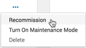
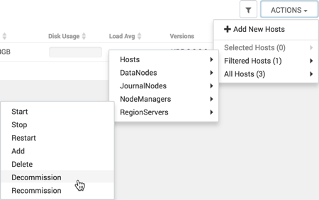
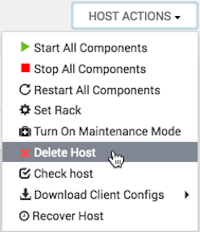

# Decommission a host（退役主机）

Decommissioning is a process that supports removing components and their hosts from the cluster.

退役是一个支持从集群中删除组件及其主机的过程。

You must decommission a master or slave running on a host before removing it or its host from service. Decommissioning helps you to prevent potential loss of data or disruption of service. Decommissioning is available for the following component types:

在移除master或slave节点前必须先执行退役过程，这样可以预防数据丢失和服务中断的风险。以下三个组件支持退役操作：

- DataNodes
- NodeManagers
- RegionServers

Decommissioning executes the following tasks:

- For DataNodes

  Safely replicates the HDFS data to other DataNodes in the cluster

  将 HDFS 数据安全地复制到集群中的其他 DataNodes

- For NodeManagers

  Stops accepting new job requests from the masters and stops the component

  停止接受master发送的新作业请求并停止组件

- For RegionServers

  Turns on drain mode and stops the component

  打开drain模式并停止组件

# Decommission a NodeManager（退役NM）

Use **Ambari Web** > **Hosts** > **Actions** to decommission a NodeManager component.

1. Using **Ambari Web**, browse the **Hosts** page.

2. Find and click the FQDN of the host on which the NodeManager component resides.

3. Using the **Actions** menu, click **Selected Hosts** > **NodeManagers** > **Decommission**.

   

   The UI shows Decommissioning status while in process.

When this NodeManager decommissioning process is finished, the Action option shows Recommission.

# Decommission a RegionServer（退役RS）

Use **Ambari Web** > **Hosts** > **Actions** to decommission a RegionServer component.

1. Using **Ambari Web**, browse the **Hosts** page.

2. Find and click the FQDN of the host on which the RegionServer component resides.

3. Using the **Actions** menu, click **Selected Hosts** > **RegionServers** > **Decommission**.

   
   

   The UI shows Decommissioning status while in process.

When this RegionServer decommissioning process is finished, the Action option shows Recommission.

# Decommission a DataNode（退役DN）

Use **Ambari Web** > **Hosts** > **Actions** to decommission a DataNode component.

1. Using **Ambari Web**, browse the **Hosts** page.

2. Find and click the FQDN of the host on which the DataNode component resides.

3. Using the **Actions** control, click **Selected Hosts** > **DataNodes** > **Decommission**.

   
   

   The UI shows Decommissioning status while in process.

When this DataNode decommissioning process is finished, the Action option shows Recommission.

# Delete a host from a cluster（删除主机）

Use **Host Actions** > **Delete Host** to remove a host from the cluster.

Deleting a host removes the host from the cluster.

Before deleting a host, you must:

删除主机前，必须：

- Stop all components running on the host.停止主机上所有组件

- Decommission any DataNodes running on the host.退役主机上的DataNode
- Move from the host any master components, such as NameNode or ResourceManager, running on the host.移除主机上任何的master组件，例如NameNode或ResourceManager
- Turn off host Maintenance Mode, if it is on.关闭维护模式

1. Using **Ambari Web**, browse the hosts page to find and click the FQDN of the host that you want to delete.

2. On the **Host** page, click **Host Actions**.

3. Click **Delete Host**.

   

   The host is removed from the cluster.