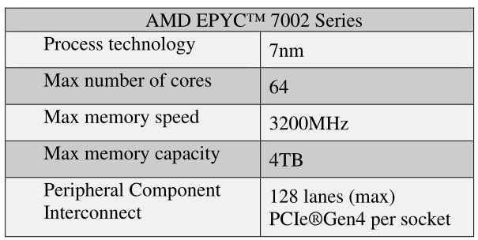
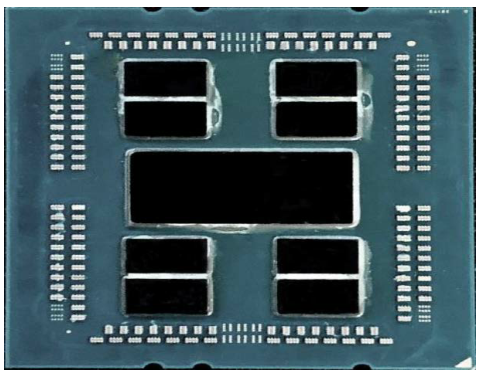
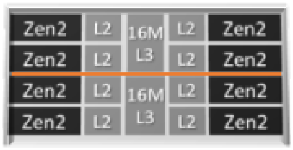
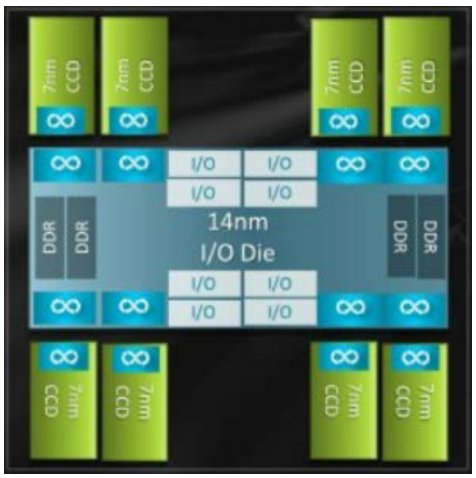

# 高性能计算：AMD EPYC 7002系列处理器调优指南

## 第1章 引言

本调优指南提供了能够在使用AMD EPYC™7002系列处理器的服务器上优化性能的参数的详细描述。来自不同OEM供应商的硬件和BIOS上的默认配置可能无法在所有OS平台和所有工作负载上提供最佳性能。为了在每个平台和工作负载级别上实现优化，本指南介绍了：

- 可能影响性能的BIOS设置
- 硬件配置最佳实践
- 支持的操作系统版本和操作系统优化选项
- BIOS和操作系统中针对各种工作负载的特定工作负载设置

### 1.1  前提条件

本文档面向具有配置服务器背景的技术读者。

- 需要对服务器的管理接口(BMC)和操作系统进行管理访问。
- 强烈建议熟悉oem服务器的管理接口(BMC)。
- 强烈建议您熟悉用于配置、监视和故障排除的操作系统特定工具。

### 1.2 历史

AMD EPYC™7002系列处理器的配置：

 

## 第2章 微体系结构概述

### 2.1 微体系结构

处理器核心、内存控制器、I/O控制器和安全性被集成到AMD EPYC™7002系列处理器的多芯片模块(MCM)中。



### 2.2 Zen2 核心

EPYC 7002系列处理器基于新的Zen2处理器核心，其中包括L1回写缓存。每个核都支持同步多线程(SMT)，允许每个核同时执行2个执行线程。每个核心都包含一个私有的512KB L2缓存。

### 2.3 CCD和CCX

最多4个Zen2核共享16MB(上一级)L3缓存。当两个L3缓存在同一个芯片上时，它们是分开的。4个核及其相关的缓存被称为一个核复合体(CCX)。每个核心复合模(CCD)包含2个CCXs



两个CCD可以抽象为一个象限。CCD通过I/O Die (IOD)连接到内存、I/O和其他CCD。每个套接字最多支持8个内存通道。



### 2.4 内存和I/O布局

每个EPYC 7002系列处理器支持8个内存通道。每个内存通道最多支持2个DIMMs。根据BIOS设置，这些通道可以跨象限(双向)交叉，一直到16通道交叉，也就是说，跨一个2socket系统的所有内存通道。在每个处理器3200MHz的情况下，系统最多可以访问4TB的DDR4内存。

PCI子系统提供高达128条高速I/O通道。

当所有的内存和I/O连接到单一的I/O  Die，他们可以被抽象成单独的象限，每个有2 DIMM通道和32 I/O车道。

两个EPYC 7002 SoCs通过套接字到套接字全局内存互连(xGMI)链路互连，这是将SoC的所有组件连接在一起的无限结构的一部分。

### 2.5 NUMA

EPYC 7002系列处理器使用NUMA微体系结构。AMD EPYC 7002系列处理器中的四个逻辑象限允许处理器被划分为不同的NUMA域。这些域被指定为NPS（NUMA per socket）。

#### 2.5.1 NPS1

处理器是一个NUMA域，也就是说，处理器上的所有核心、所有连接到它的内存以及所有连接到处理器的PCIe设备都在一个NUMA域内。所有主存横跨八个Channel。

#### 2.5.2 NPS2

处理器被划分为两个NUMA域。一半的核心和一半的Channel连接到处理器被分组到一个NUMA域。内存在每个NUMA域的四个内存通道之间交错。

#### 2.5.3 NPS4

处理器被划分为四个NUMA域。处理器的每个逻辑象限都是一个NUMA域。内存在每个象限的两个内存通道之间交错。根据具有该设备的PCIe根的IO  die的象限，PCIe设备将是处理器上四个NUMA域中的一个本地的。

#### 2.5.4 L3缓存作为NUMA域

每个L3缓存被公开为一个NUMA节点。在每个处理器最多16个L3缓存的双处理器系统上，此设置将公开32个NUMA域。

使用BIOS设置，可以将每个服务器配置为NPS1、NPS2或NPS4，还可以通过一个附加选项将L3缓存配置为NUMA节点。

## 第3章 硬件配置最佳实践

### 3.1 内存配置

介绍了1DPC（每个Channel一个DIMM）配置和2DPC（每个Channel2个DIMM）配置。1 DPC配置DIMM可以运行在最高速度，而2 DPC将典型地要求稍微降低内存速度。

#### 3.1.1 支持前几代AMD EPYC的平台

- 为AMD EPYC 7001处理器设计的平台可能兼容AMD EPYC 7002处理器。联系您的OEM咨询支持。
- 请与OEM联系，以确定平台上支持的最大内存总线频率。
- 对于吞吐量敏感的应用程序，为了获得更高的IO吞吐量，最大内存总线频率可以设置为允许的最大，只要您的内存DIMM硬件支持它。然而，在某些情况下，这些平台上的Infinity Fabric Clock可能无法与OEM支持的最大内存总线频率同步。这种不同步的行为会导致更高的延迟。
- 对于延迟敏感的应用程序，更好的性能是通过设置最大内存总线频率为2667 MT/s，因为这个频率与Infinity Fabric Clock同步。

#### 3.1.2 专门为AMD EPYC 7002设计的平台

- 专门为AMD EPYC 7002设计的平台应该支持最大的内存总线频率。请与OEM联系，以确定所支持的最大内存总线频率。
- 在这些平台上支持的最大内存总线频率应该是3200 MT/s。
- 对于吞吐量敏感的应用程序，为了获得更高的IO吞吐量，最大内存总线频率可以设置为最大允许的(3200 MT/s)，如果您的内存DIMM硬件支持它。在这种情况下，这些平台上的Infinity Fabric Clock将不会以3200 MT/s的内存总线频率进行最佳同步。这可能会略微增加内存访问延迟。
- 对于延迟敏感的应用程序，内存访问延迟可以通过设置最大内存总线频率为2933 MT/s或2667  MT/s来减少，以便与Infinity Fabric Clock同步。适当的内存总线频率同步模式将取决于AMD EPYC 7002产品家族。

#### 3.1.3 PCI子系统

对于I/O密集型工作负载，可以通过在连接到所使用的I/O设备的相同CPU套接字上执行工作负载来提高性能。例如，对于密集的网络操作，将工作负载放在NIC连接到的套接字上。Linux上的lstopo等工具可以帮助确定PCI设备和套接字之间的连接。

## 第4章  BIOS设置

### 4.1 BIOS设置通用建议

本节提供关于BareMetal HPC工作负载推荐的BIOS设置的一般指导原则。

- x2APIC -> Enabled 
- SMT -> Disabled
- NPS -> 4
- (Set Memory Frequency Properly) 
- PBDIS -> 1
- Fixed SOC Pstate -> P0
- Preferred IO

### 4.2 BIOS的特定设置

#### 4.2.1 同步多线程(SMT)

在HPC工作负载中，SMT通常是关闭的。如果您不在计算绑定场景中，您可能会看到SMT的一些好处。如果您的代码没有按核授权，或者启用SMT没有影响，那么您可能需要进行试验，看看它是否有利于您的工作负载。

- Enabled:这允许1个核心执行2个线程。
- Disabled:这允许一个核心执行一个线程。

#### 4.2.2 CCD控制

此选项允许您修改处理器中活动CCD的数量。它可以与Core Control相结合来改变部件的有效布局。

#### 4.2.3 Core Control

这个选项允许您修改CCX中活动核的数量。选项如(x+x)所示，其中x是每个CCX的活动核数。

例如:将此设置为(2+2)意味着每个CCX有2个活动内核，每个CCD有4个活动内核。如果该部分有8个CCD，那么总共有32个核心。每个CCD 4核* 8个CCD = 32核

#### 4.2.4 x2APIC

此选项有助于操作系统在高核心计数配置中更有效地处理中断。建议启用此选项。如果使用> 255个线程，必须启用此选项。

#### 4.2.5 NPS

此选项设置每个套接字的NUMA节点。在许多HPC应用程序中，ranks和内存可以固定在核心和NUMA节点上，在这种情况下，典型的建议是使用NPS4选项。如果您的工作负载不能很好地感知NUMA，或者在NUMA复杂性增加时受到影响，那么您可以使用NPS1进行试验。

#### 4.2.6 内存频率，Infinity Fabric Frequency，耦合和非耦合模式

内存频率和Infinity Fabric Frequency可以运行在同步频率，称为耦合模式，或异步频率，称为非耦合模式。

AMD EPYC支持高达3200 MT/s的DDR4频率，然而Infinity Fabric Frequenc可以同步到最大速度2933 MT/s(或2667 MT/s，为低功率组B基础设施部件)。

如果您的内存频率等于或低于2933 MT/s，内存和fabric将总是在耦合模式下运行，这将提供最低的内存延迟。

如果你运行的DDR4内存在3200 MT/s，内存和Infinity Fabric Frequency将运行在非耦合模式。这以增加内存延迟为代价，提供了稍微高一些的带宽。

如果您的系统支持3200 MT/s内存，您可以在2933 MT/s的耦合模式和3200 MT/s的非耦合模式进行试验，以确定哪种模式最适合您的工作负载。

在BIOS中，将内存频率设置为所需的速度，并确保APBDIS设置为1，固定SOC Pstate设置为P0。

#### 4.2.7 Preferred IO

Preferred IO允许在系统中的一个PCIe设备被配置在一个首选状态。该设备在Infinity Fabric Frequency上得到优先处理。这通常是为提供系统之间互连的fabric适配器启用的。

#### 4.2.8 Determinism Slider

这一选项的存在是由于CPU中不同的硅片由于制造过程而自然存在的不同特性。即使在同一SKU下，各部件之间也总是存在一些差异。Determinism Slider有两种选择:性能和功率。

- 性能:在这种模式下，系统中的cpu以最低的性能要求运行，以满足指定部件的性能。如果必须让系统中的所有节点提供相同的性能，请选择此选项。
- 功率:在这种模式下，系统中的cpu以SoC中每个硅器件的最大能力运行。由于在制造过程中存在的自然变化，一些cpu和/或节点可能能够比其他cpu和/或节点提高性能。设备的性能永远不会低于你在性能决定论模式下得到的性能，但可以获得额外的性能。

## 第5章 Linux优化选项

### 5.1 Linux 内核版本

建议使用最新的Linux内核。AMD Linux团队不断地向Linux内核推送性能更新和修复，运行最新的内核确保最新的修复和更新到位。

### 5.2 有用的命令

| -命令                                     | -描述                                                  |
| ----------------------------------------- | ------------------------------------------------------ |
| lscpu                                     | 打印出有关CPU及其配置的有用信息。                      |
| hwloc-ls                                  | 打印出关于设备的NUMA位置和一般硬件位置信息的有用信息。 |
| cat /sys/devices/system/cpu/cpufreq/boost | 打印出是否CPU boost是开或关                            |
| cpupower frequency-info                   | 打印出有关CPU调控器的有用信息。                        |

### 5.3 通用操作系统调优

本节包括推荐的Linux操作系统调优选项。这并不是一个包罗万象的清单。请评估您的环境和工作负载，以找到最适合您的选项。

#### 5.3.1 关闭swap防止意外的交换

建议禁用swap，以防止任何不必要的swap使用。如果需要使用swap，则需要配置更多的内存容量。

确保节点有足够的内存来处理工作负载。在没有足够内存的情况下禁用swap可能会产生意想不到的结果。

关闭swap的命令：

swapoff -a

#### 5.3.2 关闭NUMA平衡

NUMA平衡可能会产生意想不到的结果，因为可以在HPC中绑定ranks和内存，所以不需要这个设置。

```sh
echo 0 > /proc/sys/kernel/numa_balancing
```

#### 5.3.3 禁用ASLR

ASLR(地址空间布局随机化)是一种用于防止内存漏洞被利用的安全特性。

这可能会略微影响性能，建议将其关闭。

```sh
echo 0 > /proc/sys/kernel/randomize_va_space
```

#### 5.3.4 将CPU设置为高性能模式并禁用cc6

将CPU设置为为performance模式可以确保在任何时候都有最大的性能。禁用cc6可确保不进入更深的CPU睡眠状态。

```sh
cpupower frequency-set -g performance 
cpupower idle-set -d 2
```

### 5.4 每次运行前的调优

#### 5.4.1 清理所有缓存

使用以下命令删除以前运行中的所有缓存，并在新运行时开始清理。这有助于确保始终如一的性能。

```sh
sync; echo 3 > /proc/sys/vm/drop_caches
```

## 第6章 Mellanox HCA

本章讲解关于Mellanox HCA的使用。

## 第7章 应用层调优

**A优化的编译器和库**

应用程序级调优对于在工作负载上实现最大性能至关重要。请探索使用AMD编译器和库，以利用我们工程师已作出的优化。

- AOCC (AMD 编译器) https://developer.amd.com/amd-aocc/ 

- AOCL (AMD 库) https://developer.amd.com/amd-aocl/

本章主要介绍如何使用AMD提供的编译器和库，优化自己编写的应用程序。