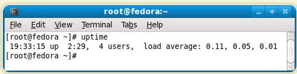
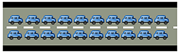

## 如何查看CPU负荷

三个数字分别代表：1分钟、5分钟、15分钟内系统的平均负荷

当CPU完全空闲的时候，平均负荷为0；当CPU工作量饱和的时候，平均负荷为1

什么时候能看出系统负荷比较重呢？等于1的时候，还是等于0.5或等于1.5的时候？如果1分钟、5分钟、15分钟三个值不一样，怎么办？

## 一个类比

**假设你的电脑只有一个CPU**，所有的运算都必须由这个CPU来完成。

那么，我们不妨把这个CPU想象成一座大桥，桥上只有一根车道，所有车辆都必须从这根车道上通过。（很显然，这座桥只能单向通行。）

系统负荷为0，意味着大桥上一辆车也没有，如下：

系统负荷为0.5，意味着大桥一半的路段有车：

系统负荷为1.0，意味着大桥的所有路段都有车，也就是说大桥已经"满"了。但是必须注意的是，直到**此时大桥还是能顺畅通行**的。

系统负荷为1.7，意味着大桥已经被占满了（100%），后面等着上桥的车辆为桥面车辆的70%。总之，当系统负荷大于1，后面的车辆就必须等待了；系统负荷越大，过桥就必须等得越久。

CPU的系统负荷，基本上等同于上面的类比。大桥的通行能力，就是CPU的最大工作量；桥梁上的车辆，就是一个个等待CPU处理的进程（process）。

**如果CPU每分钟最多处理100个进程，那么系统负荷0.2，意味着CPU在这1分钟里只处理20个进程；系统负荷1.0，意味着CPU在这1分钟里正好处理100个进程；系统负荷1.7，意味着除了CPU正在处理的100个进程以外，还有70个进程正排队等着CPU处理。**

## 系统负荷的经验法则

1.0是系统负荷的理想值吗？

不一定，系统管理员往往会留一点余地，当这个值达到**0.7**，就应当引起注意了。经验法则是这样的：

- 当系统负荷持续大于0.7，你必须开始调查了，问题出在哪里，防止情况恶化。

- 当系统负荷持续大于1.0，你必须动手寻找解决办法，把这个值降下来。

- 当系统负荷达到5.0，就表明你的系统有很严重的问题，长时间没有响应，或者接近死机了。你不应该让系统达到这个值。

## 多处理器

上面，我们假设你的电脑只有1个CPU。如果你的电脑装了2个CPU（或者单颗CPU双核），会发生什么情况呢？

两个CPU就意味着大桥有两根车道了，通车能力翻倍了：

所以，2个CPU表明系统负荷可以达到2.0，此时每个CPU都达到100%的工作量。推广开来，**n个CPU的电脑，可接受的系统负荷最大为n.0。**

## 多核处理器

在系统负荷方面，多核CPU与多CPU效果类似，所以考虑系统负荷的时候，必须考虑这台电脑有几个CPU、每个CPU有几个核心。然后，**把系统负荷除以总的核心数，只要每个核心的负荷不超过1.0**，就表明电脑正常运行。

## 最佳观察时长

1分钟系统负荷、5分钟系统负荷，15分钟系统负荷，----应该参考哪个值？

如果只有1分钟的系统负荷大于1.0，其他两个时间段都小于1.0，这表明只是暂时现象，问题不大。

如果15分钟内，平均系统负荷大于1.0（调整CPU核心数之后），表明问题持续存在，不是暂时现象。所以，你应该主要观察"15分钟系统负荷"，将它作为电脑正常运行的指标。