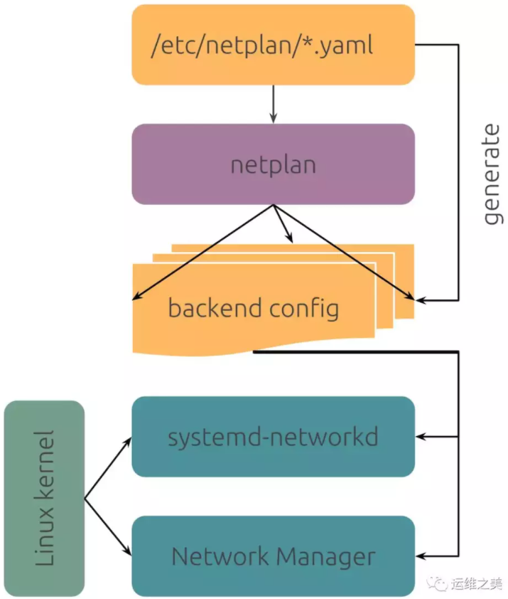

## Netplan

Netplan 官方網址：https://netplan.io/

Netplan能够通过yaml文件容易的配置网络，Netplan能够将yaml文件处理为**NetworkManager 或 systemd-network**所需的配置文件，Netplan代替ifupdown作为默认的网络配置工具开始于Ubuntu 17.10 Artful。



Netplan的配置文件可以位于以下三个位置，优先级从高到低依次为：

- /run/netplan/*.yaml
- /etc/netplan/*.yaml
- /lib/netplan/*.yaml

## 示例

### Static&&DHCP

以下配置了四个网络设备：

- enp3s0：DHCP IPv4
- enp4s0：自定义MTU，IPv4 Static
- net1：绑定MAC，IPv6 Static
- net2：绑定MAC，自定义MTU，IPv4 and IPv6 DHCP

```yaml
ethernets:
    enp3s0:
        dhcp4: true
    enp4s0:
        addresses:
            - 192.168.0.10/24
        gateway4: 192.168.0.1
        mtu: 1480
        nameservers:
            addresses:
                - 8.8.8.8
                - 9.9.9.9
    net1:
        addresses:
            - fe80::a00:10a/120
        gateway6: fe80::a00:101
        match:
            macaddress: 52:54:00:12:34:06
    net2:
        dhcp4: true
        dhcp6: true
        match:
            macaddress: 52:54:00:12:34:07
        mtu: 9000
```

### Bond

可以支持balance-rr, active-backup, balance-xor, broadcast, 802.3ad, balance-tlb, balance-alb等各种模式的双网口绑定。

关于网口绑定可参考：https://help.ubuntu.com/community/UbuntuBonding

```yaml
bonds:
    bond0:
        dhcp4: yes
        interfaces:
            - enp3s0
            - enp4s0
        parameters:
            mode: active-backup
            primary: enp3s0
```

> ## Descriptions of bonding modes
>
> 
>
> - Mode 0
>
>   balance-rr 
>
> Round-robin policy: Transmit packets in sequential order from the first available slave through the last. This mode provides load balancing and fault tolerance.
>
> - Mode 1
>
>   active-backup 
>
> Active-backup policy: Only one slave in the bond is active. A different slave becomes active if, and only if, the active slave fails. The bond's MAC address is externally visible on only one port (network adapter) to avoid confusing the switch. This mode provides fault tolerance. The primary option affects the behavior of this mode.
>
> - Mode 2
>
>   balance-xor 
>
> XOR policy: Transmit based on selectable hashing algorithm. The default policy is a simple source+destination MAC address algorithm. Alternate transmit policies may be selected via the xmit_hash_policy option, described below. This mode provides load balancing and fault tolerance.
>
> - Mode 3
>
>   broadcast 
>
> Broadcast policy: transmits everything on all slave interfaces. This mode provides fault tolerance.
>
> - Mode 4
>
>   802.3ad 
>
> IEEE 802.3ad Dynamic link aggregation. Creates aggregation groups that share the same speed and duplex settings. Utilizes all slaves in the active aggregator according to the 802.3ad specification.
>
> - **Prerequisites:**
>   1. Ethtool support in the base drivers for retrieving the speed and duplex of each slave.
>   2. A switch that supports IEEE 802.3ad Dynamic link aggregation. Most switches will require some type of configuration to enable 802.3ad mode.
> - Mode 5
>
> - balance-tlb
>
> Adaptive transmit load balancing: channel bonding that does not require any special switch support. The outgoing traffic is distributed according to the current load (computed relative to the speed) on each slave. Incoming traffic is received by the current slave. If the receiving slave fails, another slave takes over the MAC address of the failed receiving slave.
>
> - **Prerequisites:**
>   - Ethtool support in the base drivers for retrieving the speed of each slave.
> - Mode 6
>
> - balance-alb
>
> Adaptive load balancing: includes balance-tlb plus receive load balancing (rlb) for IPV4 traffic, and does not require any special switch support. The receive load balancing is achieved by ARP negotiation. The bonding driver intercepts the ARP Replies sent by the local system on their way out and overwrites the source hardware address with the unique hardware address of one of the slaves in the bond such that different peers use different hardware addresses for the server.

### Bridges

Here is a very simple example of a bridge using DHCP:

```yaml
bridges:
    br0:
        dhcp4: yes
        interfaces:
            - enp3s0
```

### Vlans

Similarly, vlans only require a name as the key and then an id and link to use for the vlan:

```yaml
vlans:
    vdev:
        id: 101
        link: net1
        addresses:
            - 10.0.1.10/24
    vprod:
        id: 102
        link: net2
        addresses:
            - 10.0.2.10/24
    vtest:
        id: 103
        link: net3
        addresses:
            - 10.0.3.10/24
    vmgmt:
        id: 104
        link: net4
        addresses:
            - 10.0.4.10/24
```

## 链接和参考

- [Netplan Wiki](https://wiki.ubuntu.com/Netplan)
- [Netplan自述文件](https://git.launchpad.net/netplan/tree/doc/netplan.md)
- [Netplan源代码](https://git.launchpad.net/netplan?h=master)
- [Netplan设计文档](https://wiki.ubuntu.com/Netplan/Design)
- [Netplan错误](https://bugs.launchpad.net/cloud-init)