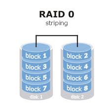

**JBOD**

JBOD（Just a bunch of disk）严格上来说不是一种RAID，因为它只是简单将多个磁盘合并成一个大的逻辑盘，并没有任何的数据冗余。数据的存放机制就是从第一块磁盘开始依序向后存储数据。如果某个磁盘损毁，则该盘上的数据就会丢失。

**RAID0** **（****striping** **条带）**

RAID0的主要思想是“条带”（striping）。Striping是指存储数据时，将数据根据特定的大小（stripe size）分段，然后把这些分段（有的地方称作block，有的地方称作segment，有的地方称作stripe）依次写到不同的磁盘里。RAID0没有数据冗余，单个磁盘的损坏会导致整个磁盘阵列的数据丢失。而且理论上，整个磁盘阵列损坏的概率大于单个磁盘损坏的概率，磁盘越多，概率越高。但是RAID0中的数据读写可以由多个磁盘并发完成，所以整个磁盘阵列的读写性能会有明显提升。

需要注意的是，RAID0的性能和磁盘读写的IO size有关。当IO size小于stripe size的时候，不同的IO请求可以由RAID group中的不同磁盘并行执行，从宏观上看（阵列的寻道时间=单个磁盘的寻道时间/磁盘个数），由于小IO的读写时间主要花在磁盘寻道上，所以在这种情况下RAID0能体现出较高的性能。当IO size大于stripe size的时候，单个IO请求需要多个磁盘共同执行，多个磁盘的磁头都要找到读写位置。因此整个RAID group的寻道时间等于寻道时间最长的磁盘所用的时间。在这种情况下，RAID group对于磁盘寻道性能没有提升，但是磁盘阵列的总的带宽理论上可以等于所有磁盘带宽之和，所以对于大IO的读写请求，RAID0依然可以提高其性能。。

