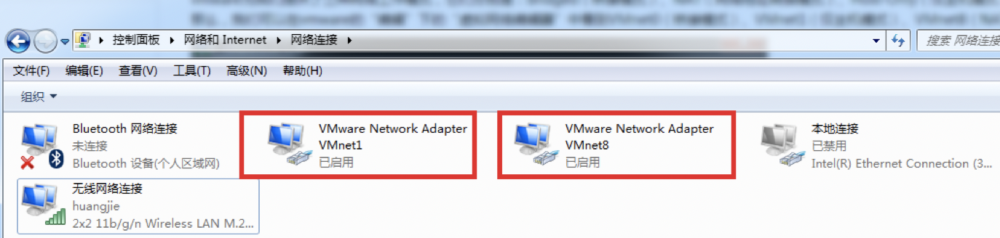
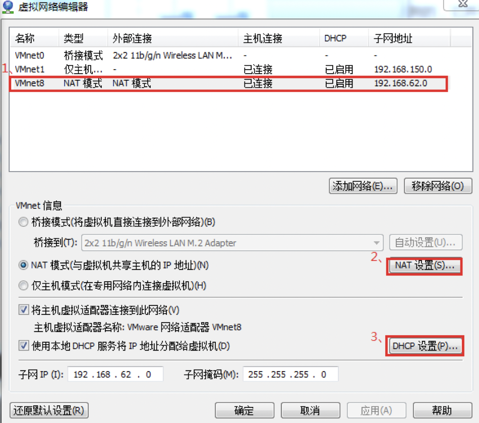
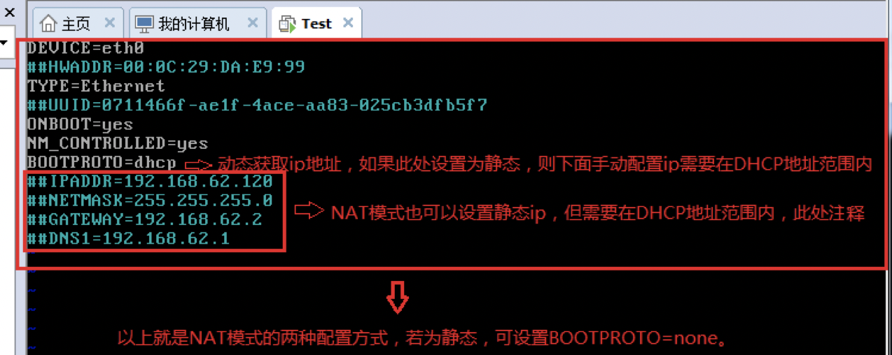

打开VMware Workstation，我们可以在选项栏的“编辑”下的“虚拟网络编辑器”中看到VMnet0（桥接模式）、VMnet1（仅主机模式）、VMnet8（NAT模式）。

VMnet0：桥接模式下的虚拟交换机；

VMnet1：仅主机模式下的虚拟交换机；

VMnet8：NAT模式下的虚拟交换机。

主机上对应的有VMware Network Adapter VMnet1和VMware Network Adapter VMnet8两块虚拟网卡。如果将这两块卸载了，可以在vmware的“编辑”下的“虚拟网络编辑器”中点击“还原默认设置”，可重新将虚拟网卡还原。

为什么宿主机上没有VMware Network Adapter VMnet0虚拟网卡呢？

### 桥接模式

桥接模式就是将主机网卡与虚拟机虚拟的网卡利用虚拟网桥进行通信。在桥接的作用下，类似于把物理主机虚拟为一个交换机，所有桥接设置的虚拟机连接到这个交换机的一个接口上，物理主机也同样插在这个交换机当中，所以所有桥接下的网卡与网卡都是交换模式的，相互可以访问而不干扰。在桥接模式下，虚拟机ip地址需要与主机在同一个网段，如果需要联网，则网关与DNS需要与主机网卡一致。其网络结构如下图所示：

**如何设置桥接模式：**

**测试：**

1. 虚拟机内ping外部网络
2. 宿主机上ssh登录到虚拟机测试
3. 同一网络的外部主机能够访问虚拟机

适用场景：

桥接模式配置简单，但如果你的ip资源很缺少或对ip管理比较严格的话，那桥接模式就不太适用了。

### NAT（地址转换模式）

如果你的网络ip资源紧缺，但是你又希望你的虚拟机能够联网，这时候NAT模式是最好的选择。NAT模式借助虚拟NAT设备和虚拟DHCP服务器，使得虚拟机可以联网。其网络结构如下图所示：

在NAT模式中，主机网卡直接与虚拟NAT设备相连，然后虚拟NAT设备与虚拟DHCP服务器一起连接在虚拟交换机VMnet8上，这样就实现了虚拟机联网。那么我们会觉得很奇怪，为什么需要虚拟网卡VMware Network Adapter VMnet8呢？原来我们的VMware Network Adapter VMnet8虚拟网卡主要是为了实现主机与虚拟机之间的通信。

**如何设置：**

通过“虚拟网络编辑器”，设置NAT参数及DHCP参数。如下：

将虚拟机的网络连接模式修改成NAT模式：

虚拟机开机，设置虚拟机的网卡：

**测试：**

1. 虚拟机内ping外部网络（**禁用宿主机上的VMnet8虚拟网卡，依然ping通**）
2. 宿主机上ssh登录到虚拟机测试（**禁用宿主机上的VMnet8虚拟网卡，则不通**）

这就是NAT模式，利用虚拟的NAT设备以及虚拟DHCP服务器来使虚拟机连接外网，而VMware Network Adapter VMnet8虚拟网卡是用来与虚拟机通信的。

### Host-Only（仅主机模式）

Host-Only模式其实就是NAT模式去除了虚拟NAT设备，然后使用VMware Network Adapter VMnet1虚拟网卡连接VMnet1虚拟交换机来与虚拟机通信的，Host-Only模式将虚拟机与外网隔开，使得虚拟机成为一个独立的系统，只与主机相互通讯。其网络结构如下图所示：

通过上图，可以发现，如果要使虚拟机联网，可以将主机网卡共享给VMware Network Adapter VMnet1网卡，从而达到虚拟机联网的目的。

**如何设置：**

首先设置“虚拟网络编辑器”，设置DHCP的起始范围：

设置虚拟机为Host-Only模式：

开机启动系统，然后设置网卡文件：

共享主机网络给虚拟网卡VMnet1：

看到上图有一个提示，强制将VMware Network Adapter VMnet1的ip设置成192.168.137.1，那么接下来，我们就要将虚拟机的DHCP的子网和起始地址进行修改：

重新配置网卡，将VMware Network Adapter VMnet1虚拟网卡作为虚拟机的路由：

**测试：**

1. 虚拟机内ping外部网络
2. 宿主机上ssh登录到虚拟机测试