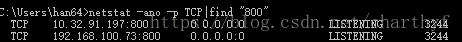
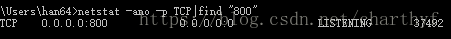

**socket开发：一台服务器同一端口同时在多个网卡上开启listen的误区理解。**

 

**误区一：一个端口是否在服务器上只能开一次？** 

socket开发中经常会发现，当前端口已被占用，貌似感觉一个端口在一台服务器上只能被打开一次，实际是端口和IP地址相关，一台电脑上如果配置多个IP，则每个IP都可以配置相同的端口。如本机两个网卡IP分别为192.168.100.73和10.32.91.197，可以分别在这个两个网卡上开800端口进行监听。 

 

**误区二：为什么不指定监听在哪个ip上也能实现访问服务？** 

在建立socket的时候，大多数情况是不需要指定本地服务器IP，而是使用INADDR_ANY，这样建立监听后本地所有网卡都可访问。

serv.sin_family=AF_INET;
 serv.sin_addr.S_un.S_addr=htonl(INADDR_ANY);//设置成INADDR_ANY，而非一个指定的IP
 serv.sin_port = htons(800); //设置端口

 

原因是INADDR_ANY建立的监听会开在0.0.0.0这个IP上 

 

0.0.0.0这个IP代表的意思是该主机上所有IP地址。用telnet测试时都可访问。

telnet 127.0.0.1 800
 telnet 192.168.100.73 800
 telnet 10.32.91.197 800

 

**误区三：在本机上通过127.0.0.1这个IP一定能访问到本地的服务么？** 

127.0.0.1是换回口loopback地址，指向本机，监听时如果socket绑定地址为INADDR_ANY或者“127.0.0.1”，则可以在本机通过127.0.0.1这个地址访问本机服务，否则无法访问。

  serv.sin_family=AF_INET;
   serv.sin_port = htons(800); //设置端口
   //serv.sin_addr.s_addr = inet_addr("127.0.0.1"); //127.0.0.1可以访问  
   serv.sin_addr.s_addr = inet_addr("10.32.91.197"); //127.0.0.1不可以访问

 

IP能否访问主要遵循路由原则，非同一网段且路由不可达情况下，无法进行访问。

**误区四：能否在本地开个服务端口只有该主机才能访问呢？** 

可以，只要服务绑定的IP地址为127.0.0.1。这样只有本机能访问该服务端口，对于针对本机提供的服务，在开启服务时可以指定服务绑定IP地址为127.0.0.1，这样其他主机无法访问。

**误区五：能否在指定的几个IP上开通同一个端口监听呢？** 

可以，但每个IP要单独对应socket进行监听，无法做到类似INADDR_ANY，一个socket handle就可以监听所有IP。

**思考题：如果在本机上同一个端口（800）上建立两个socket一个是INADDR_ANY，一个是127.0.0.1，那在本地输入telnet 127.0.0.1 800会accept哪个监听上呢？** 

测试一下是绑定到127.0.0.1上，即INADDR_ANY优先级最低。

*本文采用的TCP进行测试，UDP类似。*