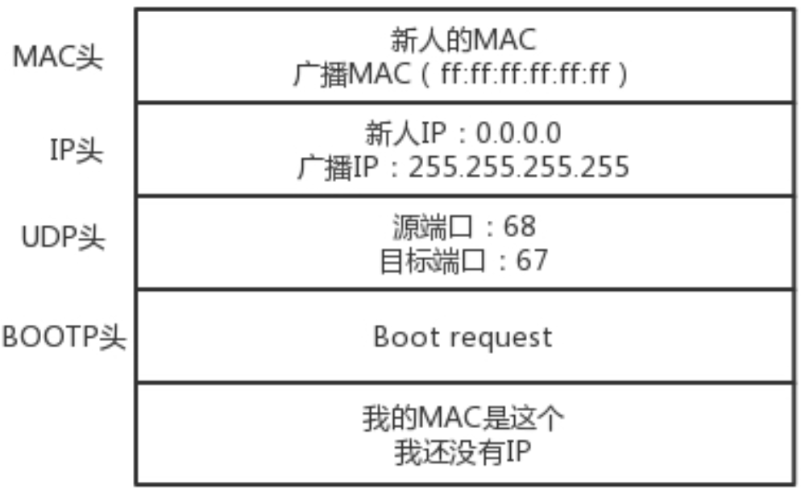
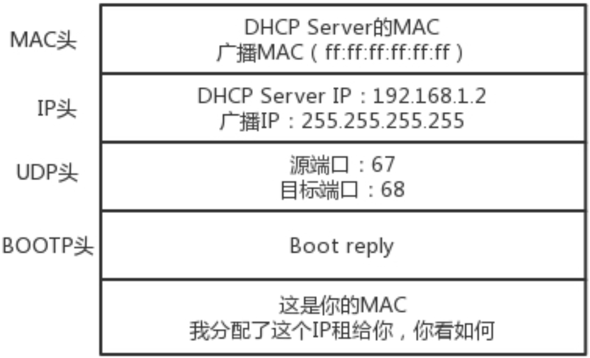
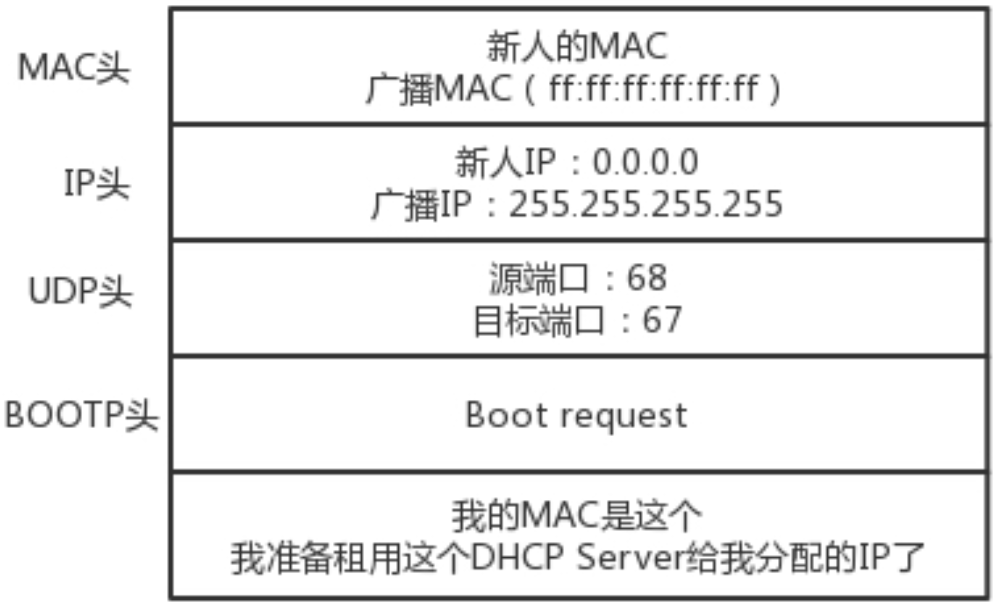
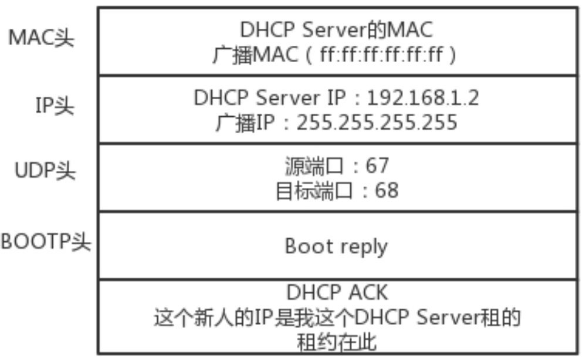
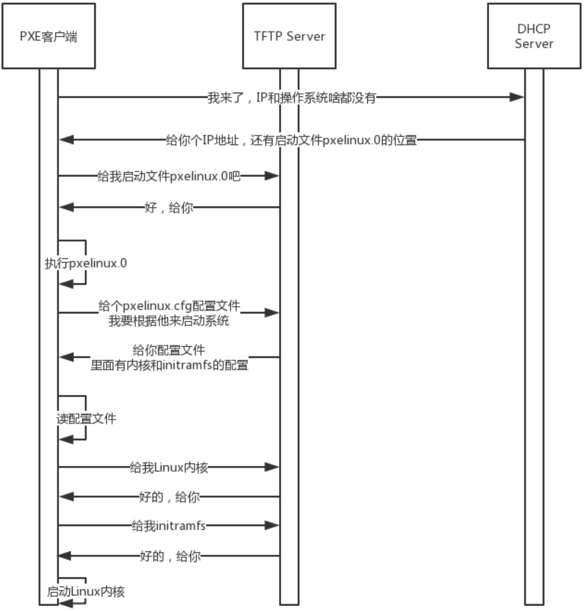

## IP能随便配置吗

问题：旁边一台计算机，IP地址为192.168.1.6，你自己的计算机与它连接到了同一台交换机，但是你把IP地址设置为了16.158.23.6，那么你能够ping通192.168.1.6吗？

> 网络上跑的包，都必须是完整的，可以有下层没上层，绝对不可能有上层没下层。所以要想把包发出去，除了已知的本机IP和目标IP，还需要填写本机Mac、目标Mac。
>
> 本机Mac好说，目标Mac填什么？是不是填192.168.1.6的Mac？当然不是，操作系统首先会判断，要去的这个地址和我是一个网段的吗，或者和我的一个网卡是同 一网段的吗?只有是一个网段的，它才会发送 ARP 请求，获取 MAC 地址。如果发现不是呢?
>
> 操作系统默认的逻辑是，如果这是一个跨网段的调用，它便不会直接将包发送到网络上，而是将包发送到网关。如果没有配置网关呢?那包压根就发不出去。
>
> 如果将网关配置为 192.168.1.6 呢?不可能，操作系统不会让你配置成功的，因为网关要和当前的网络至少一个网卡是同一个网段的，怎么可能16.158.23.6 的网关是192.168.1.6 呢?	

## DHCP的工作原理

动态主机配置协议(Dynamic Host Configuration Protocol)，简称DHCP。

当一台机器新加入一个网络：

DHCP Server分配IP，这个过程称为DHCP Offer，格式如下：

如果有多个DHCP Server提供了IP，新机器会选择其中一个DHCP Offer，并向网络发送一个DHCP Request广播数据包：

当 DHCP Server 接收到客户机的 DHCP request 之后，会广播返回给客户机一个 DHCP ACK 消息包，表明已经接受客户机的选择，并将这一 IP 地址的合法租用信息和其他的配置信息都放 入该广播包，发给客户机，欢迎它加入网络大家庭。

## 预启动执行环境(PXE)

预启动执行环境(Pre-boot Execution Environment)，简称PXE。

PXE 协议分为客户端和服务器端，由于还没有操作系统，只能先把客户端放在 BIOS 里面。

PXE 服务器上，往往还需要有一个 TFTP 服务器，用于与客户端进行启动文件的传输。

