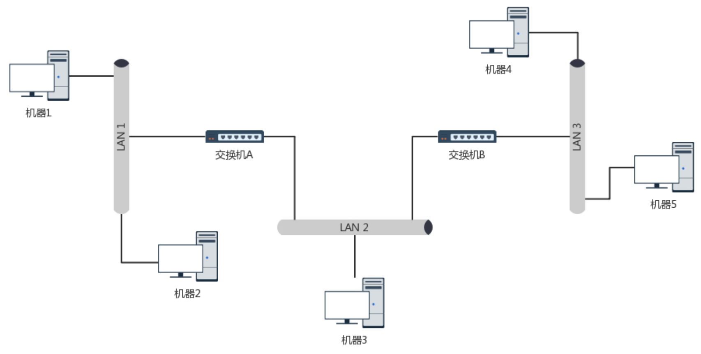
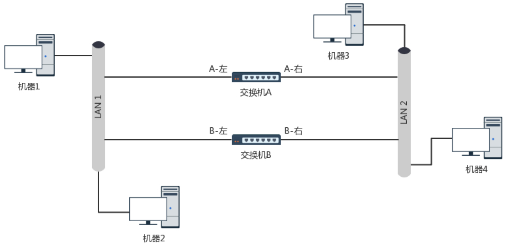
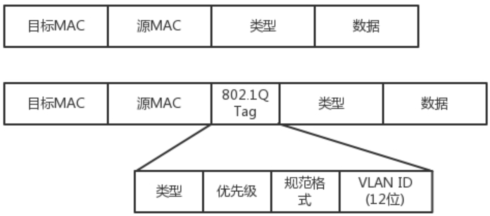
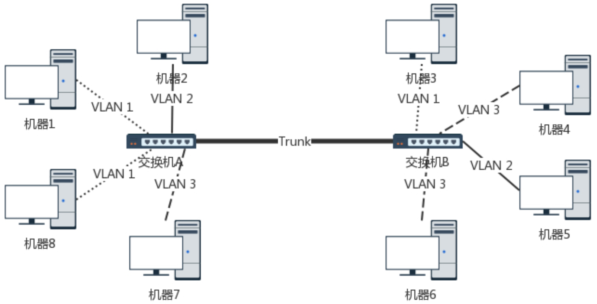

思考：

- 如果机器 1 只知道机器 4 的 IP 地址，当它想要访问机器 4，把包发出去的时候，它必须要知道机器 4 的 MAC 地址。那么通过ARP广播获取机器4的Mac地址的过程如何？
- 如果已经完成以上过程，即机器1成功访问到机器4，此时，如果机器2访问机器1，ARP请求的路径如何？（提示：交换机A已经知道机器1位于左边的网口）

## 环路问题

思考：机器1访问机器2的过程？ 会有什么后果？交换机能够学会这个拓扑结构吗？

## 通过STP协议破除环路

网络管理 员知道哪些交换机贵，哪些交换机好，就会给它们分配高的优先级。然后交换机之间华山论剑。

## 解决广播问题和安全问题

广播带来的问题：

- 性能下降
- 不安全

解决方法：

- 物理隔离：不同部门使用不同的交换机组成一个个子网，子网之间用路由器连接，实现部门间交互。但是这样极不灵活，很难应对部门人数变化。
- VLAN：或者叫虚拟局域网。使用 VLAN，一个交换机上会连属于多个局域网的机器，那交换机怎么区分哪个机器属于哪个局域网呢?

如果我们买的交换机是支持 VLAN 的，当这个交换机把二层的头取下来的时候，就能够识别这 个 VLAN ID。这样只有相同 VLAN 的包，才会互相转发，不同 VLAN 的包，是看不到的。这样 广播问题和安全问题就都能够解决了。

​	