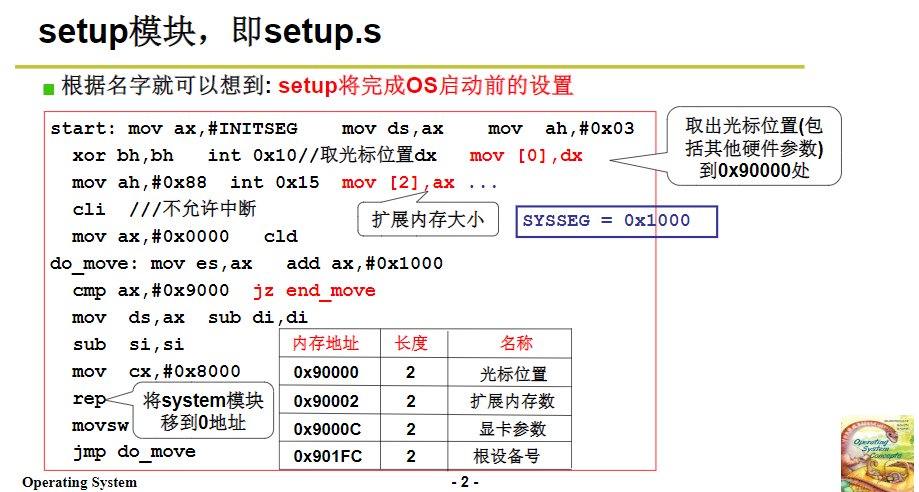
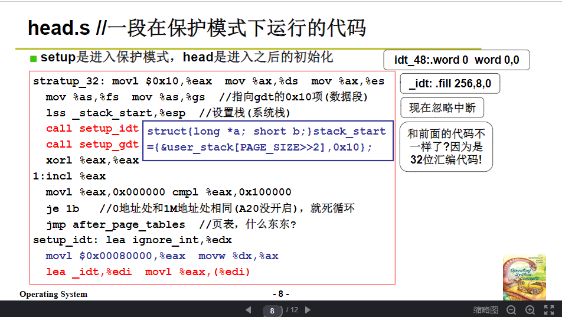
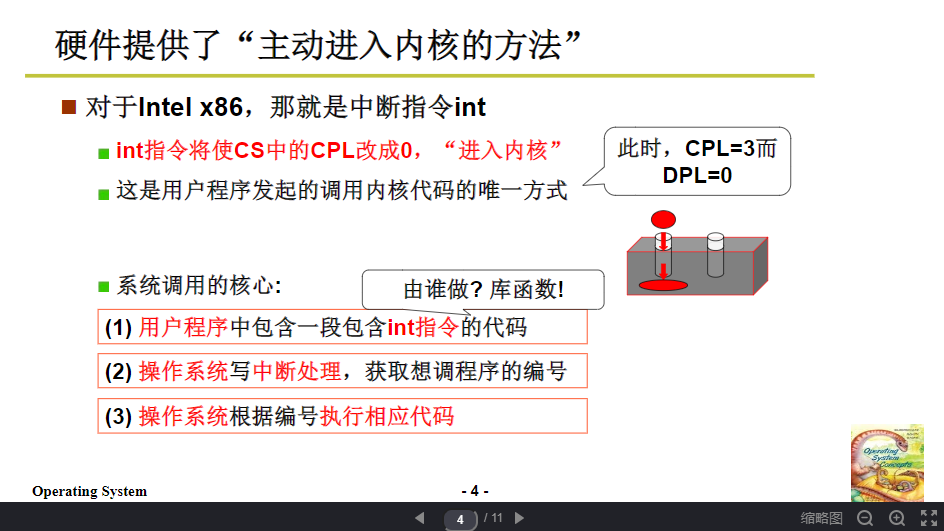

## 一些傻瓜式的问题

- **按下开机键后发生了什么，为什么可以跳转到BIOS程序？**

参考：https://www.zhihu.com/question/22364502

https://cloud.tencent.com/developer/article/1452645

- **ROM为什么可以存储BIOS程序？**

参考百度百科：https://baike.baidu.com/item/%E5%8F%AA%E8%AF%BB%E5%AD%98%E5%82%A8%E5%99%A8/2399075?fromtitle=ROM&fromid=12424911&fr=aladdin

总结：BIOS程序是已二进制（通过与门、或门等硬件器件控制）的形式存储在ROM中的

- **既然ROM中存放的BIOS程序是固化的，那么BIOS设置又是什么？**

  https://tieba.baidu.com/p/3488886783

- **程序是什么？计算机为什么可以运行高级语言编写的程序？**

站在人的角度看程序；站在计算机的角度看程序。

- **GCC可以编译C语言程序，而GCC又是用C语言编写的，矛盾吗？**

## 操作系统概述

网易云课堂，搜索“操作系统”

## 操作系统引导

### 揭开钢琴的盖子

### 操作系统启动

## 系统接口

### 操作系统接口

### 系统调用的实现

​	

