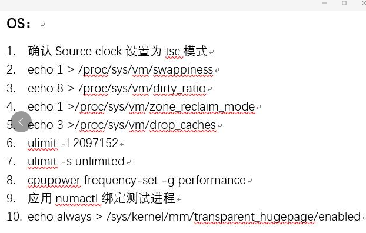
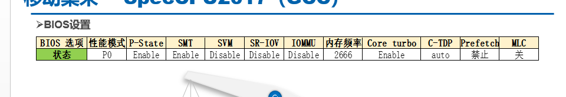
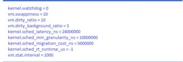
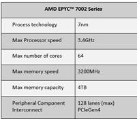

OS：

GCC7.3最高到212

基准值：

调优方向：

**低延时调优**

参考文档：

Performance Tuning Guidelines for Low Latency Response on AMD EPYC™-Based Servers Application Note

调优建议

BIOS：

•Prefetcher -Enabled 

• L2 Stream HW Prefetcher - Enabled 

• SR-IOV – Disabled 

• AMD IOMMU – Disabled 

• Min Processor Idle Power Core C-State – No C-State - Disabled 

• AMD TurboCore – Disabled 

• L1 Stream HW – Enabled 

• NUMA Group Size Optimization – Clustered 

• Memory patrol scrubbing – Disabled

• Memory Refresh Rate – 1X

•Memory Pre-Failure Notification—Disables notification when correctable errors occur above a threshold

• SMT –disable

• Disable Node Interleaving to preserve the use of local node memory allocation. Local memory should provide the lowest access latency

• The ACPI SLIT table provides the relative latencies between nodes. Enable this feature so the information can be used by the Linux scheduler

•Enable Memory Proximity Reporting for IO. This feature reports the proximity relationship between IO devices and system memory to the operating system

 

OS：

• echo 0 >/proc/sys/kernel/watchdog 

Watchdog monitoring and interrupts can cause jitter. Disable them during the benchmarking

• echo 10 >/proc/sys/vm/swappiness 

Lowering the swappiness to 10 means that swap will be used when RAM is 90% full. If your system has a lot of memory, this should be a safe and effective choice to improve performance.

•Echo 10 >/proc/sys/vm/dirty_ratio 

Dirty_ratio is the limit to which, if the total number of dirty pages exceed, then all writes are blocked until some of the dirty pages are written to disk.

•echo 3 >/proc/sys/vm/dirty_background_ratio 

Dirty_background_ratio is the limit to which, when dirty page exceeds, then they start getting written to the disk.

•echo 24000000 >/proc/sys/kernel/sched_latency_ns

Sched_lantency_ns represents the preemption latency of a CPU bound task. Increasing this value increases the task's timeslice.

• echo 10000000 >/proc/sys/kernel/sched_min_granularity_ns 

​     Sched_min_granularity_ns is the minimum preemption granularity for CPU bound tasks.

• echo 5000000 >/proc/sys/kernel/shced_migration_cost_ns 

Sched_migration_cost_ns determines how long a task remains cache-hot after the last execution and, hence, avoid migration off the CPU. Increasing this variable reduces task migrations.

• echo -1 >/proc/sys/kernel/sched_rt_runtime_us

Sched_rt_runtime_us is the quantum allowed rt tasks. The Default is 950000 out of 1000000.  A value of -1 disables the enforcement.

• echo 1000 >/proc/sys/vm/stat_interval

Stat_interval is the interval in seconds in which the vm statistics are updated. The default is 1, which was causing a spike every second while collecting the statistics. Changing it to 1000 avoids these interrupts for at least 16 mins.

整合来看

• echo performance >/sys/devices/system/cpu/cpu*/coufreq/scaling_governor

•echo 0 >/sys/buis/workquenue/devices/wirteback/numa

• echo ff >/sys/bus/workqueue/devices/writeback/cpumask

•设置transparent_hugepage=never

• selinux=0

This disables the Linux Security module that provides a mechanism for supporting access control security policies.

• nmi_watchdog=0

This disables the nmi watchdog because it uses the Perf infrastructure. Perf is not intended to run as a continuous profiling utility, especially in low latency environments where it can cause spikes. 

• nohz=on

Disables the kernel timer tick on idle cores. 

• clocksource=tsc

Select the preferred kernel clock source. 

• nosoftlockup

Disables logging of backtraces when a process executes on a CPU or longer than the softlockup threshold (default 120 seconds). 

• mce=ignore_ce

Disable features for corrected errors. 

• cpuidle.off=1

Disable the cpuidle sub-system. 

• skew_tick=1

Causes the kernel to program each CPU's tick timer to fire at different times to avoid any possible lock contention. 

• processor.max_cstate=0

Disables going from C0 into any other C-state. 

• isolcpus=<core list>

Isolates the cores from the scheduler.  

• rcunocbs=<core list>

Restricts these cores from receiving any rcu call backs. 

• rcu_nocb_poll

Relieves each CPU from the responsibility awakening their RCU offload threads. Using the combination of rcunocbs and rcu_nocb_poll reduces the interference on your benchmark cpus. 

• nohz_full=<core list>

Restricts cores from receiving any timer ticks if only one process is running. 

• acpi_irq_nobalance

ACPI will not move active IRQs.

• Disable idrbalance service

• Disable or stop all unnecessary services with systemct

•针对需要低latecy benchmark：Taskset was used to pin the application to a core from the isolated list

 

**HPC****调优**

参考文档

HPC Tuning Guide for AMD EPYC™ Processors；high performance computing tuning guide for amd epyc 7002 series processors

调优参考（High Performance compute，对应测试多应用于linpack）

BIOS：

• Determinism Slider = Performance Reduces machine to machine variability within a cluster 

• SEV = OFF Secure Encrypted Virtualization. Allows memory encryption on a per Virtual Machine basis 

• SME = OFF Secure Memory Encryption (encrypts all the memory) 

• SMT = OFF or ON Simultaneous Multi-Threading. The benefit of this setting is application-dependent 

• Boost = ON or OFF Turns the boost function ON or OFF on all cores. This can also be switched on or off via the Linux command line as root in RHEL/CentOS for example

• Memory speed = AUTO AUTO will allow the system to automatically train to the correct speed setting for a given DIMM population and memory rank. Users can clock this down if they wish to, e.g. for applications that are not sensitive to memory speed, and therefore save on power. Reducing from 2600 MTS to 2400 MTS saves approximately 15 watts per socket. 

• Downcoring Sets the number of active cores per CCX (see later). For a 32-core part AUTO will leave 4 cores active per CCX. Other options would be: 3-3: 3 cores active per CCX, i.e. turn off 1 core per CCX 2-2: 2 cores active per CCX, i.e. turn off 2 cores per CCX 1-1: 1 core active per CCX, i.e. turn off 3 cores per CCX Users may wish to disable cores to maximize the L3-cache per core ratio on certain codes.  

• C-States = Enabled Leave these enabled. If required, users should disable C2 via the command line as root (see later)

 

OS：

• os尽量选rhel or centos7.4+，内核3.10；sles 12 sp3+ 内核4.4

•/proc/sys/vm/zone_reclaim_mode

1 = Zone reclaim on 2 = Zone reclaim writes dirty pages out 4 = Zone reclaim swaps pages

• /proc/sys/vm/drop_caches

​     echo 1 > /proc/sys/vm/drop_caches   [frees page-cache] 

echo 2 > /proc/sys/vm/drop_caches [frees slab objects e.g. dentries, inodes] 

echo 3 > /proc/sys/vm/drop_caches [cleans page-cache and slab objects]

• /proc/sys/vm/swappiness 

​     根据需要设置

• Transparent Huge Pages

​     对于HPC建议开启，参数为always；对于明确使用huge page的应用建议关闭，参数为never

• echo 0 > /sys/kernel/debug/x86/retp_enabled

• echo 0 > /sys/kernel/debug/x86/ibpb_enabled

• echo 1 > /sys/devices/system/cpu/cpufreq/boost

• cpupower frequency-set -g performance

• echo 0 >/proc/sys/kernel/numa_balancing

• echo 0 >/porc/sys/kernel/randomize_va_space

• cpupower idle-set –d 2

 

Application：

Librarie：openblas，Libm，libFlame；

Compilers： aocc，gcc，open64；Amd cpu推荐aocc

 

**Database tune**

参考文档：datebase tuning on linux os

调优参考

硬件选取：

OS：

Bios开启numa；使用numactl，将进程、core、core对应的内存绑定

对于SATA&SAS SSD，echo deadline (或者noop)>/sys/class/block/sdx/queue/scheduler

对于nvme SSD，echo deadline (或者none)>/sys/class/block/sdx/queue/scheduler

在/etc/sysctl.conf中，添加net.core.rmem_max=4194304, net.core.wmem_max=4194304；sysctl –p

文件系统，推荐使用xfs

cpupower frequency-set -g performance

echo 0 >/proc/sys/vm/swappiness

 

 

**SPECCPU****调优**：

os下参数推荐值与上述场景有区别，推荐参数如下

echo 1 > /proc/sys/vm/swappiness

echo 8 > /proc/sys/vm/dirty_ratio

echo 1 >/proc/sys/vm/zone_reclaim_mode

echo 3 >/proc/sys/vm/drop_caches

ulimit -l 2097152

ulimit -s unlimited

cpupower frequency-set -g performance

应用numactl绑定测试进程               

echo always > /sys/kernel/mm/transparent_hugepage/enabled

安装的时候jemalloc那个文件夹cp到 /home/spec2017下去

ln -s libjemalloc.so.2 libjemalloc.so

 

 

 