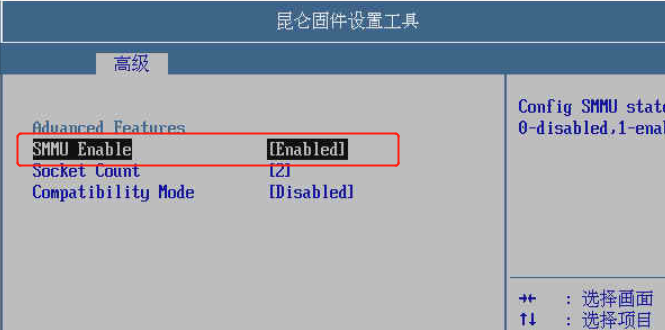
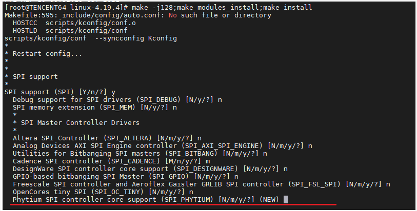
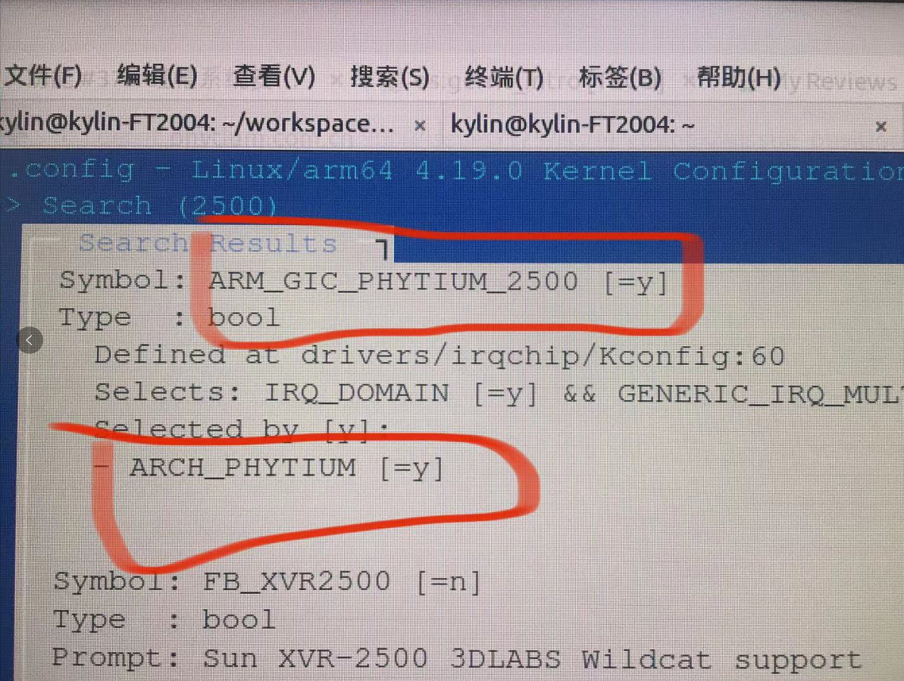

飞腾提供的方法，测试未通过，后续再研究，此处做记录：

一个像素:
这里要改一下

一个像素:
第一个关闭，第二个设置成1,第三个打开

一个像素:
就可以安装了

aliang:
[图片]

一个像素:
第二个Socket 这个要设置成  1

aliang:
我之前是这样跑的，不行，我把2改成1试试

aliang:
能简单说一下原因吗？

一个像素:
对把2改成1

aliang:
您是飞腾的老师吗？

一个像素:
我是飞腾的毛泓博，您称呼我毛工就行，您稍等我发一下原因

一个像素:
因为开源社区centos或者ubuntu系统默认不支持ft2500双路特性，所以飞腾在固件和软件层面做了一些配置。
1.固件层面的配置：开关iommu、开关单路双路、开关兼容模式。
2.软件层面的配置：增加了patch-phytium-4.19.5内核补丁。

一个像素:
所以为什么要配置BIOS原因就是这个

一个像素:
你们打上飞腾的内核补丁后，再开启双路模式，就可以运行双路了。

aliang:
就是说像刚才那样安装上，是单路模式，性能不好，对吗？

aliang:
@一个像素 先那样装上，再通过补丁解决双路模式

一个像素:
如果刚刚这样安装上了，就只能用单路CPU，体现不出双路CPU的优势

一个像素:
对

aliang:
双路支持的内核补丁怎么获取呢？

一个像素:
我发给您

一个像素:
一个内核补丁，一个内核配置文件，一个日志。

一个像素:
 下载linux-4.19.5.tar.gz源码包
下载地址：https://mirrors.tuna.tsinghua.edu.cn/kernel/v4.x/linux-4.19.5.tar.gz
安装升级源码包

tar xvf linux-4.19.5.tar.gz

cd linux-4.19.5

patch -p1 < ../patch-phytium-4.19.5

make menuconfig (退出、保存) 在linux-4.19.5目录下生成.config文件。

cp ../config-ft2000plus   .config  (把config-ft2000plus文件覆盖linux-4.19.5目录下的.config文件)

make menuconfig (选择General setup选项----->选择Local version - append to kernel release (NEW)选项在这个选项填写名字，编译出来的内核就是这个名字------>保存、退出)

make -j64

make modules_install

make install 

一个像素:
在S2500上，只要选上这两个模块就可以了

一个像素:
在你们的内核配置文件基础上

一个像素:
如果用的是centos系统，现在默认的处理方法，基于一个centos默认config文件，然后执行make  menuconfig加上这两个模块就可以了。

vincent.lai:
我们准备先试试通过你们之前给的手动安装补丁的方法

一个像素:
哪个版本的内核补丁

vincent.lai:
@小新 发下内核版本哈