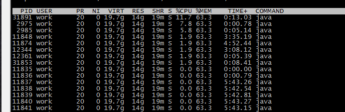
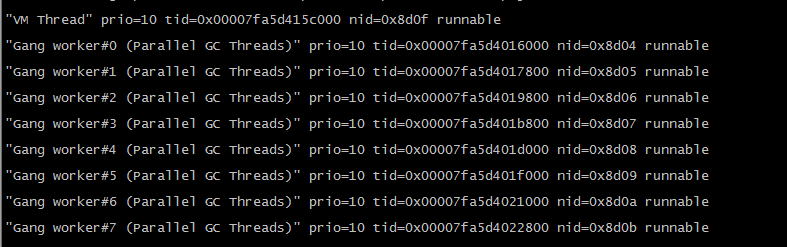
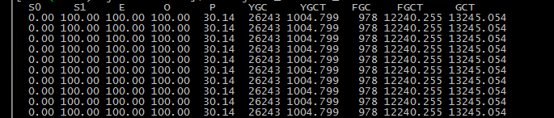
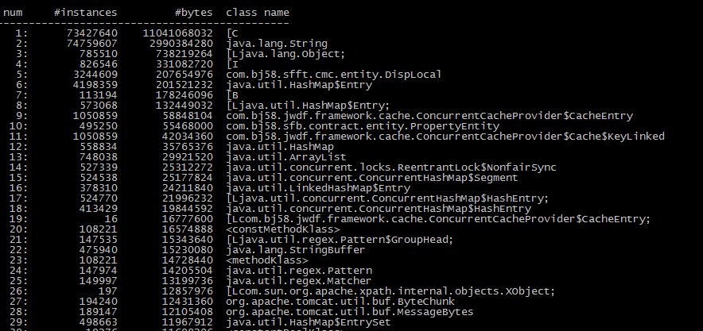

最近，公司网站频繁报警，JVM_OLD占用过高，线上访问超时严重，针对这个问题着实头疼了一把，不过最终还是解决了，下面说下解决的过程。

1，首先 登到线上机器上去，top命令，查看当前机器的负载，查看当前哪个进程在消耗资源。

```sh
top
```

找到CPU或者内存占用过高的那个进程。发现有一个进程，CPU居高不下，保留进程id

2，top命令，继续跟踪该进程里的所有线程，找到占用CPU过高的线程。

```sh
top -Hp [pid]
```

[](http://www.liuzk.com/wp-content/uploads/2017/05/top-hp.png)

3，找到线程ID，正在消耗CPU，把线程ID转换为16进制，执行jstack命令保留当前java进程堆栈

```sh
jstack [pid] > jstack_01
```

然后，在该文件jstack_01 里搜索 线程id为[16进制的线程id]的线程，查看堆栈信息。

[](http://www.liuzk.com/wp-content/uploads/2017/05/jstack_01.png)

一般情况下，这三部就能找到消耗资源的线程的情况，看到该线程的运行堆栈信息，当时发现，其实中 nid=0x8d0f 的线程在占用cpu，堆栈里看到的是VM线程，VM线程的意思就是jvm线程在工作，看下面几个run的线程，都是gc线程，猜测，此时，jvm正在GC。

4、接下来就是确认当前JVM各分区的情况了，这里使用的是jstat

```sh
jstat -gcutil [pid] 1000
```

每1000ms打印一次gc信息。

[](http://www.liuzk.com/wp-content/uploads/2017/05/jstat_01.png)

通过此图，可以发现，新生代eden区，survivor区，old区都已经100%，并且，jvm启动到现在，Full GC了978次，共花费时间12240.255秒，这样平均每次Full GC 12.5秒。

看来就是Full GC频繁并且过程漫长，导致线上机器卡死的问题了。下面解释下jstat的gc信息各个字段的含义：

```tex
S0 年轻代中第一个survivor（幸存区）已使用的占当前容量百分比 
S1 年轻代中第二个survivor（幸存区）已使用的占当前容量百分比 
E 年轻代中Eden（伊甸园）已使用的占当前容量百分比 
O old代已使用的占当前容量百分比 
P perm代已使用的占当前容量百分比 
YGC 从应用程序启动到采样时年轻代中gc次数 
YGCT 从应用程序启动到采样时年轻代中gc所用时间(s) 
FGC 从应用程序启动到采样时old代(全gc)gc次数 
FGCT 从应用程序启动到采样时old代(全gc)gc所用时间(s) 
GCT 从应用程序启动到采样时gc用的总时间(s)
```

5、确认是Full GC问题，那就只能看堆内存了，

```sh
jmap -histo [pid] > jmap.txt
```

该命令可以查看当前jvm内存里对象的实例数和占用内存数

【注意】该命令可能会造成线上程序假死，会卡死一段时间，所以线上程序谨慎使用！！！

[](http://www.liuzk.com/wp-content/uploads/2017/05/jmap_01.png)

从结果里可以看出，占内存最多的是前两个，一个是char，一个是string

所以有以下猜测：

1）程序里有内存缓存，缓存的是字符串，内存缓存逐渐增多，逐步移步老年代，最终导致爆满。

2）有大量拼接字符串的地方，

3）static的变量，存储大量的字符串，排名第六的是hashMap，猜想可能是有static的 hashMap？？

继续分析该文件，看到，有个 com.bj58.jwdf.framework.cache.ConcurrentCacheProvider 对象，有10w多个实例，通过看代码，的确这个是一个自己实现的内存缓存，果断想办法优化。

优化上线后，发现内存问题虽然有所缓解，但是还是会有jvm爆满的时候。

这样在继续分析，就比较困难了，然后同时优化了下jvm启动的参数，添加full gc的时机，

```sh
-XX:CMSInitiatingOccupancyFraction=80 -XX:+UseCMSInitiatingOccupancyOnly
```

保证，在old区达到80%的时候就开始执行Full GC。

添加：

```sh
-XX:+PrintGCDetails -XX:+PrintGCDateStamps -XX:+PrintHeapAtGC -Xloggc:gc.log
```

打印gc信息，以便保留证据。

并且在代码里查找一些其他的公共的static 的map 以及 内存缓存的地方，统统优化了，上线后还是不理想。

最后没办法了，只能dump堆内存快照了，用工具分析了。

修改jvm启动内存，改小一些，以便在满的时候打的快照能在本地分析，

```sh
jmap -dump:format=b,**file**=aa.bin 1232134
```

该命令打印出堆内存快照，我把jvm内存改成最大6G，下载的快照文件，足足有6.5G，然后下载MAT工具进行分析。