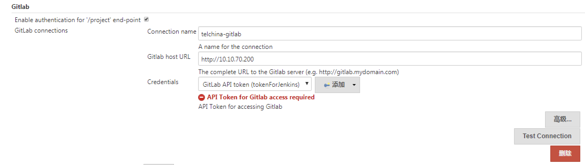
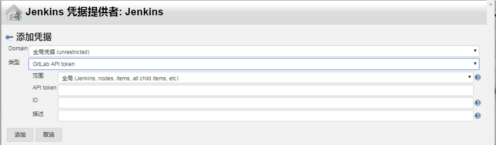
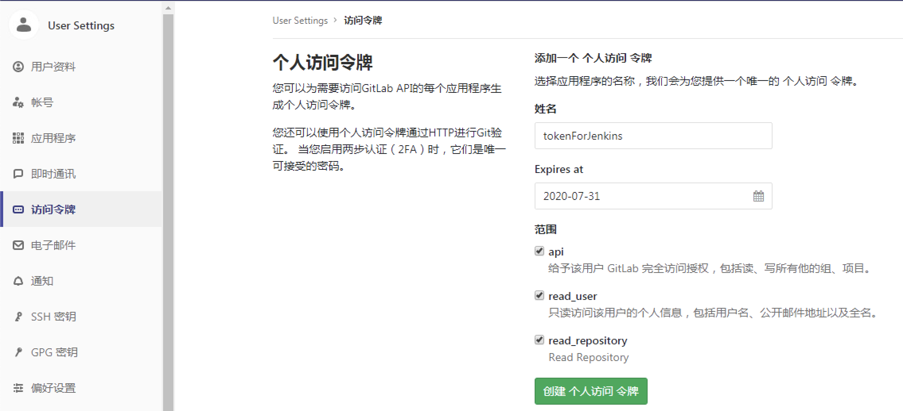
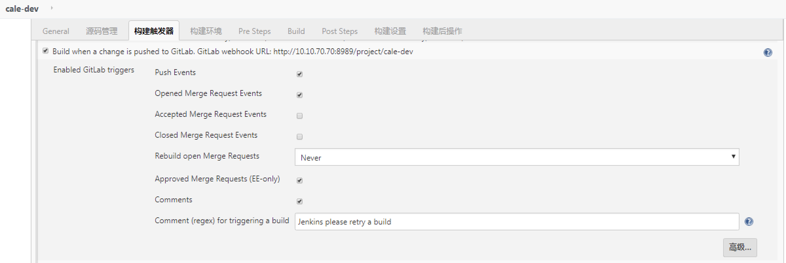
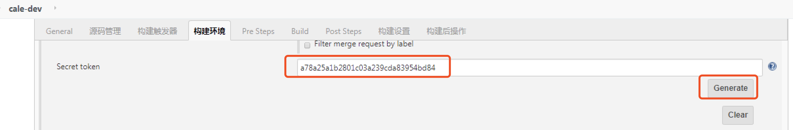
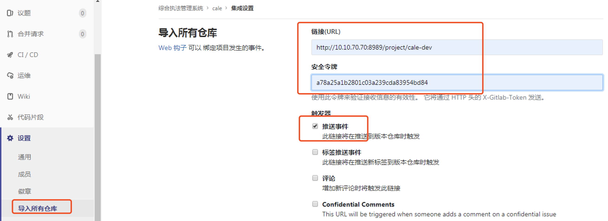
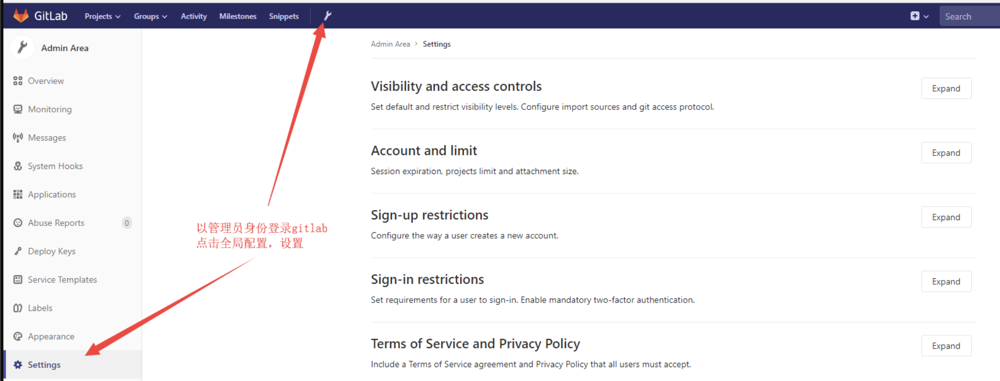
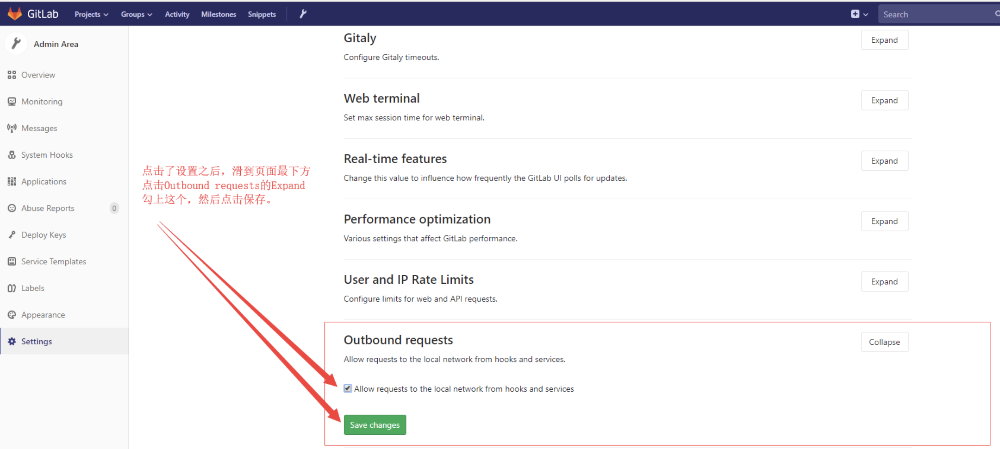

## Jenkins中安装Gitlab Plugin

不再多说，请见我之前的文档[打造自己的jenkins docker镜像](./打造自己的jenkins docker镜像.md)

## Jenkins中配置Gitlab地址

系统管理->系统配置

点击“添加”，添加凭据：

上图中的API token需要在Gitlab中提前生成好，方法如下：

## Jenkins中的项目启用Gitlab webhook

点击“高级”，然后点击“Generate”生成token，如下：

## Gitlab中创建webhook

如果有报错：Urlis blocked: Requests to the local network are not allowed，这是因为新版的gitlab为了安全默认禁止了本地局域网地址调用web hook，需要使用admin账号登录gitlab，进行如下设置：

