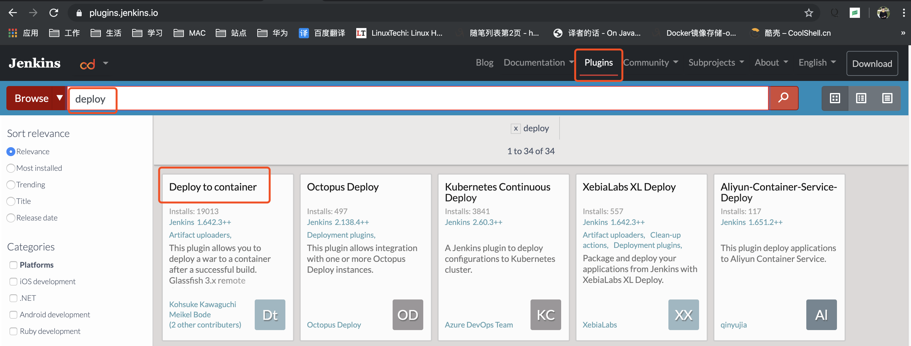
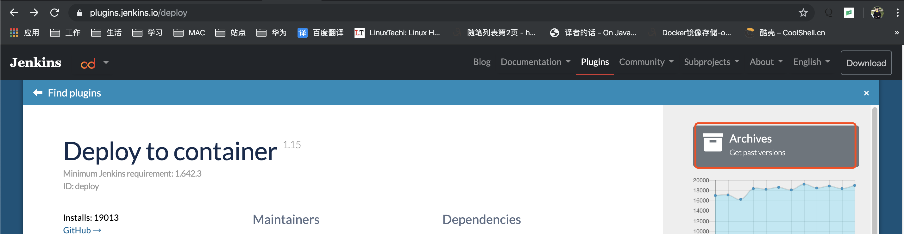
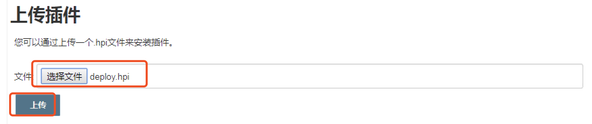
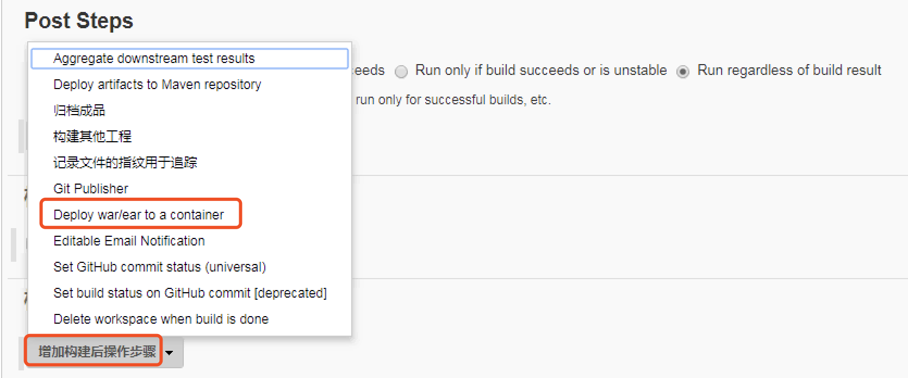
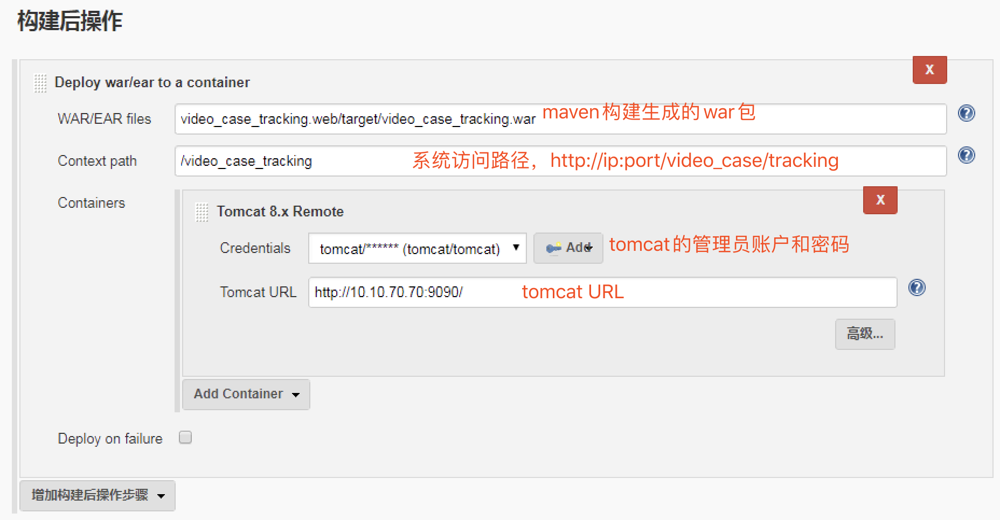
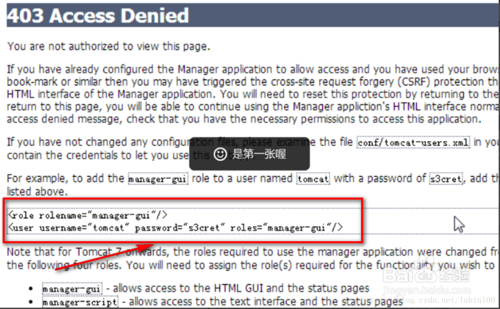
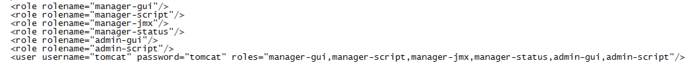

### Jenkins集成Deploy插件

登录jenkins官网，下载Deploy to container插件如下：





下载后，将会得到deploy.hpi文件。

登录我们自己的jenkins服务，转到“系统管理”->“插件管理”，切到“高级”选项卡，上传插件：



上传成功后，会自动安装插件。

### 在Jenkins中创建工程

前面的步骤和其他项目没什么区别，关键是以下步骤：





### 开启Tomcat管理员用户

默认tomcat的管理员用户是不可用的，你可以尝试访问http://ip:port/manager，将提示如下：



以Tomcat8为例说明开启方法如下：

1. 修改tomcat-user.xml如下：



2. 需要修改webapp文件夹manager和host-mananger两个项目下META-INF中的context.xml文件，注释掉以下内容：

```xml
 <Valve className="org.apache.catalina.valves.RemoteAddrValve"
         allow="127\.\d+\.\d+\.\d+|::1|0:0:0:0:0:0:0:1" />
```

3. 重启tomcat