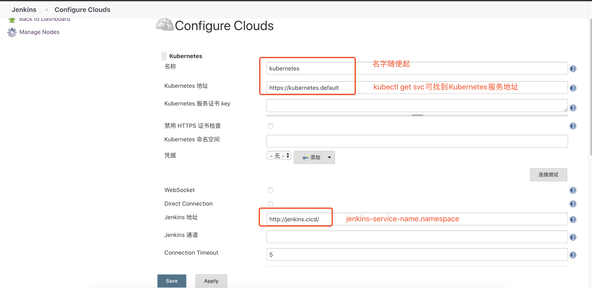

## 目标

1. 使用Kubernetes部署master-slave架构的jenkins集群
2. 使用jenkins将应用部署到Kubernetes集群上

>　Jenkins是大名鼎鼎的DevOps自动化平台，由于其开源，社区支持力度大，插件生态丰富等优势，成为持续开发，持续集成，持续测试和持续交付领域的王者。它的口号是"Build Great Things at Any Scale"，翻译成中文是"构建伟大，无所不能"。
>
>　　Kubernetes则是DevOps领域的"当红炸子鸡"，近年来热度持续上升中。作为一款开源容器编排工具，Kubernetes基于一整套工具链，实现了对云平台上容器化应用的自动化规划，部署，伸缩，升级和维护。
>
>　　一个是"老当益壮"的王者，一个是"风头正劲"的网红，Jenkins与Kubernetes相遇，会擦出什么样的火花？
>
>　　从本质上来说，Jenkins与Kubernetes有着泾渭分明的应用场景。前者主要用在软件开发和测试阶段，后者主要用在软件部署和运维阶段。从表面上看，它们之间似乎是互不相关的。
>
>　　然而就我看来，在容器化和云原生越来越流行的时代背景下，Kubernetes的出现，为Jenkins更好地承担自动化平台的角色提供了新的机会。与Kubernetes相结合，Jenkins将变得更加强大。这个观点，可以从两方面理解。
>
>　　一方面，Jenkins也是一种应用，并且也支持容器化部署。因此，**我们可以用Kubernetes来部署容器化的Jenkins，实现Jenkins的自动安装，扩容和维护**。
>
>　　另一方面，**Kunernetes集群可以作为一种新型的Jenkins slave，从而更方便地执行针对各种各样的容器化服务和应用的自动化任务。**
>
>　　这里，需要回顾下Jenkins的工作原理。Jenkins是主从(master-slave)架构的，由Jenkins master和Jenkins salve组成。Jenkins是为完成各种各样的自动化任务而存在的。在这个过程中，Jenkins master负责自动化任务的调度，而Jenkins slave负责自动化任务的执行。
>
>　　在微服务场景下，许多应用是运行在Kubernetes集群之中的。要对这些微服务进行接口，功能，性能等方面的持续集成和持续测试，通常就需要构建基于Kubernetes的运行环境，并基于这种环境来进行各种集成和测试。
>
>　　传统的Jenkins slave，例如VM，Docker等，无法满足这种需求。基于Kubernetes集群的Jenkins slave，才是更好的选择。
>
>　　以上就是Kubernetes的出现为Jenkins带来的两方面机会。那么，如何抓住这两方面机会呢？
>
>　　基于Kubernetes来部署Jenkins，与部署其他容器化应用的思路是一致的。需要创建Kubernetes集群，准备应用的容器镜像，并定义描述服务内容以及配置信息的模版文件，然后基于Kubernetes提供的命令，一键部署即可。
>
>　　基于Kubernetes构建新型Jenkins slave，并与Jenkins master集成，则需要依赖于Jenkins的Kubernetes插件。这个插件能够帮助建立Jenkins master与Kubernetes 集群之间的链路，并基于Jenkins任务定义的模板文件，在每次构建任务时，自动在Kubernetes集群上创建基于容器的Pod，然后执行预定义的任务脚本，执行完毕后自动销毁Pod。
>
>　　这样不仅能够实现Kubernetes自动化任务的执行，还有一些其他好处。例如，只在需要执行任务时才创建slave，这种动态slave机制大大提高了云平台资源的利用率；基于Kubernetes动态扩容技术，能够支撑各种大规模和高频率Jenkins持续集成和持续测试的场景。
>
>　　总而言之，**借助Kubernetes的能力，Jenkins自身的部署和Jenkins自动化任务的执行这两方面都可以做得更好**。个人相信，将Jenkins部署在Kubernetes集群中，并基于Kubernetes集群动态创建容器化环境来执行各种各样的自动化任务，在持续集成和DevOps领域将变得越来越普遍。

## 参考

jenkins的Kubernetes插件：

https://plugins.jenkins.io/kubernetes/

https://github.com/jenkinsci/kubernetes-plugin

https://blog.csdn.net/nklinsirui/article/details/90403311  网友的一篇文章，讲的不错

https://blog.csdn.net/aixiaoyang168/article/details/79767649

## 使用Kubernetes安装Jenkins

### 制作Jenkins Master镜像

```dockerfile
FROM 10.10.50.204:5000/jenkins/jenkins:latest

MAINTAINER xucunliang@telchina.net

LABEL Description="This is an extend image base from jenkins/jenkins which install plugins of git、pipeline、docker、Kubernetes and others"

COPY plugins.txt /usr/share/jenkins/ref/plugins.txt

ENV JENKINS_UC https://mirrors.tuna.tsinghua.edu.cn/jenkins
ENV JENKINS_UC_DOWNLOAD $JENKINS_UC

RUN /usr/local/bin/install-plugins.sh < /usr/share/jenkins/ref/plugins.txt
```

该镜像安装了如下插件：

```sh
git:latest
subversion:latest
locale:latest
localization-zh-cn:latest
workflow-aggregator:latest
docker-plugin:latest
docker-workflow:latest
kubernetes:latest
```

### 安装Jenkins Master

```sh
$ kubectl apply -f https://github.com/jenkinsci/kubernetes-plugin/tree/master/src/main/kubernetes/service-account.yml
$ kubectl apply -f https://github.com/jenkinsci/kubernetes-plugin/tree/master/src/main/kubernetes/jenkins.yml
## 最好提前下载两个yaml文件，根据自己的Kubernetes环境，进行配置的修改，例如：
1. 增加Namespace
2. 修改为自己的镜像地址及名称
3. 修改为自己的StorageClass
4. 修改Ingress地址
```

### 访问Jenkins并进行配置

**访问方法：**

1. 配置本地hosts，增加一行：Kubernetes任意一个节点的IP  Ingress地址
2. 访问：https://Ingress-host/path，Ingress-host和path的值，请参见jenkins.yaml最后部分。

**为Jenkins添加一个Kubernetes云：**

系统管理->系统配置，滚动至页面最下方Cloud项，点击链接：The cloud configuration has moved to a separate configuration page，在打开的页面中进行如下配置：



**Pod Retention**选择Never，Jenkins构建结束后会**销毁Pod**。

如果Jenkins Master不是部署在以上添加的Kubernetes上，则以上页面的配置方式比较麻烦，请参考：https://blog.csdn.net/nklinsirui/article/details/90403311