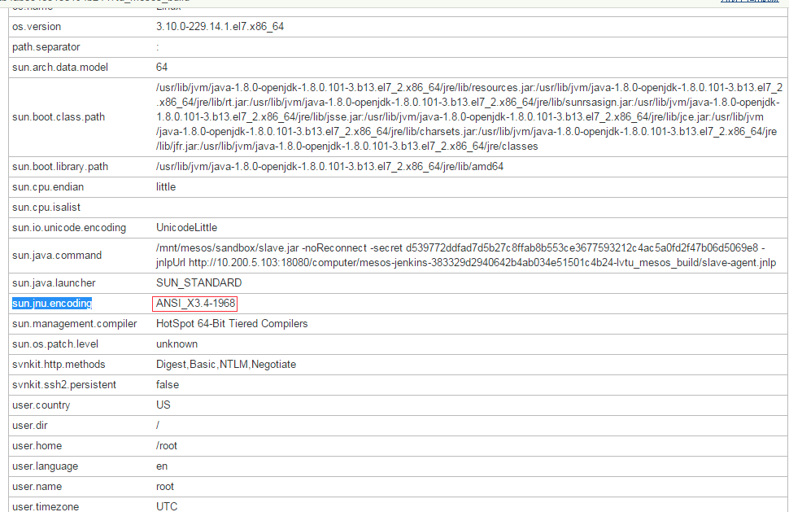
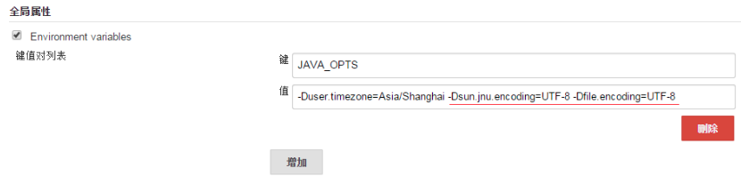

这两天在用Jenkins构建maven编译任务时，发现有编码的报错：

unmappable character for encoding ANSI_X3.4-1968

我使用的Jenkins On Mesos框架，Jenkins Master和Jenkins Slave都是用Docker运行的。当时第一反应就是设置Docker容器的系统环境变量LANG为UTF-8，但是并没有解决问题。

后来查看Jenkins节点的系统信息发现： 

上面的系统信息里面显示的sun.jnu.encoding ANSI_X3.4-1968与报错中的编码方式一致，推测应该是需要指定java运行参数来解决这个问题：file.encoding和sun.jnu.encoding。于是，我在制作Docker镜像的Dockerfile中加了一段，指定UTF-8编码：

ENV JAVA_OPTS -Dsun.jnu.encoding=UTF-8 -Dfile.encoding=UTF-8

Jenkins Master和Jenkins Slave的Docker容器里环境变量和java参数都设置了，但是问题还没有解决，感觉很奇怪。后来，无意中，在Jenkins的【系统管理】-【系统设置】里面发现有个【全局属性】，这里可以设置Jenkins节点共用的环境变量。于是，我在这里又设置了一遍JAVA_OPTS： 

当我再次构建maven编译任务的时候，报错已经没有了。问题解决！ 

（让我有些疑惑的是，为什么前面设置的不行呢？）