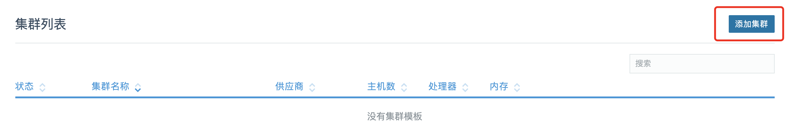
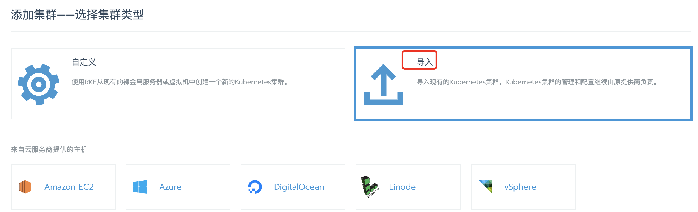
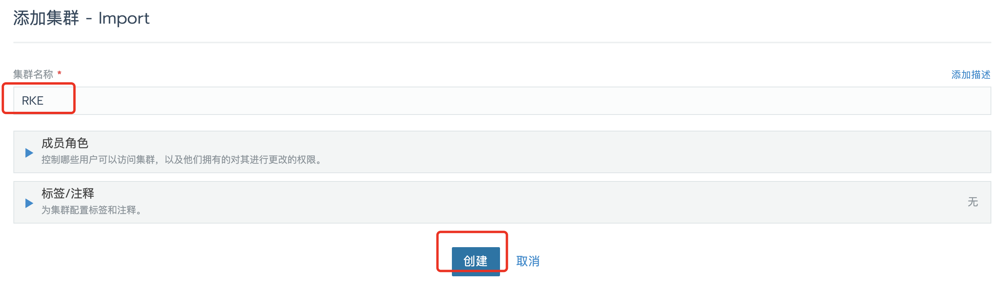
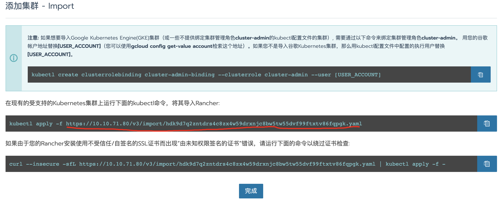
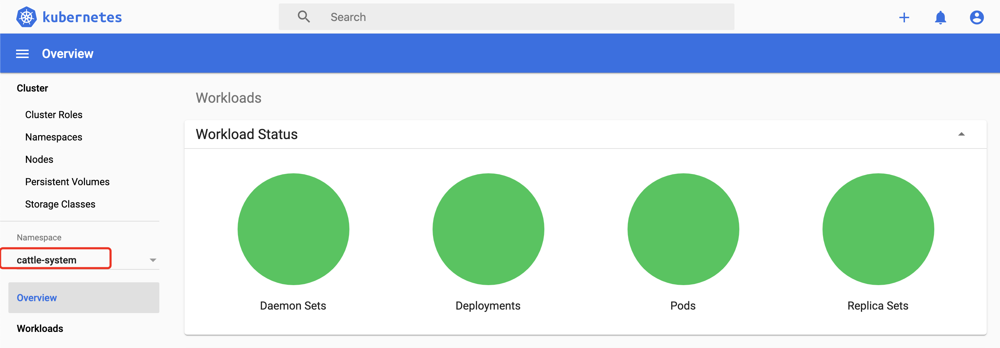
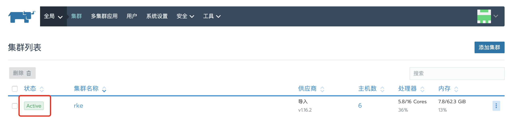

Rancher Kubernetes Engine(RKE)是一款轻量级Kubernetes安装程序，支持在裸机和虚拟化服务器上安装Kubernetes。RKE解决了Kubernettes社区中的一个常见问题，比如:安装复杂性。RKE支持多种平台运行，比如MacOS、linux、windows。

## 必要条件

### 操作系统

1. 推荐ubuntu16.04

2. 必须安装docker，最好支持非root用户操作docker, 命令：`usermod -aG docker <user_name>`

3. 禁用swap，命令：`swapoff -a`

4. 加载必须的内核模块

   内核检测脚本：

   ```sh
   module_list='br_netfilter ip6_udp_tunnel ip_set ip_set_hash_ip ip_set_hash_net iptable_filter iptable_nat iptable_mangle iptable_raw nf_conntrack_netlink nf_conntrack nf_conntrack_ipv4 nf_defrag_ipv4 nf_nat nf_nat_ipv4 nf_nat_masquerade_ipv4 nfnetlink udp_tunnel veth vxlan x_tables xt_addrtype xt_conntrack xt_comment xt_mark xt_multiport xt_nat xt_recent xt_set xt_statistic xt_tcpudp'
   
   for module in $module_list;
   do
         if ! lsmod | grep -q $module; then
               echo "module $module is not present"
         fi
   done;
   ```

   临时开启内核：`modprobe <module_name>`

   将缺少的内核设置为开机自启动：

   ```sh
   ubuntu@rke-master01:~$ cat /etc/modules-load.d/modules.conf
   # /etc/modules: kernel modules to load at boot time.
    ip6_udp_tunnel
    ip_set
    ...
   ```

5. sysctl设置

   ```bash
   net.bridge.bridge-nf-call-iptables=1
   ```

6. 加入操作系统为Redhat或Oracle Linux，所需的额外配置请见官网。

### 软件

1. 注意Docker版本与Kubernetes版本的兼容关系
2. OpenSSH版本必须在7.0以上，`ssh -V`

### 端口

1. master节点与worker节点需要开放的端口不同，具体所需的端口，请见官网。
2. 最好关闭防火墙，如果不关闭，需要进行端口开放设置，设置方法rancher官网有介绍。

### SSH配置


## 准备服务器

互信

时间同步，否则etcd状态可能会有问题

修改镜像库地址


kubectl安装

https://kubernetes.io/docs/tasks/tools/install-kubectl/

https://storage.googleapis.com/kubernetes-release/release/v1.17.3/bin/linux/amd64/kubectl

## Rancher2安装

### 快速安装单节点

```sh
docker run -d --restart=unless-stopped \
-p 80:80 -p 443:443 \
-v /home/ubuntu/rancher-data:/var/lib/rancher/ \
-v /var/log/rancher/auditlog:/var/log/auditlog \
-e AUDIT_LEVEL=3 \
-e CATTLE_SYSTEM_CATALOG=bundled \
#-v /etc/<CERT_DIRECTORY>/tls.crt:/etc/rancher/ssl/cert.pem \
#-v /etc/<CERT_DIRECTORY>/tls.key:/etc/rancher/ssl/key.pem \
#-v /etc/<CERT_DIRECTORY>/cacerts.pem:/etc/rancher/ssl/cacerts.pem \
rancher/rancher:stable (或者rancher/rancher:latest)
```

### 导入现有Kubernetes集群









下载以上的yaml文件，查看文件使用到中的image，手工pull下来，并上传到公司docker仓库私服，并修改yaml中docker仓库地址，使用公司私服。然后在要导入的kubernetes集群上执行：

```sh
$ kubectl apply -f imp.yaml
clusterrole.rbac.authorization.k8s.io/proxy-clusterrole-kubeapiserver unchanged
clusterrolebinding.rbac.authorization.k8s.io/proxy-role-binding-kubernetes-master unchanged
namespace/cattle-system created
serviceaccount/cattle created
clusterrolebinding.rbac.authorization.k8s.io/cattle-admin-binding unchanged
secret/cattle-credentials-7d3c6e3 created
clusterrole.rbac.authorization.k8s.io/cattle-admin unchanged
deployment.apps/cattle-cluster-agent created
daemonset.apps/cattle-node-agent created
```

然后通过kubernetes dashboard查看cattle-system namespace所有负载都是正常的：



然后，再回到rancher界面，发现添加的集群变为Active状态：



