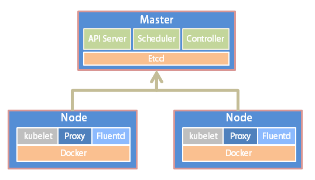
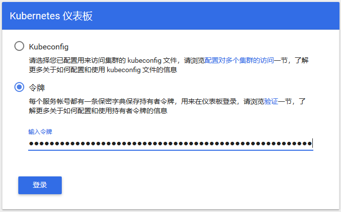
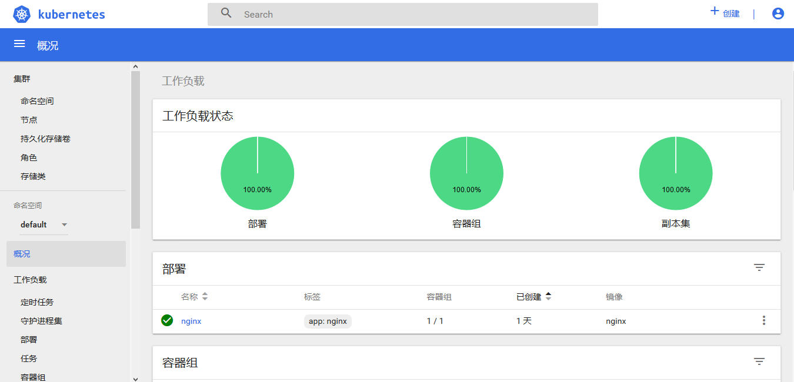

## kubeadm安装Kubernetes 1.14最佳实践_Kubernetes中文社区

前言

Kubernetes作为容器编排工具，简化容器管理，提升工作效率而颇受青睐。很多新手部署Kubernetes由于“科学上网”问题举步维艰，本文以实战经验详解kubeadm不用“科学上网”部署Kubernetes的最简方法。

一、Kubernetes简介

Kubernetes（简称K8S）是开源的容器集群管理系统，可以实现容器集群的自动化部署、自动扩缩容、维护等功能。它既是一款容器编排工具，也是全新的基于容器技术的分布式架构领先方案。在Docker技术的基础上，为容器化的应用提供部署运行、资源调度、服务发现和动态伸缩等功能，提高了大规模容器集群管理的便捷性。

K8S集群中有管理节点与工作节点两种类型。管理节点主要负责K8S集群管理，集群中各节点间的信息交互、任务调度，还负责容器、Pod、NameSpaces、PV等生命周期的管理。工作节点主要为容器和Pod提供计算资源，Pod及容器全部运行在工作节点上，工作节点通过kubelet服务与管理节点通信以管理容器的生命周期，并与集群其他节点进行通信。



二、环境准备

Kubernetes支持在物理服务器或虚拟机中运行，本次使用虚拟机准备测试环境，硬件配置信息如表所示：

| IP地址      | 节点角色 | CPU  | Memory | Hostname | 磁盘     |
| ----------- | -------- | ---- | ------ | -------- | -------- |
| 10.10.10.10 | master   | >=2c | >=2G   | master   | sda、sdb |
| 10.10.10.11 | worker   | >=2c | >=2G   | node1    | sda、sdb |
| 10.10.10.12 | worker   | >=2c | >=2G   | node2    | sda、sdb |

注：在所有节点上进行如下操作

1.设置主机名hostname，管理节点设置主机名为 master 。

```
hostnamectl set-hostname master
```

需要设置其他主机名称时，可将 master 替换为正确的主机名node1、node2即可。

2.编辑 /etc/hosts 文件，添加域名解析。

```
cat <<EOF >>/etc/hosts

10.10.10.10 master

10.10.10.11 node1

10.10.10.12 node2

EOF
```

3.关闭防火墙、selinux和swap。

```
systemctl stop firewalld

systemctl disable firewalld

setenforce 0

sed -i "s/^SELINUX=enforcing/SELINUX=disabled/g" /etc/selinux/config

swapoff -a

sed -i 's/.*swap.*/#&/' /etc/fstab
```

4.配置内核参数，将桥接的IPv4流量传递到iptables的链

```
cat > /etc/sysctl.d/k8s.conf <<EOF

net.bridge.bridge-nf-call-ip6tables = 1

net.bridge.bridge-nf-call-iptables = 1

EOF

sysctl --system
```

5.配置国内yum源

```
yum install -y wget

mkdir /etc/yum.repos.d/bak && mv /etc/yum.repos.d/*.repo /etc/yum.repos.d/bak

wget -O /etc/yum.repos.d/CentOS-Base.repo http://mirrors.cloud.tencent.com/repo/centos7_base.repo

wget -O /etc/yum.repos.d/epel.repo http://mirrors.cloud.tencent.com/repo/epel-7.repo

yum clean all && yum makecache
```

配置国内Kubernetes源

```
cat <<EOF > /etc/yum.repos.d/kubernetes.repo

[kubernetes]

name=Kubernetes

baseurl=https://mirrors.aliyun.com/kubernetes/yum/repos/kubernetes-el7-x86_64/

enabled=1

gpgcheck=1

repo_gpgcheck=1

gpgkey=https://mirrors.aliyun.com/kubernetes/yum/doc/yum-key.gpg https://mirrors.aliyun.com/kubernetes/yum/doc/rpm-package-key.gpg

EOF
```

配置 docker 源

```
wget https://mirrors.aliyun.com/docker-ce/linux/centos/docker-ce.repo -O /etc/yum.repos.d/docker-ce.repo
```

三、软件安装

注：在所有节点上进行如下操作

1.安装docker

```
yum install -y docker-ce-18.06.1.ce-3.el7

systemctl enable docker && systemctl start docker

docker –version

Docker version 18.06.1-ce, build e68fc7a
```

docker服务为容器运行提供计算资源，是所有容器运行的基本平台。

2.安装kubeadm、kubelet、kubectl

```
yum install -y kubelet kubeadm kubectl

systemctl enable kubelet
```

Kubelet负责与其他节点集群通信，并进行本节点Pod和容器生命周期的管理。[Kubeadm](https://www.kubernetes.org.cn/tags/kubeadm)是Kubernetes的自动化部署工具，降低了部署难度，提高效率。Kubectl是Kubernetes集群管理工具。

四、部署master 节点

注：在master节点上进行如下操作

1.在master进行Kubernetes集群初始化。

```
kubeadm init --kubernetes-version=1.14.2 \

--apiserver-advertise-address=10.10.10.10 \

--image-repository registry.aliyuncs.com/google_containers \

--service-cidr=10.1.0.0/16 \

--pod-network-cidr=10.244.0.0/16
```

定义POD的网段为: 10.244.0.0/16， api server地址就是master本机IP地址。

这一步很关键，由于kubeadm 默认从官网k8s.grc.io下载所需镜像，国内无法访问，因此需要通过–image-repository指定阿里云镜像仓库地址，很多新手初次部署都卡在此环节无法进行后续配置。

集群初始化成功后返回如下信息：

记录生成的最后部分内容，此内容需要在其它节点加入Kubernetes集群时执行。

```
kubeadm join 10.10.10.10:6443 --token kekvgu.nw1n76h84f4camj6 \

--discovery-token-ca-cert-hash sha256:4ee74205227c78ca62f2d641635afa4d50e6634acfaa8291f28582c7e3b0e30e
```

2.配置kubectl工具

```
mkdir -p /root/.kube

cp /etc/kubernetes/admin.conf /root/.kube/config

kubectl get nodes

kubectl get cs
```

3.部署flannel网络

```
kubectl apply -f https://raw.githubusercontent.com/coreos/flannel/a70459be0084506e4ec919aa1c114638878db11b/Documentation/kube-flannel.yml
```

五、部署node节点

注：在所有node节点上进行如下操作

执行如下命令，使所有node节点加入Kubernetes集群

```
kubeadm join 10.10.10.10:6443 --token kekvgu.nw1n76h84f4camj6 \

--discovery-token-ca-cert-hash sha256:4ee74205227c78ca62f2d641635afa4d50e6634acfaa8291f28582c7e3b0e30e
```

此命令为集群初始化时（kubeadm init）返回结果中的内容。

六、集群状态检测

注：在master节点上进行如下操作

1.在master节点输入命令检查集群状态，返回如下结果则集群状态正常。

```
kubectl get nodes

NAME     STATUS   ROLES    AGE     VERSION

master   Ready    master   26m     v1.14.2

node1    Ready    <none>   3m10s   v1.14.2

node2    Ready    <none>   3m      v1.14.2
```

重点查看STATUS内容为Ready时，则说明集群状态正常。

2.创建Pod以验证集群是否正常。

```
kubectl create deployment nginx --image=nginx
kubectl expose deployment nginx --port=80 --type=NodePort
kubectl get pod,svc
```

七、部署Dashboard

注：在master节点上进行如下操作

1.创建Dashboard的yaml文件

```
wget https://raw.githubusercontent.com/kubernetes/dashboard/v1.10.1/src/deploy/recommended/kubernetes-dashboard.yaml
sed -i 's/k8s.gcr.io/loveone/g' kubernetes-dashboard.yaml

sed -i '/targetPort:/a\ \ \ \ \ \ nodePort: 30001\n\ \ type: NodePort' kubernetes-dashboard.yaml
```

2.部署Dashboard

```
kubectl create -f kubernetes-dashboard.yaml
```

3.创建完成后，检查相关服务运行状态

```
kubectl get deployment kubernetes-dashboard -n kube-system

kubectl get pods -n kube-system -o wide

kubectl get services -n kube-system

netstat -ntlp|grep 30001
```

4.在Firefox浏览器输入Dashboard访问地址：https://10.10.10.10:30001

5.查看访问Dashboard的认证令牌

```
kubectl create serviceaccount  dashboard-admin -n kube-system
kubectl create clusterrolebinding  dashboard-admin --clusterrole=cluster-admin --serviceaccount=kube-system:dashboard-admin
kubectl describe secrets -n kube-system $(kubectl -n kube-system get secret | awk '/dashboard-admin/{print $1}')
```

6.使用输出的token登录Dashboard。



认证通过后，登录Dashboard首页如图

