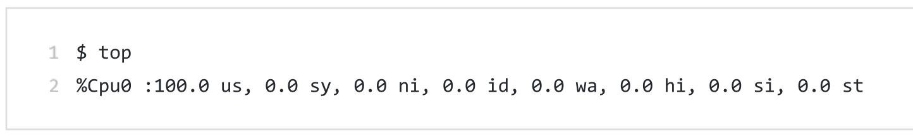
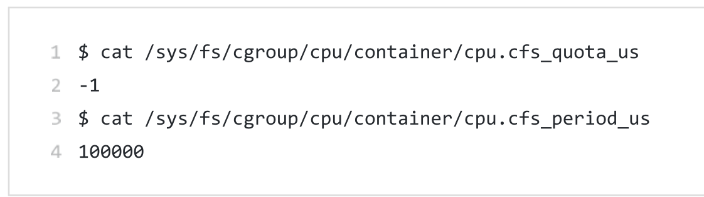
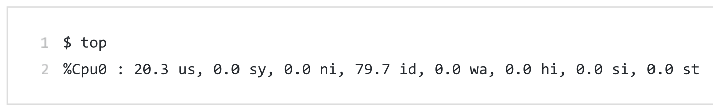
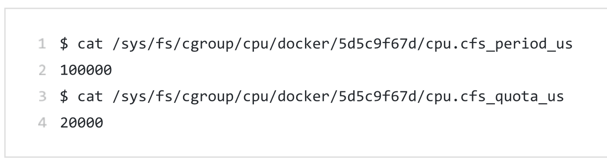

### 容器与虚拟机的”隔离“对比：


#### 正确的对比图：


不应该把 Docker Engine 放在跟 Hypervisor 相同的位置，因为它们并不像 Hypervisor 那样对应用进程的隔离环境负责，也**不会创建任何实体的“容器”**，**真正对隔离环境负责的是宿主机操作系统本身**，所以，在这个对比图里，我们应该把 Docker 画在**跟应用同级别并且靠边的位置**。用户运行在容器里的应用进程，跟宿主机上的其他进程一样，都**由宿主机操作系统统一管理**，只不过这些被隔离的进程拥有额外设置过的 Namespace 参数。而 Docker 项目在这里扮演的角色，更多的是**旁路式的辅助和管理工作**。


#### 与虚拟机相比，容器的优缺点：

* 虚拟机必须运行一个完整的 Guest OS 才能执行用户的应用进程。不可避免地带来了额外的资源消耗和占用。根据实验，一个运行着 CentOS 的 KVM 虚拟机启动后，在不做优化的情况下，**虚拟机自己就需要占用 100~200 MB 内存**。
* 用户应用运行在虚拟机里面，它对宿主机操作系统的调用就不可避免地要经过**虚拟化软件的拦截和处理**，这本身又是一层性能损耗，尤其对计算资源、网络和磁盘 I/O 的损耗非常大。
* **敏捷和高性能**是容器相较于虚拟机最大的优势，也是它能够在 PaaS 这种更细粒度的资源管理平台上大行其道的重要原因。
* 容器最主要的问题是：**共享宿主机内核，隔离得不彻底**。会带来如下问题：
  * 在 Windows 宿主机上运行 Linux 容器，或者在低版本的 Linux 宿主机上运行高版本的Linux 容器，都是行不通的。
  
  * **很多资源和对象是不能Namespace 化的**，最典型的例子就是：**时间**。如果你的容器中的程序使用 settimeofday(2) 系统调用修改了时间，整个宿主机的时间都会被随之修改。在容器里部署应用的时候，“**什么能做，什么不能做**”，就是用户必须考虑的一个问题。
  
  * **安全性不如虚拟机**。基于共享宿主机内核的事实，容器给应用暴露出来的攻击面是相当大的，应用“**越狱**”的难度自然也比虚拟机低得多。
  
    

### 容器的”限制“问题


#### 已经通过namespace进行了进程隔离，为什么还需要限制：

虽然容器内的第1号进程在“障眼法”的干扰下只能看到容器里的情况，但是宿主机上，它作为第100号进程与其他所有进程之间依然是平等的竞争关系。这就意味着，虽然第100号进程表面上被隔离了起来，但是它所能够使用到的资源(比如CPU、内存)，却是可以随时被宿主机上的其他进程(或者其他容器)占用的。当然，这个100号进程自己也可能把所有资源吃光。这些情况，显然都不是一个“沙盒”应该表现出来的合理行为。**一句话：与其他进程资源竞争。**


#### 资源限制的方法：

**Linux Cgroups**的全称是**Linux Control Group**。它最主要的作用，就是限制一个进程组能够使用的资源上限，包括**CPU、内存、磁盘、网络带宽**等等。此外, Cgroups 还能够对**进程进行优先级设置、审计，以及将进程挂起和恢复等操作**。
在Linux中, Cgroups给用户暴露出来的操作接口是文件系统，即它以文件和目录的方式组织在操作系统的**/sys/fs/cgroup**路径下。在Ubuntu 16.04 机器里,我可以用mount指令把它们展示出来，这条命令是:

```sh
$ mount -t cgroup
cpuset on /sys/fs/cgroup/cpuset type cgroup (rw, nosuid, nodev , noexec, relatime, cpuset)
cpu on /sys/fs/cgroup/cpu type cgroup (rw, nosuid, nodev , noexec , relat ime, cpu)
cpuacct on /sys/fs/cgroup/cpuacct type cgroup (rw, nosuid, nodev, noexec, relatime, cpuacct)
blkio on /sys/fs/cgroup/blkio type cgroup (rw, nosuid, nodev , noexec , relatime , blkio)
memory on /sys/fs/ cgroup/memory type cgroup (rw, nosuid, nodev, noexec, relatime , memory)
```

可以看到，在/sys/fs/cgroup下面有很多诸如cpuset、cpu、memory 这样的子目录，也叫子系统。这些都是我这台机器当前可以被Cgroups进行限制的资源种类。比如，对CPU子系统来说，我们可以看到如下几个配置文件：

```sh
ls /sys/fs/cgroup/cpu
cgroup.clone_children  cpuacct.stat          cpuacct.usage_percpu_sys   cpu.cfs_period_us  
cgroup.procs           cpuacct.usage         cpuacct.usage_percpu_user  cpu.cfs_quota_us             tasks
cgroup.sane_behavior   cpuacct.usage_all     cpuacct.usage_sys          cpu.shares         
cpuacct.usage_percpu  cpuacct.usage_user         cpu.stat     
```

如果熟悉Linux CPU管理的话,你就会在它的输出里注意到cfs_period 和cfs_quota 这样的关键词。这两个参数需要组合使用，可以用来限制进程在长度为cfs_period 的一段时间内，只能被分配到总量为cfs_quota的CPU时间。


#### 限制进程的CPU时间实例演示：

你需要在对应的子系统下面创建一个目录，比如，我们现在进入/sys/fs/cgroup/cpu目录下:

```sh
root@ubuntu:/sys/fs/cgroup/cpu$ mkdir container
root@ubuntu:/sys/fs/cgroup/cpu$ ls container/
cgroup.clone_children cpu.cfs_period_us cpu.rt_period_us cpu.shares notify_on_release
cgroup.procs cpu.cfs_quota_us cpu.rt_runtime_us cpu.stat tasks
```

这个目录就称为一个”控制组”。你会发现，操作系统会在你新创建的container目录下，自动生成该子系统对应的资源限制文件。
现在，我们在后台执行这样一条脚本:

```sh
$while : ; do : ; done &
[1] 226
```

显然，它执行了一个死循环，可以把计算机的CPU吃到100%，根据它的输出，我们可以看到进程号是226.

用top命令确认一下CPU有没有打满：



可以看到CPU已经100%了。

而此时，查看Container目录下的文件，看到CPU quota还没有任何限制（即-1），CPU period则是默认的100ms（100000us）：



接下来，我们通过修改这些文件来设置限制。

比如，向Container组里的cfs_quota文件写入20ms（20000us）：

```sh
$ echo 20000 > /sys/fs/cgroup/cpu/container/cpu.cfs_quota_us
```

这意味着在每100ms的CPU时间里，被该控制组限制的进程只能使用20ms的CPU时间，也就说这个进程只能使用到20%的CPU带宽。

接下来，我们把要限制的进程的PID写入tasks文件，上面的设置就会到该进程生效了：

```sh
$ echo 226 > /sys/fs/cgroup/cpu/container/tasks
```

我们可以用top命令查看一下：



可以看到CPU使用率立刻降到了20%。


#### 其他资源限制功能：

除CPU子系统外，Cgroups 的每一项子系统都有其独有的资源限制能力，比如:
●blkio, 为块设备设定I/O限制，一般用于磁盘等设备;
●cpuset, 为进程分配单独的CPU核和对应的内存节点;
●memory,为进程设定内存使用的限制。

#### docker是如何使用Cgroup的：

对于Docker等Linux容器项目来说，它们只需要在每个子系统下面，为每个容器创建一个控制组 (即创建一个新目录)，然后在启动容器进程之后，把这个进程的PID填写到对应控制组的tasks文件中就可以了。

而至于在这些控制组下面的资源文件里填上什么值，就靠用户执行docker run时的参数指定了，比如这样一条命令 : 

```sh
$ docker run -it --cpu-period=100000 --cpu-quota=20000 ubuntu /bin/bash
```

在启动这个容器后，我们可以通过查看Cgroups文件系统下，CPU子系统中，"docker" 这个控制组里的咨源限制文件的内容来确认.



### 容器是一个”单进程“模型

在一个容器中，你没办法同时运行两个不同的应用，除非你能事先找到一个公共的 **PID=1** 的程序来充当两个不同应用的父进程，这也是为什么很多人都会用 **systemd 或者 supervisord** 这样的软件来代替应用本身作为容器的启动进程。

但是，在后面分享**容器设计模式**时，我还会推荐其他更好的解决办法。这是因为容器本身的设计，就是希望**容器和应用能够同生命周期**，否则，一旦出现类似于“**容器是正常运行的，但是里面的应用早已经挂了**”的情况，编排系统处理起来就非常麻烦了。

### Cgroup的缺陷

Linux 下的 **/proc** 目录存储的是记录当前内核运行状态的一系列特殊文件，用户可以通过访问这些文件，查看系统以及当前正在运行的进程的信息，比如 CPU 使用情况、内存占用率等，这些文件也是 **top** 指令查看系统信息的主要数据来源。

但是，你如果在容器里执行 top 指令，就会发现，它显示的信息居然是**宿主机**的 CPU 和内存数据，而不是当前容器的数据。造成这个问题的原因就是，/proc 文件系统并不知道用户通过 Cgroups 给这个容器做了什么样的资源限制，即：/proc 文件系统不了解 Cgroups 限制的存在。