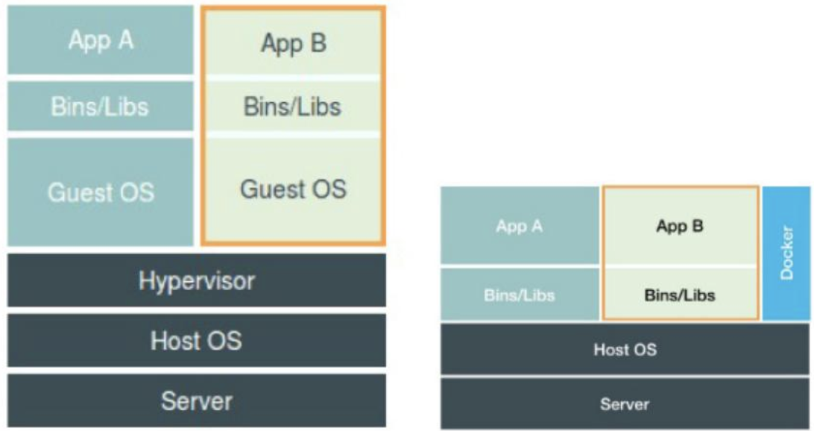

### 正确的虚拟机与Docker对比图：

不应该把 Docker Engine 放在跟 Hypervisor 相同的位置，因为它们并不像 Hypervisor 那样对应用进程的隔离环境负责，也**不会创建任何实体的“容器”**，**真正对隔离环境负责的是宿主机操作系统本身**，所以，在这个对比图里，我们应该把 Docker 画在**跟应用同级别并且靠边的位置**。用户运行在容器里的应用进程，跟宿主机上的其他进程一样，都**由宿主机操作系统统一管理**，只不过这些被隔离的进程拥有额外设置过的 Namespace 参数。而 Docker 项目在这里扮演的角色，更多的是**旁路式的辅助和管理工作**。

### 虚拟机与Docker对比：

* 虚拟机必须运行一个完整的 Guest OS 才能执行用户的应用进程。不可避免地带来了额外的资源消耗和占用。根据实验，一个运行着 CentOS 的 KVM 虚拟机启动后，在不做优化的情况下，**虚拟机自己就需要占用 100~200 MB 内存**。
* 用户应用运行在虚拟机里面，它对宿主机操作系统的调用就不可避免地要经过**虚拟化软件的拦截和处理**，这本身又是一层性能损耗，尤其对计算资源、网络和磁盘 I/O 的损耗非常大。
* **敏捷和高性能**是容器相较于虚拟机最大的优势，也是它能够在 PaaS 这种更细粒度的资源管理平台上大行其道的重要原因。
* 容器最主要的问题是：**隔离得不彻底**。在 Windows 宿主机上运行 Linux 容器，或者在低版本的 Linux 宿主机上运行高版本的Linux 容器，都是行不通的，因为容器**共享宿主机的内核**。