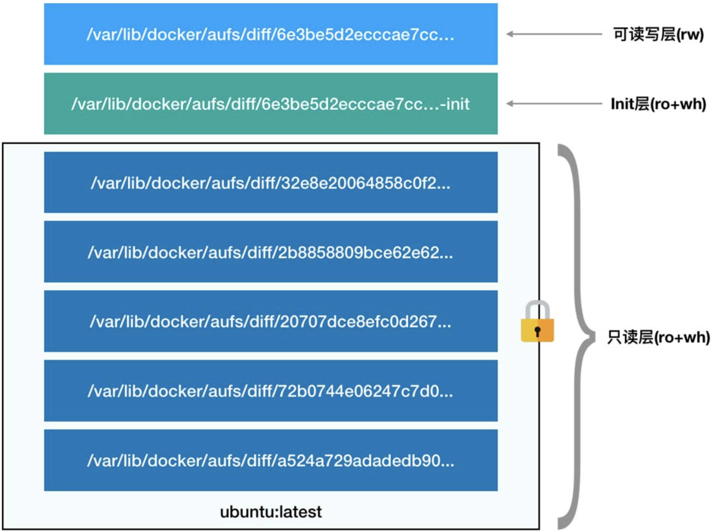

> 通过**Namespace**和**Cgroup**，进程就被围上了一圈看不见的**墙**，被装在了一个与世隔绝的房间里，但是你有没有思考过：这个房间四周虽然有了墙，但是如果容器进程低头一看地面，又是怎样一幅景象？
>
> 换句话说：**容器里的进程看到的文件系统又是什么样子的呢？**你可能会想到这是一个Mount Namespace的问题，容器里的进程理应看到一份完全独立的文件系统，事实真的如此吗？

## Mount Namespace

通过一个Linux C程序测试：

```c
#define _GNU_SOURCE
#include <sys/mount.h>
#include <sys/types.h>
#include <sys/wait.h>
#include <stdio.h>
#include <sched.h>
#include <signal.h>
#include <unistd.h>
 
/* 定义一个给 clone 用的栈，栈大小1M */
#define STACK_SIZE (1024 * 1024)
static char container_stack[STACK_SIZE];
 
char* const container_args[] = {
    "/bin/bash",
    NULL
};
 
int container_main(void* arg)
{
    printf("Container - inside the container!\n");
    /* 直接执行一个shell，以便我们观察这个进程空间里的资源是否被隔离了 */
    execv(container_args[0], container_args); 
    printf("Something's wrong!\n");
    return 1;
}
 
int main()
{
    printf("Parent - start a container!\n");
    /* 调用clone函数，其中传出一个函数，还有一个栈空间的（为什么传尾指针，因为栈是反着的） */
    int container_pid = clone(container_main, container_stack+STACK_SIZE, CLONE_NEWNS | SIGCHLD, NULL);
    /* 等待子进程结束 */
    waitpid(container_pid, NULL, 0);
    printf("Parent - container stopped!\n");
    return 0;
}
```

编译并运行：

```sh
root@telchina204:/tmp# gcc -o ns ns.c
root@telchina204:/tmp# ./ns 
Parent - start a container!
Container - inside the container!
root@telchina204:/tmp# ls /tmp
ns  ns.c
```

会看到/tmp目录下的内容与宿主机是完全一样的，也就是说：

> 即使开启了Mount Namespace，容器看到的文件系统也跟宿主机完全一样。

其实并不难理解，Mount Namespace修改的是容器进程对**Mount操作的认知**，**只有Mount操作发生之后，进程的视图才会改变，而在此之前，直接继承宿主机的各个挂载点。**

修改C程序便可以实现：

```c
int container_main(void* arg)
{
    printf("Container - inside the container!\n");
    // 重新挂载/tmp目录
    mount("none", "/tmp", "tmpfs", 0, "");
    /* 直接执行一个shell，以便我们观察这个进程空间里的资源是否被隔离了 */
    execv(container_args[0], container_args); 
    printf("Something's wrong!\n");
    return 1;
}
```

```sh
$ gcc -o ns ns.c                
$ ./ns 
Parent - start a container!
Container - inside the container!
$ ls /tmp
$                         ##/tmp变成了空目录
$ mount -l | grep tmpfs
none on /tmp type tmpfs (rw,relatime)           ##/tmp目录是以tmpfs单独挂载的
```

在宿主机上执行` mount -l | grep tmpfs`发现这个挂载并不存在，因为这个挂载操作只在容器进程的Mount Namespace中有效。

## chroot

> 我们不难想到，在容器进程启动之前，重新挂载它的整个根目录"/"，就能够实现容器拥有自己独立的文件系统，**chroot（change root file system）**命令就能帮你完成这个工作。

举例说明：

假设我们创建一个$HOME/test目录，将它作为一个bash进程的根目录，然后在这个bash进程中通过ls /命令查看根目录是否发生了变化，如下：

```sh
$ mkdir -p $HOME/test/{bin,lib,lib64}
$ mkdir -p $HOME/test/lib/x86_64-linux-gnu
$ cp -v /bin/{bash,ls} $HOME/test/bin        ##需要将bash、ls命令拷贝到新建的目录中，并按照Linux文件系统的规则放置，即：/bin/bash,/bin/ls

$ list="$(ldd /bin/{bash,ls} | egrep -o '/lib.*\.[0-9]')"  ##拷贝bash和ls命令所需的so文件
$ for i in $list; do cp -v $i $HOME/test$i; done

$ chroot $HOME/test /bin/bash               ##启动一个bash进程，并改变其根目录
bash-4.4# ls /                              ##仅有我们拷贝到$HOME/test目录下的内容,chroot生效了
bin  lib  lib64
bash-4.4# exit                              ##退出进程
exit
$ ls /                                      ##再次查看根目录，发现变回去了
boot etc lib mnt proc run tmp var bin dev home media opt root usr  
```

通过以上事例，我们很容易想到：只要为容器进程的根目录准备一个操作系统完整的文件系统，比如ubuntu或centos的iso，那么在容器里ls /就能看到一个操作系统完整的目录结构，这个为容器进程提供隔离后执行环境的文件系统，就是所谓的**容器镜像**。它有一个更专业的名字：**rootfs（根文件系统）**。

## 总结容器核心原理

Docker的核心原理是为待创建的用户进程：

1. 启用Linux Namespace配置
2. 设置指定的Cgroup参数
3. 切换进程的根目录（Change Root）

说明：

1. Docker在最后一步优先使用pivot_root系统调用，如果系统不支持，才会使用chroot。
2. rootfs只是一个操作系统的**躯壳**（文件、配置、目录），**不包括灵魂（内核）**，操作系统开机启动时才会加载指定版本的内核镜像。所有容器**共享宿主机内核**。如果您的应用需要配置内核参数、加载额外的内核模块，以及跟内核进行直接交互，你需要特别注意，这是牵一发而动全身的。这是相比于虚拟机的主要缺陷之一。

## 容器的一致性

rootfs里打包的不止是应用。而是整个操作系统的文件和目录，意味着，应用运行的所有依赖都被封装在了一起。这种深入到操作系统级别的运行环境一致性，打通了应用在本地开发和远端执行环境之间难以逾越的鸿沟。

## 镜像分层（layer）与联合文件系统（UnionFS）

> 比如，我用ubuntu的iso制作了一个rootfs，然后又在里面安装了Java环境，用来部署我的Java应用，我的同事在发布他的Java应用时，显然希望能够直接使用我安装过Java环境的rootfs，而不是重复这个流程。
>
> 一种解决方法是：我制作rootfs时，每做一步有意义的操作，就保存一个rootfs，这样其他同事就可以从我这里拿到他需要的rootfs。但是这个方法不具备推广性，因为一旦同事修改了这个rootfs，新旧两个rootfs就没有任何关系了，这样做的结果就是极度碎片化。

Docker在镜像的设计中引入了层（Layer）的概念，用户制作镜像的每一步操作，都会生成一个层，也就是一个增量rootfs。然后通过UnionFS与之前生成的层挂载到一起。

举例说明Union File System：

```sh
$ tree ./     
./
├── A
│   ├── a
│   └── x
└── B
    ├── b
    └── x

2 directories, 4 files
$ mkdir C
$ mount -t aufs -o dirs=./A:./B none ./C    ##将A和B目录合并挂载到C目录
$ tree ./C
./C
├── a
├── b
└── x
```

举例说明Docker容器的Layer：

```sh
$ docker ps
CONTAINER ID    IMAGE           COMMAND     CREATED         STATUS      PORTS      NAMES
43378553ebf9   ubuntu:16.04      "bash"   2 months ago    Up 2 months            ubuntu1604
$ docker inspect ubuntu:16.04 | more  ##镜像的Layer
"GraphDriver": {
            "Data": {
                "LowerDir": "/var/lib/docker/overlay2/959a...8b8e/diff:/var/lib/docker/overlay2/eb9e...2b70/diff:/var/lib/docker/overlay2/5059...da69/diff",
                "MergedDir": "/var/lib/docker/overlay2/fc05...8646/merged",
                "UpperDir": "/var/lib/docker/overlay2/fc05...8646/diff",
                "WorkDir": "/var/lib/docker/overlay2/fc05...8646/work"
            },
            "Name": "overlay2"
        }
$ docker inspect 43378553ebf9 | more    ##容器的Layer,可以看到正是镜像的Layer+init层+UpperDir(可读写层)。
...
"GraphDriver": {
            "Data": {
                "LowerDir": "/var/lib/docker/overlay2/00df...2b36-init/diff:/var/lib/docker/overlay2/fc05...8646/diff:/var/lib/docker/overlay2/959a...8b8e/diff:/var/lib/docker/overlay2/eb9e...2b70/diff:/var/lib/docker/overlay2/5059...da69/diff",
                "MergedDir": "/var/lib/docker/overlay2/00df...2b36/merged",
                "UpperDir": "/var/lib/docker/overlay2/00df...2b36/diff",
                "WorkDir": "/var/lib/docker/overlay2/00df...2b36/work"
            },
            "Name": "overlay2"
        }

```

我的Docker使用的联合文件系统是**overlay2**，而不是aufs，可以通过**docker info**命令查看。overlayfs通过三个目录：LowerDir、UpperDir、WorkDir实现，其中LowerDir可以是多个，WorkDir为工作基础目录，挂载后内容会被清空，且在使用过程中其内容用户不可见，最后联合挂载完成给用户呈现的统一视图称为MergedDir。overlay2的挂载命令：

```sh
$ mount -l | grep overlay2
...
overlay on /var/lib/docker/overlay2/00df...2b36/merged type overlay (rw,relatime,lowerdir=/var/lib/docker/overlay2/l/2MDYW7B2Q2STJEFJJIHFCUI3AH:/var/lib/docker/overlay2/l/YF2MI4BYHTB3CYYH3NKUKKR77E:/var/lib/docker/overlay2/l/FLLJULTZLP7RD3AVOXJQWMQVNU:/var/lib/docker/overlay2/l/DDCLAU46BN5SLGCX73I2UNE4S6:/var/lib/docker/overlay2/l/SDJ5HI3VJYIXQPAAKUEIDDQ2VY,upperdir=/var/lib/docker/overlay2/00df...2b36/diff,workdir=/var/lib/docker/overlay2/00df...2b36/work)
$ ll /var/lib/docker/overlay2/l/2MDYW7B2Q2STJEFJJIHFCUI3AH
lrwxrwxrwx 1 root root 77 Oct 23 07:19 /var/lib/docker/overlay2/l/2MDYW7B2Q2STJEFJJIHFCUI3AH -> ../00df...2b36-init/diff/
$ ll /var/lib/docker/overlay2/l/YF2MI4BYHTB3CYYH3NKUKKR77E
lrwxrwxrwx 1 root root 72 Oct 23 06:13 /var/lib/docker/overlay2/l/YF2MI4BYHTB3CYYH3NKUKKR77E -> ../fc05...8646/diff/
```

所以一个容器的rootfs结构如下所示：



**只读层：**

对应镜像的Layer，它们的挂载方式是**ro+wh(readonly+whiteout)**，这些层以增量的方式分别包含了Ubuntu操作系统的一部分，如下所示：

```sh
$ ls fc05...8646/diff/
run
$ ls 959a...8b8e/diff/
etc  sbin  usr  var
$ ls eb9e...2b70/diff/
var
$ ls 5059...da69/diff/
bin  boot  dev  etc  home  lib  lib64  media  mnt  opt  proc  root  run  sbin  srv  sys  tmp  usr  var
```

**可读写层：**

位于容器rootfs最上面的一层，挂载方式是rw，一旦在容器里做了写入操作，修改的内容就会出现在这个层中。

读：

- 如果文件在容器层（upperdir），直接读取文件；
- 如果文件不在容器层（upperdir），则从镜像层（lowerdir）读取；

修改：

- 首次写入： 如果在upperdir中不存在，把文件从lowdir拷贝到upperdir，然后对文件的副本进行操作。这也就是常常说的写时复制（**copy-on-write**）
- 删除文件和目录： 当在容器中删除文件时，在容器层（upperdir）创建**whiteout**文件，镜像层(lowerdir)的文件是不会被删除的，因为他们是只读的，但without文件会阻止他们显示，当目录在容器内被删除时，在容器层（upperdir）一个**不透明的目录**，这个和上面whiteout原理一样，阻止用户继续访问，即便镜像层仍然存在。 
- 修改完成后，你就可以使用**docker commit**命令把这些修改保存下来并生成一个新的镜像层，然后**push**到镜像仓库供他人使用。

注意事项

1. copy_up操作只发生在文件首次写入，以后都是只修改副本,
2. overlayfs只使用两层目录,相比于比AUFS，查找搜索都更快。
3. 容器层的文件删除只是一个“障眼法”，是靠whiteout文件将其遮挡,image层并没有删除，这也就是为什么使用**docker commit 提交保存的镜像会越来越大**，无论在容器层怎么删除数据，image层都不会改变。

**init层：**

一个以**-init**结尾的层，夹在只读层与读写层之间，专门用来存放/etc/hosts、/etc/resolv.conf等信息，这些文件本来应该属于只读层，但是用户往往需要在启动容器时写入指定的值，比如hostname，但是我们又**不希望执行docker commit时将这些信息保存到镜像中**。

```sh
$ tree /var/lib/docker/overlay2/00df...2b36-init/diff
/var/lib/docker/overlay2/00df...2b36-init/diff
├── dev
│   └── console
└── etc
    ├── hostname
    ├── hosts
    ├── mtab -> /proc/mounts
    └── resolv.conf
```

