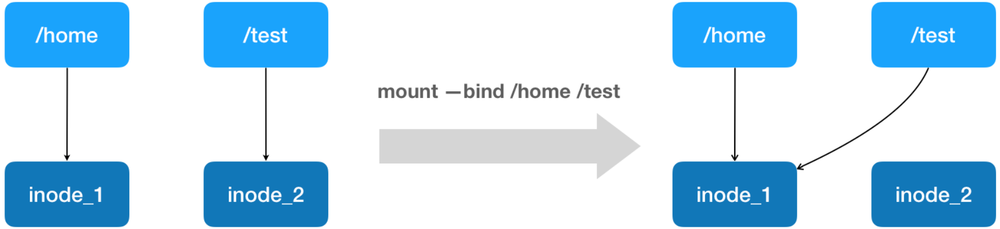
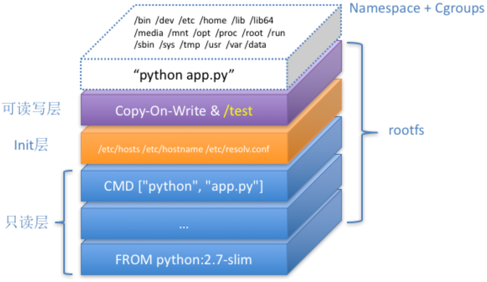

### 使用Docker部署Python编写的web应用

Python应用代码：

```python
from flask import Flask
import socket
import os
app = Flask(__name__)
@app.route('/') 
def hello():
    html = "<h3>Hello {name}!</h3><b>Hostname:</b> {hostname}<br/>"
    return html.format(name=os.getenv("NAME", "world"), hostname=socket.gethostname())
if __name__ == "__main__": 
    app.run(host='0.0.0.0', port=80)
```

将这个应用容器化的第一步：**制作容器镜像**

```dockerfile
FROM python:2.7-slim      #使用官方提供的Python开发镜像作为基础镜像，免去了安装Python环境的麻烦
WORKDIR /app              #将工作目录切换为/app，所以下面CMD中的app.py的完整路径其实是/app/app.py
ADD . /app                #将宿主机当前目录下的所有内容复制到容器内/app目录下
RUN pip install --trusted-host pypi.python.org -r requirements.txt #使用pip安装这个应用所需要的依赖，requirements.txt是依赖列表文件
EXPOSE 80                 #允许外界访问容器的80端口
ENV NAME World            #设置环境变量
CMD ["python", "app.py"]  #设置容器进程为:python app.py，即:这个Python应用的启动命令
```

还有一个叫作**ENTRYPOINT**的原语。它和CMD都是Docker容器进程启动所必需的参数，完整格式是:**“ENTRYPOINT CMD”**。在不指定ENTRYPOINT时，Docker提供一个隐含的ENTRYPOINT，即:**/bin/sh -c**。所以在我们这个例子里，完整进程是:**/bin/sh -c “python app.py”**，即 **CMD 的内容就是 ENTRYPOINT 的参数**。

应用部署过程如下：

```sh
$ ls                                   ##在宿主机的一个目录下准备好以下3个文件
Dockerfile app.py requirements.txt
$ docker build -t helloworld .         ##创建镜像，镜像名称定义为helloworld
$ docker images
REPOSITORY        TAG            IMAGE ID            CREATED             SIZE
helloworld       latest        bf0eb5c5447a        8 minutes ago         158MB
$ docker run -p 4000:80 helloworld    ##创建并运行一个容器，将宿主机的4000端口绑定到容器的80端口
$ docker ps
CONTAINER ID    IMAGE       COMMAND         CREATED       STATUS        PORTS      NAMES
fa45acca0857 helloworld "python app.py" 10 minutes ago  Up 10 minutes  0.0.0.0:4000->80/tcp  sharp_lichterman
$ curl http://localhost:4000          ##访问Web应用
<h3>Hello World!</h3><b>Hostname:</b> fa45acca0857<br/>
$ docker tag helloworld 10.10.50.204:5000/myrepo/helloworld:v1  ##为镜像起个完整的名字，10.10.50.204:5000是仓库地址，不写默认为DockerHub，myrepo是仓库名称，helloworld是镜像名称，v1是镜像版本。
$ docker push 10.10.50.204:5000/myrepo/helloworld:v1  ##分享
$ docker exec -it fa45acca0857 /bin/bash              ##进入到容器内，添加一个test.txt
root@fa45acca0857:/app# touch test.txt
root@fa45acca0857:/app# exit
exit
$ docker commit fa45acca0857 helloworld:v2            ##通过commit命令创建一个新版本镜像
sha256:26d690fc16ab557f7abfc8fa615bad55e53e4f27468249d17f7399ea150183d7
$ docker images
REPOSITORY      TAG       IMAGE ID         CREATED             SIZE
helloworld      v2      26d690fc16ab     4 seconds ago          158MB
helloworld     latest   bf0eb5c5447a     28 minutes ago         158MB
```

### docker exec是怎么做到进入容器的？

```sh
$ docker inspect --format '{{ .State.Pid }}' fa45acca0857  ##容器的进程ID
7429
$ ll /proc/7429/ns                                         ##容器的Namespace
lrwxrwxrwx 1 root root 0 Jan  2 01:07 cgroup -> 'cgroup:[4026531835]'
lrwxrwxrwx 1 root root 0 Jan  2 01:07 ipc -> 'ipc:[4026532292]'
lrwxrwxrwx 1 root root 0 Jan  2 01:07 mnt -> 'mnt:[4026532290]'
lrwxrwxrwx 1 root root 0 Jan  2 01:04 net -> 'net:[4026532295]'
lrwxrwxrwx 1 root root 0 Jan  2 01:07 pid -> 'pid:[4026532293]'
lrwxrwxrwx 1 root root 0 Jan  2 01:07 pid_for_children -> 'pid:[4026532293]'
lrwxrwxrwx 1 root root 0 Jan  2 01:07 user -> 'user:[4026531837]'
lrwxrwxrwx 1 root root 0 Jan  2 01:07 uts -> 'uts:[4026532291]'
```

一个进程可以**加入到某个进程已有的Namespace**中，从而达到**进入这个容器**的目的，这就是docker exec的实现原理，它依赖一个叫做**setns()**的Linux系统调用。

```c
#define _GNU_SOURCE
#include <fcntl.h>
#include <sched.h>
#include <unistd.h>
#include <stdlib.h>
#include <stdio.h>
#define errExit(msg) do { perror(msg); exit(EXIT_FAILURE);} while (0)
int main(int argc, char *argv[]) {
        int fd;
        fd = open(argv[1], O_RDONLY);     //argv[1]：要加入的Namespace文件路径
        if (setns(fd, 0) == -1) {
                errExit("setns");
        }
        execvp(argv[2], &argv[2]);        //argv[2]：要在Namespace中运行的命令
        errExit("execvp");
}
```

```sh
$ gcc -o set_ns set_ns.c 
$ ./set_ns /proc/7429/ns/net /bin/bash
$ ifconfig                            ##可以看到正是容器的IP地址，说明进入到了容器的Net Namespace
eth0: flags=4163<UP,BROADCAST,RUNNING,MULTICAST>  mtu 1500
        inet 172.17.0.2  netmask 255.255.0.0  broadcast 172.17.255.255
$ ps -ef | grep bash | grep -v grep
root      8257  1909  0 02:21 pts/0    00:00:00 /bin/bash
$ ll /proc/8257/ns/net                ##可以看到这个bash进程与容器进程的Net Namespace是同一个文件
lrwxrwxrwx 1 root root 0 Jan  2 02:22 /proc/8257/ns/net -> 'net:[4026532295]'
$ ll /proc/7429/ns/net 
lrwxrwxrwx 1 root root 0 Jan  2 01:40 /proc/7429/ns/net -> 'net:[4026532295]'
```

```sh
$ docker run -it --net container:fa45acca0857 busybox ifconfig  ##通过--net参数，启动一个容器，加入到另一个容器的Network Namespace
eth0      Link encap:Ethernet  HWaddr 02:42:AC:11:00:02  
          inet addr:172.17.0.2  Bcast:172.17.255.255  Mask:255.255.0.0   ##正是另一个容器的IP
$ docker run -it --net host busybox ifconfig  ##--net指定为host，不启用Network Namespace
enp0s5    Link encap:Ethernet  HWaddr 00:1C:42:D0:AC:B1  
          inet addr:10.211.55.12  Bcast:10.211.55.255  Mask:255.255.255.0  ##看到宿主机的IP
```

### Volume

> 容器技术使用rootfs 机制和 Mount Namespace，构建出了一个同宿主机完全隔离的文件系统。这样有两个问题:
>
> 1. 容器里进程新建的文件，怎么才能让宿主机获取到?
> 2. 宿主机上的文件和目录，怎么才能让容器里的进程访问到?

**Volume 机制，允许你将宿主机上指定的目录或者文件，挂载到容器里面进行读取和修改操作。**如下：

```sh
$ docker run -v /test ...          ##等同于/var/lib/docker/volumes/[VOLUME_ID]/_data:/test
$ docker run -v /home:/test ...
```

**怎么做到的？**

之前介绍过，虽然容器进程开启了Mount Namespace，但是在chroot之前，容器进程一直可以看到宿主机的整个文件系统，所以只要**在rootfs准备好之后，在执行chroot之前，将宿主机/home目录挂载到容器目录/test**（即 /var/lib/docker/aufs/mnt/[可读写层 ID]/test）即可。

由于Mount Namespace 已经开启了。所以这个**挂载事件只在这个容器里可见**。宿主机上看不见容器内部的这个挂载点。这就保证了**容器的隔离性不会被 Volume 打破**。

> 注意:这里提到的 " 容器进程 "，是 Docker 创建的一个容器初始化进程 (dockerinit)，而不是应用进程 (ENTRYPOINT + CMD)。dockerinit 会负责完成根目录的准备、挂载设备和目录、配置 hostname 等一系列需要在容器内进行的初始化操作。最后，它通过 execv() 系统调用，让应用进程取代自己，成为容器里的 PID=1 的进程。

这里用到的挂载技术，就是 Linux 的**绑定挂载(bind mount)**机制，允许你将**一个目录或者文件，而不是整个设备，挂载到一个指定的目录上，原挂载点的内容则会被隐藏起来**。

绑定挂载实际上是一个 **inode 替换**的过程：



执行 umount 命令，/test 目录原先的内容就会恢复：因为修改真正发生在的，是 /home 目录里。

docker commit是发生在宿主机空间的。而由于 Mount Namespace 的隔离作用，宿主机并不知道这个绑定挂载的存在。所以，在宿主机看来，容器中可读写层的 /test 目录 (/var/lib/docker/aufs/mnt/[可读写层 ID]/test)，始终是空的。所以**Volume的内容不会被提交。只是会多一个空的/test目录**。

验证Volume机制：

```sh
$ docker run -d -v /test helloworld
ca3a3b5bd38a65ac7d74f0669f08dd0213d54956abdab2aea750d418915910fb
$ docker volume ls                                        ##生成了一个volume
DRIVER              VOLUME NAME
local               4be342ca3c39602a9be359f950bdde6b65ca02bde9e73e2a4c0d329ba6c315f6
$ ls /var/lib/docker/volumes/4be342ca...a6c315f6/_data/   ##volume在宿主机的路径
$ docker exec -it ca3a3b /bin/sh                          ##进入容器，添加一个test.txt文件
# cd /test
# touch test.txt
# exit
$ ls /var/lib/docker/volumes/44be342ca...a6c315f6/_data/  ##宿主机目录下有了这个文件
test.txt
$ docker inspect ca3a3b5b | more                          ##查找容器的可读写层
...
"UpperDir": "/var/lib/docker/overlay2/361c23d8ef30ab3757f97f2ffd696d75d27ff238de9f5f2f1e80acfd7396d0ac/diff",
$ ls /var/lib/docker/overlay2/361c2...396d0ac/diff       ##可读写层多了一个test目录
test  usr
$ ls /var/lib/docker/overlay2/361c2...396d0ac/diff/test  ##test目录是空的
$
```

### 总结

Docker全景图：



再次总结Docker的核心原理：

为待创建的用户进程：

1. 启动一个**dockerinit**进程，启用**Linux Namespace**配置
2. 设置指定的**Cgroup**参数
3. 准备**rootfs**的各个**Layer**（只读层、init层、可读写层）并通过**UnionFS**联合挂载到一起
4. 如果通过-v参数指定了**Volume**，则通过**bind mount**将一个宿主机目录挂载到容器内的一个目录。
5. 切换进程的根目录（**Change Root**）
6. dockerinit进程通过**execv()** 系统调用，让应用进程取代自己