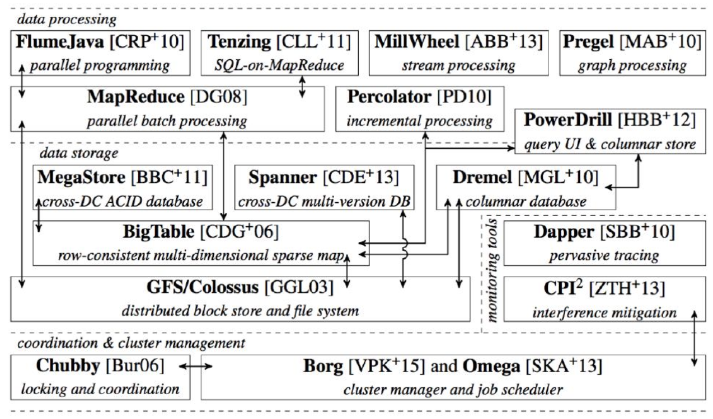
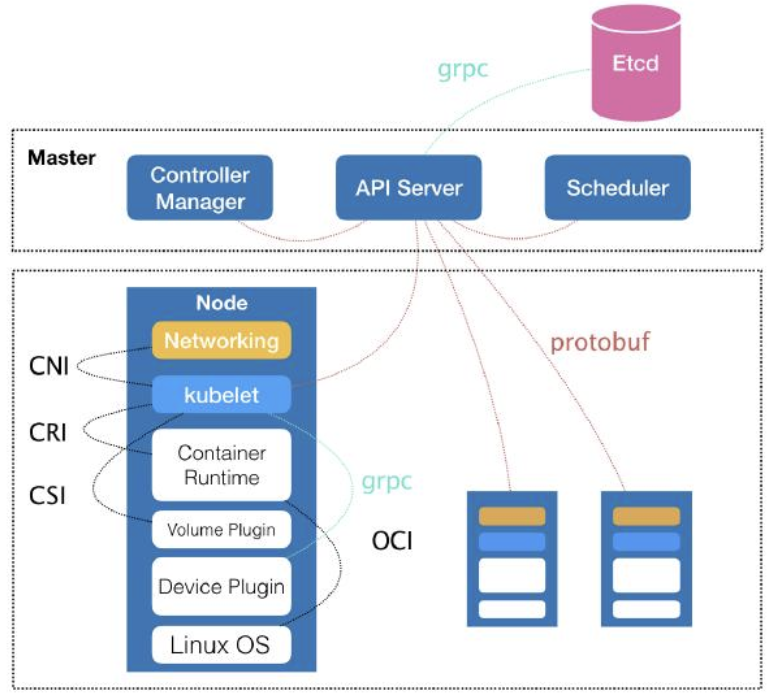

## 从容器到容器云

有了容器技术，一家云服务商或者基础设施提供商，只要能够将用户提交的 Docker 镜像以容器的方式运行起来，就能成为这个非常热闹的容器生态图上的一个承载点，从这个承载点向 Docker 镜像制作者和使用者方向回溯，整条路径上的各个服务节点，比如 CI/CD、监控、安全、网络、存储等等，都有可以发挥和盈利的余地。这正是所有云计算提供商如此热衷于容器技术的重要原因：**通过容器镜像，可以和潜在用户（即，开发者）直接关联起来**。

从一个开发者和单一的容器镜像，到无数开发者和庞大的容器集群，容器技术实现了从“容器”到“容器云”的飞跃，标志着它真正得到了市场和生态的认可。这样，**容器就从一个开发者手里的小工具，一跃成为了云计算领域的绝对主角；而能够定义容器组织和管理规范的“容器编排”技术，则当仁不让地坐上了容器技术领域的“头把交椅”。**

**容器编排工具：**

* Docker公司的Compose + Swarm
* Mesos
* Google与Redhat主导的Kubernetes

## Kubernetes的来源

Kubernetes 项目要归功于 Google 公司在 2015 年 4 月发布的 Borg 论文。Borg 系统，一直以来都被誉为 Google 公司内部最强大的“秘密武器”。因为，相比于 Spanner、BigTable 等相对上层的项目，Borg 要承担的责任，是承载Google 公司整个基础设施的核心依赖。在 Google 公司已经公开发表的基础设施体系论文中，Borg 项目当仁不让地位居整个基础设施技术栈的最底层。

相比于“小打小闹”的 Docker 公司、“旧瓶装新酒”的 Mesos 社区，Kubernetes 项目从一开始就比较幸运地站上了一个他人难以企及的高度。在 Borg体系的指导下，体现出了一种独有的“先进性”与“完备性”，而这些特质才是一个基础设施领域开源项目赖以生存的核心价值。

## Kubernetes要解决的问题是什么？

编排？调度？容器云？还是集群管理？这个问题到目前为止都**没有固定的答案**。

对于大多数用户来说，他们希望 Kubernetes帮助他们在一个给定的集群上把应用运行起来。还希望 Kubernetes 提供路由网关、水平扩展、监控、备份、灾难恢复等一系列运维能力。这些功能听起来好像有些耳熟？这不就是经典 PaaS（比如，Cloud Foundry）项目的能力吗？

使用 Docker 公司的 Compose+Swarm 项目，就完全可以很方便地 DIY 出这些功能了！所以说，如果 Kubernetes 项目只是停留在拉取用户镜像、运行容器，以及提供常见的运维功能的话，那么别说跟“原生”的 Docker Swarm 项目竞争了，哪怕跟经典的 PaaS 项目相比也难有什么优势可言。

## Kubernetes全局架构

控制节点（Master节点）组成：

* kube-apiserver：负责 API 服务
* kube-scheduler：负责调度 
* kube-controller-manager：负责容器编排
* Etcd：整个集群的持久化数据，由 kube-apiserver 处理后保存在Etcd中

计算节点（Node节点）的核心组件Kubelet：

* Kubelet通过CRI（Container Runtime Interface）与容器运行时（比如Docker）打交道，容器运行时Docker又通过OCI与Linux操作系统进行交互，即：把 CRI 请求翻译成对 Linux 操作系统的调用（操作 Linux Namespace 和 Cgroups 等）。
* Kubelet 通过 gRPC 协议同一个叫作 Device Plugin 的插件进行交互。这个插件，是 Kubernetes 项目用来管理 GPU 等宿主机物理设备的主要组件，也是基于Kubernetes 项目进行机器学习训练工作必须关注的功能。
* Kubelet通过CNI（Container Networking Interface）调用网络插件为容器配置网络。
* Kubelet通过CSI（Container Storage Interface）调用存储插件为容器配置持久化存储。

## Borg对Kubernetes的指导体现在哪里？

Borg 项目并不支持我们这里所讲的容器技术，Kubelet 完全是为了实现对容器的管理能力而重新实现的一个组件，与Borg 之间并没有传承关系。**Borg对Kubernetes项目的指导体现在Master节点**。它们的出发点高度一致，即：如何编排、管理、调度用户提交的**作业**。

Borg 项目完全可以把 Docker 镜像看做是一种新的应用打包方式。这样，Borg 团队过去在大规模作业管理与编排上的经验就可以直接“套”在 Kubernetes 项目上了。

这些经验最主要的表现就是，**从一开始，Kubernetes 项目就没有像同时期的各种“容器云”项目那样，把 Docker 作为整个架构的核心，而仅仅把它作为最底层的一个容器运行时实现。**