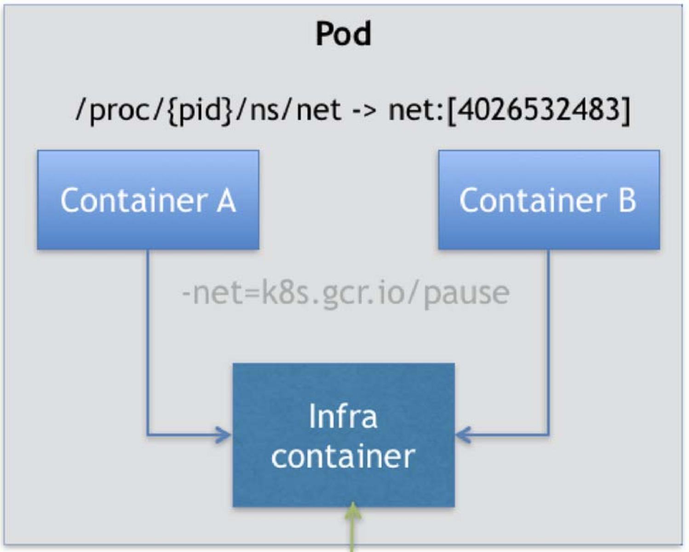

### 13|为什么需要Pod

#### 原因一：解决容器之间的“超紧密关系”

容器的本质是**进程**；那么，k8s就是**操作系统**

通过pstree -g命令可以发现存在**进程组**的概念，k8s就是将**进程组**的概念移植到了容器技术中。原因是：应用之间往往存在着类似**进程和进程组**的超亲密关系，必须部署在同一台机器上。

如果没有**“组”**的概念，这样的运维关系难以处理。举例如下：

```tex
以rsyslogd程序为例，已知rsyslogd由3个进程组成：imklog、imuxsock、main。这3个进程必须运行在同一机器上，否则它们之间基于Socket的通信和文件交换会出现问题。
如果要将这个应用容器化，由于受限于容器的“单进程模型”，这3个模块需要分别制作成3个不同的容器。假设3个容器设置的内存配额都是1GB。
如果k8s集群有两个节点，node1有3GB可用内存，node2有2.5GB可用内存。
如果采用Docker Swarm来处理，假如首先将main和imklog调度到了node2上，那么在调度imuxsock时就懵了，只能调度到node2上，但是node2只有0.5GB可用内存了。
而k8s由于有pod的概念，3个容器作为一个整体，需要3GB内存，自然就直接选择node1了。
```

这种容器之间的“超紧密关系”有哪些？

答：1. 直接的文件交换

2. 使用localhost或Socket文件进行本地通信
3. 频繁的远程调用
4. 需要共享某些Linux NameSpace（比如：一个容器需要加入到另一个容器的Network Namespace）

#### Pod实现原理

Pod只是一个**逻辑概念**，k8s真正处理的还是宿主机操作系统上Linux容器的**Namespace和Cgroups**，**并不存在**一个所谓的pod的边界或隔离环境。

Pod只是共享了某些资源的**一组容器**，Pod里所有的容器**共享同一个Network Namespace**，并且可以声明**共享同一个Volume**。

也许会有疑问：通过docker run --net=B --volume-from=B --name=A imageA ...这样的命令也能实现类似Pod的功能。但是这样的话，容器B必须比A先启动，这样一个Pod里的多个容器就不是**对等关系**，而是**拓扑关系**了。

所以：k8s中pod的实现借助了一个中间容器Infra，Infra永远是pod中第一个被创建的容器，其他容器通过Join Network Namespace方式与Infra容器关联在一起。



Infra容器使用的镜像是：k8s.gcr.io/pause，是一个用汇编语言编写的、永远处于“暂停”状态的容器，解压后也只有100-200KB大小，占用极少资源。

**Pod的特点：**

1. pod中所有容器可以直接使用localhost通信
2. pod中所有容器的网络设备与Infra容器完全一样
3. 一个Pod只有一个IP地址，也就是这个Pod的Network Namespace对应的IP地址
4. 所有的网络资源，都是一个pod一份，并且被该Pod中的所有容器共享
5. Pod的生命周期只跟Infra容器一致，与容器A、B无关。

**Pod内所有容器如何共享Volume：**把Volume定义在Pod层，Pod里的容器声明挂载这个Volume即可。


#### 原因二：丰富了容器设计模式

**典型案例一：war包与Web服务器：**

如果没有pod，使用docker，有两种实现方式：

1. 将war直接放到tomcat的webapps目录下，做成一个镜像。问题是：如果要更新war包、升级tomcat，需要频繁重新制作新的镜像，非常麻烦。
2. 只发布一个干净的tomcat镜像，把宿主机上的war包挂载到tomcat容器中，但问题是：tomcat有可能被调度到任意一台宿主机上，所以如何保证每台宿主机上都预先准备好war包呢，要么每台宿主机都准备，很麻烦，要么搞个分布式存储系统。

**有了Pod后的解决方法：**

```yaml
apiVersion: v1
kind: pod
...
spec:
  initContainers:
    ...
    name: war
    command: ["cp", "/sample.war", "/app"]
    volumeMounts:
      - mountPath: /app
        name: app-volume
  Containers:
    ...
    name: tomcat
    command: ["sh", "-c", "/root/apache-tomcat/bin/start.sh"]
    volumeMounts:
      - mountPath: /root/apache-tomcat/webapps
        name: app-volume
        ...
  volumes:
    - name: app-volume
      emptyDir: {}
```

如上，war包和tomcat分别定义为两个容器，war定义为Init Container，tomcat定义为普通Container，两个容器都挂载了同一个Volume，Init Container启动后将根目录下的war拷贝到/app目录下，然后就退出了，然后tomcat容器才会启动，这时tomcat容器中已经有了war包。这种设计模式叫做：**sidecar**。

**典型案例二：容器的日志收集：**

比如有一个应用，不断的把日志输出到容器的/var/log目录下，那么我就可以在pod中定义一个volume，同时挂载到这个应用容器的/var/log和另一个sidecar容器的/var/log目录，接下来，我只要将sidecar容器/var/log目录下的日志转发到MongoDB或ElasticSearch中存储就行了。与第一个例子相同，此例也借助了pod支持**共享volume**来完成对文件的操作。

此外，更重要的是pod中所有容器共享同一个Network Namespace，所以很多与**pod网络相关的配置和管理**，可以交给sidecar容器完成，例如：**Istio**微服务治理项目

#### 总结

应用在物理机和虚拟机中的运行方式是一样的，所以将应用从物理机迁移到虚拟机很容易的。

但是将应用迁移到容器中时，千万**不要把容器想象成虚拟机，千万不要把所有进程都放进一个容器里**，因为一个容器只能管理一个进程，或者说一个容器就是一个进程，而虚拟机中可以部署很多进程，这个区别是非常大的。

正确的方法是：**分析虚拟机中运行了哪些进程，将虚拟机想象成一个pod，把这些进程分别做成镜像，把有顺序关系的容器定义为InitContainer。**