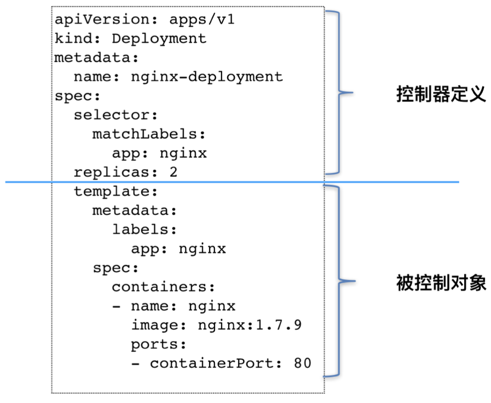

> 回顾一下名叫 nginx-deployment 的例子，这个 Deployment 定义的编排动作非常简单，即:确保携带了 app=nginx 标签的 Pod 的个数，永远等于 spec.replicas 指定的个数，即 2 个。怎么实现的？

在前面介绍 Kubernetes 架构的时候，曾经提到过一个叫作 kube-controller-manager 的组件。实际上，这个组件，就是一系列控制器的集合。我们可以查看一下 Kubernetes 项目的 pkg/controller 目录：

这个目录下面的每一个控制器，都以独有的方式负责某种编排功能。Deployment正是这些控制器中的一种。这些控制器之所以被统一放在 pkg/controller 目录下，就是因为它们都遵循 Kubernetes 项目中的一个通用编排模式，即:控制循环(control loop)。

比如，现在有一种待编排的对象 X，它有一个对应的控制器。那么，我就可以用一段 Go 语言风格的伪代码，为你描述这个控制循环:

```go
for {
  实际状态 := 获取集群中对象 X 的实际状态(Actual State) 
  期望状态 := 获取集群中对象 X 的期望状态(Desired State) 
  if 实际状态 == 期望状态{
    什么都不做
  } else {
    执行编排动作，将实际状态调整为期望状态
  }
}
```

**实际状态来源：**kubelet 通过心跳汇报的容器状态和节点状态，或者监控系统中保存的应用监控数 据，或者控制器主动收集的它自己感兴趣的信息，这些都是常见的实际状态的来源。

**期望状态来源：**来自于用户提交的 YAML 文件。比如，Deployment 对象中 Replicas 字段的值。很明显，这些信息往往都保存在Etcd中。

以 Deployment 为例，简单描述一下它对控制器模型的实现:

1. Deployment 控制器从 Etcd 中获取到所有携带了“app: nginx”标签的 Pod，然后统 计它们的数量，这就是实际状态;
2. Deployment 对象的 Replicas 字段的值就是期望状态;
3. Deployment 控制器将两个状态做比较，然后根据比较结果，确定是创建 Pod，还是删除已有的 Pod。

