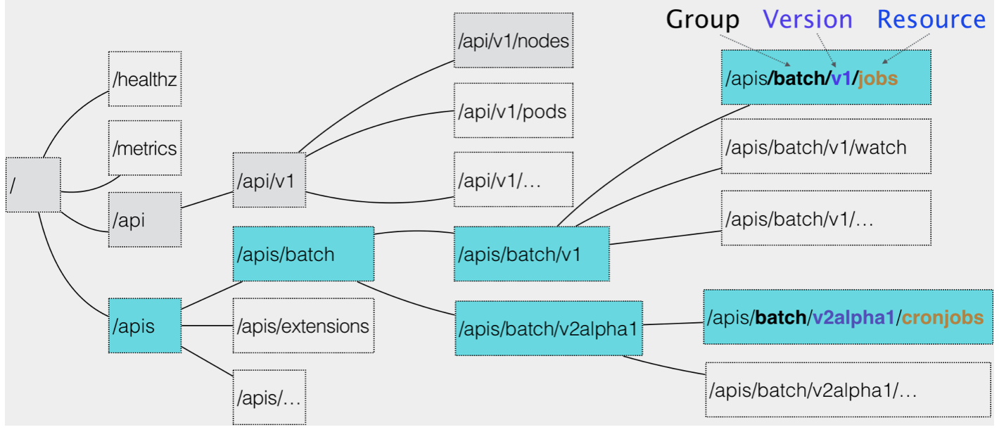
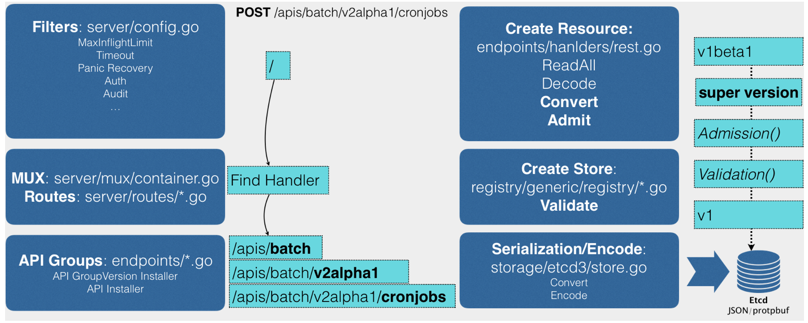

### Kubernetes里API对象的组织方式

一个 API 对象在***Etcd***里的完整资源路径，是由：***Group、Version、Resource***三部分组成。



### 创建API对象的流程



	1. 发起创建CronJob的POST请求后，我们编写的YAML信息就被提交给了APIServer
 	2. **Filter：**过滤这个请求，并完成一些前置性工作，比如授权、超时处理、审计等
 	3. **MUX和Routes：**APIServer完成URL和Handler绑定的场所，***Handler***按照刚才介绍的匹配过程，找到CronJob资源类型的定义
 	4. **创建CronJob对象：**
     - **Convert：**把提交的YAML转换成***Super Version***对象，这个对象包含此类资源***所有版本的字段全集***，这样的好处是不同版本的YAML都可以用Super Version对象处理
     - **Admission：**上一篇文章提到的Admission Controller和Initializer都属于Admission的内容
     - **Validation：**验证对象里的各个字段是否合法，验证通过后保存在APIServer里一个叫***Registry***的数据结构中。
     - 转换成用户最初提交的版本，进行***序列化***操作，调用***Etcd***的API保存起来

### 自定义API资源

Kubernetes v1.7之后，新增了API插件机制:***CRD***。CRD 的全称是***Custom Resource Definition***。允许用户自定义API资源。

举例说明：自定义一个名叫Network的API资源类型

- Network对象的YAML，example-network.yaml:

```yaml
apiVersion: samplecrd.k8s.io/v1      ## Group: samplecrd.k8s.io, Version: v1
kind: Network                        ## Resource: Network
metadata:
  name: example-network
spec:
  cidr: "192.168.0.0/16"
  gateway: "192.168.0.1"
```

- 上面的这个YAML文件，就是一个***CR(Custom Resource)***。而为了能够让 Kubernetes认识这个CR，你就需要***CRD(Custom Resource Definition)***。如下network.yaml：

```yaml
apiVersion: apiextensions.k8s.io/v1beta1 
kind: CustomResourceDefinition
metadata:
  name: networks.samplecrd.k8s.io 
spec:
  group: samplecrd.k8s.io 
  version: v1
  names:
    kind: Network
    plural: networks      ##复数
  scope: Namespaced
```

- 但是kubernetes还不能认识cidr（网段）、gateway（网关）这些字段的含义，为此需要进行go语言编码工作。代码结构如下：

```sh
$ tree $GOPATH/src/github.com/<your-name>/k8s-controller-custom-resource
.
├── controller.go 
├── crd
│   └── network.yaml 
├── example
│   └── example-network.yaml 
├── main.go
└── pkg
    └── apis
        └── samplecrd                  ## Group
            ├── register.go            ## 全局变量
            └── v1                     ## Version
                ├── doc.go             ## Golang的文档源文件
                ├── register.go        ## 让客户端也能“知道”Network资源类型的定义
                └── types.go           ## Network对象的完整描述
```

源代码位置：https://github.com/resouer/k8s-controller-custom-resource	

pkg/apis/samplecrd/register.go:

```go
package samplecrd

const (
	GroupName = "samplecrd.k8s.io"
	Version   = "v1"
)
```

doc.go：

Kubernetes进行代码生成时用到的Annotation风格的注释，起到的是全局的代码生成控制的作用，所以也被称为 Global Tags。

```go
// +k8s:deepcopy-gen=package   ## 为整个v1包里的所有类型定义自动生成DeepCopy方法

// +groupName=samplecrd.k8s.io  ## 这个包对应的API组的名字。
package v1
```

types.go:

定义一个 Network 类型到底有哪些字段。

```go
package v1

import (
	metav1 "k8s.io/apimachinery/pkg/apis/meta/v1"
)

// +genclient                ## 自动生成对应的Client代码
// +genclient:noStatus       ## 这个API资源类型定义里，没有Status字段，不要生成UpdateStatus代码
// +k8s:deepcopy-gen:interfaces=k8s.io/apimachinery/pkg/runtime.Object
type Network struct {
	// TypeMeta is the metadata for the resource, like kind and apiversion
	metav1.TypeMeta `json:",inline"`      // API元数据转换成json时的格式
  
	// ObjectMeta contains the metadata for the particular object, like name, namespace, labels...
	metav1.ObjectMeta `json:"metadata,omitempty"`     // 对象元数据转换成json时的格式

	Spec NetworkSpec `json:"spec"`      //spec转换成json时的格式
}

type NetworkSpec struct {
	Cidr    string `json:"cidr"`      //Cidr字段转换成json时的格式
	Gateway string `json:"gateway"`
}

// +k8s:deepcopy-gen:interfaces=k8s.io/apimachinery/pkg/runtime.Object
// 生成DeepCopy的时候，实现Kubernetes提供的runtime.Object接口。否则，在某些版本的Kubernetes里，你的这个类型定义会出现编译错误。这是一个固定的操作，记住即可。
type NetworkList struct {               //用来描述一组 Network 对象应该包括哪些字段
	metav1.TypeMeta `json:",inline"`
	metav1.ListMeta `json:"metadata"`

	Items []Network `json:"items"`
}

```

pkg/apis/samplecrd/v1/register.go:

有了这个方法，Kubernetes 就能够在后面生成客户端的时候，“知道”Network以及 NetworkList 类型的定义了。

```go
package v1
...
// addKnownTypes adds our types to the API scheme by registering
// Network and NetworkList
func addKnownTypes(scheme *runtime.Scheme) error {
	scheme.AddKnownTypes(
		SchemeGroupVersion,
		&Network{},
		&NetworkList{},
	)

	// register the type in the scheme
	metav1.AddToGroupVersion(scheme, SchemeGroupVersion)
	return nil
}

```

[代码生成博客](https://blog.openshift.com/kubernetes-deep-dive-code-generation-customresources/)

使用Kubernetes提供的代码生成工具，为上面定义的Network资源类型自动生成clientset、informer和 lister。

代码生成工具名叫k8s.io/code-generator，使用方法如下所示:

```sh
1 # 代码生成的工作目录，也就是我们的项目路径
2 $ ROOT_PACKAGE="github.com/resouer/k8s-controller-custom-resource"
3 # API Group
4 $ CUSTOM_RESOURCE_NAME="samplecrd"
5 # API Version
6 $ CUSTOM_RESOURCE_VERSION="v1"
7
8 # 安装 k8s.io/code-generator
9 $ go get -u k8s.io/code-generator/...
10 $ cd $GOPATH/src/k8s.io/code-generator 
11
12 # 执行代码自动生成，其中 pkg/client 是生成目标目录，pkg/apis 是类型定义目录
13 $ ./generate-groups.sh all "$ROOT_PACKAGE/pkg/client" "$ROOT_PACKAGE/pkg/apis" "$CUSTOM_RESOURCE_NAME:$CUSTOM_RESOURCE_VERSION"
```

会生成：

- zz_generated.deepcopy.go文件：Deepcopy代码

- client目录以及下面的三个包(clientset、informers、 listers)，是Kubernetes为Network类型生成的客户端库，这些库会在后面编写自定义控制器的时候用到。

创建Network对象的CRD及Network对象：

```sh
$ kubectl apply -f network.yaml
$ kubectl get crd
$ kubectl apply -f example-network.yaml
$ kubectl get network
$ kubectl describe network example-network
```

### 代码生成时遇到的问题

1. 直接使用作者的示例代码，注意保持与作者github的代码路径一致为：go/src/github.com/resouer/k8s-c...，否则import的路径不对，报错。

2. 代码生成程序需要放到k8s.io目录下，原因同上。

3. 很可能会报错：提示Hit an unsupported type invalid type，可以先安装下k8s.io/apimachinery包。应该是deepcopy找不到metav1.ObjectMeta和metav1.TypeMeta

   解决方法：go get -u k8s.io/apimachinery（被墙）

   git clone https://github.com/kubernetes/apimachinery.git

