## Kubernetes集群的部署方式及详细步骤

**一、部署环境架构以及方式**

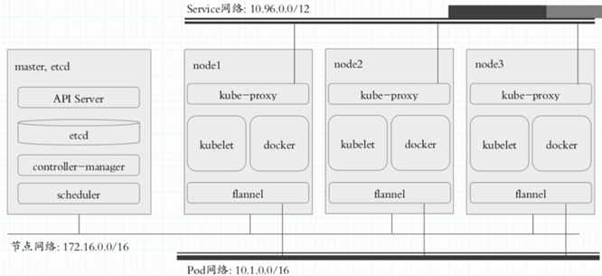

第一种部署方式

1、针对于master节点

将API Server、etcd、controller-manager、scheduler各组件进行yum install、编译安装或者展开安装的方式手动直接安装在master节点主机上，作为系统级守护进程运行。

2、针对于node节点

将kube-proxy、kubelet、docker、flannel各组件进行yum install或下载已预制好的二进制程序包手动安装在node节点主机上，作为系统级守护进程运行。

此部署方式非常的繁琐，出于安全方面的考虑，各组件之间通信都需要配置CA和证书。

注：此部署方式的缺点就是如果master宕机了，需要手动进行启动这些系统级的守护进程

第二种部署方式

由于第一种部署方式比较繁琐，此次我们采用kubeadm工具进行部署，由k8s官方所提供的专门部署集群的管理工具。

每一个节点主机上包括master节点都要手动安装并运行docker，同时也都要手动安装并运行kubelet。如果将第一个节点初始化为master节点，在执行初始化这个步骤，其实就是通过kubeadm工具将API Server、etcd、controller-manager、scheduler各组件运行为Pod，也就是跑在docker上。而其他node节点，因已经运行了kubelet、docker组件，剩下的kube-proxy组件也是要运行在Pod上。

kubelet：负责能运行Pod化容器的核心组件

docker：运行容器的引擎

但是以上master节点上的Pod都是静态Pod（static Pod），并不受k8s自身管理，只是运行为Pod形式而已，也可运行为自托管Pod（本文不作阐述）。

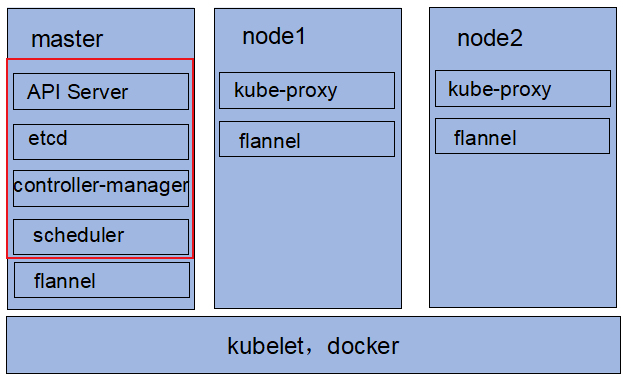

而flannel组件也是运行在Pod上的系统级守护进程，起到各node节点通信作用。以下是flannel简单介绍：

https://blog.csdn.net/xuguokun1986/article/details/53119330

3、kubeadm的介绍

在GitHub上kubeadm的介绍：

https://github.com/kubernetes/kubeadm

**二、Kubernetes集群的部署详细步骤**

（一）简述部署流程

1、master、nodes节点要先安装kubelet、kubeadm和docker

2、在master节点上运行kubeadm init进程进行初始化集群

3、将各node节点加入集群中：kubeadm join

kubeadm工作原理详解见：https://github.com/kubernetes/kubeadm/blob/master/docs/design/design_v1.10.md（此文档介绍的是k8s1.10版本）

（二）部署流程的详细介绍

（1）master节点环境安装的准备工作

1、确保集群中的所有节点，服务器时间是同步的。设置详情如下：

https://www.cnblogs.com/huhyoung/p/9657253.html

2、公司内部局域网的服务器可配置hosts文件进行域名解析，例如马哥视频中的：

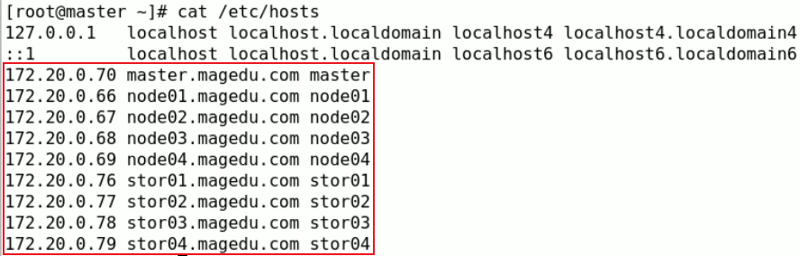

而云服务器需要另外考虑

注：阿里云服务器切记不要修改hostname

3、关闭防火墙服务

需要注意的是，CentOS Linux 7默认启动了firewalld（防火墙服务），而Kubernetes的master与工作node之间会有大量的网络通信，安全的做法是在防火墙上配置各组件需要相互通信的端口号。在一个安全的内部网络环境中可以关闭防火墙服务：

[root@master ~]# systemctl disable firewalld
[root@master ~]# systemctl stop firewalld

4、获取软件包

第一种部署方式获取软件包

源码包获取地址：https://github.com/kubernetes/kubernetes/releases

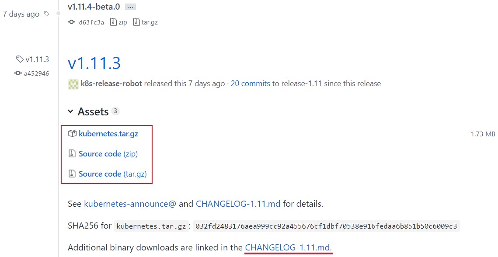

图中红色框的为源码包，而kubernetes.tar.gz不是源码包，但包含所需的所有组件。建议下载官方预制好的，master、node相关组件分别分开组建的包，点击CHANGELOG-1.11.md

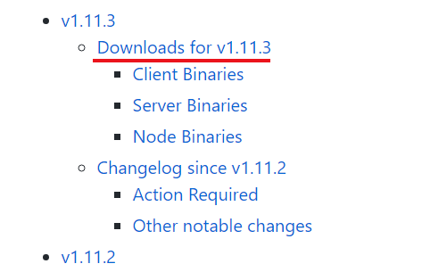

点击目录[Downloads for v1.11.3](https://github.com/kubernetes/kubernetes/blob/master/CHANGELOG-1.11.md#downloads-for-v1113)跳转到

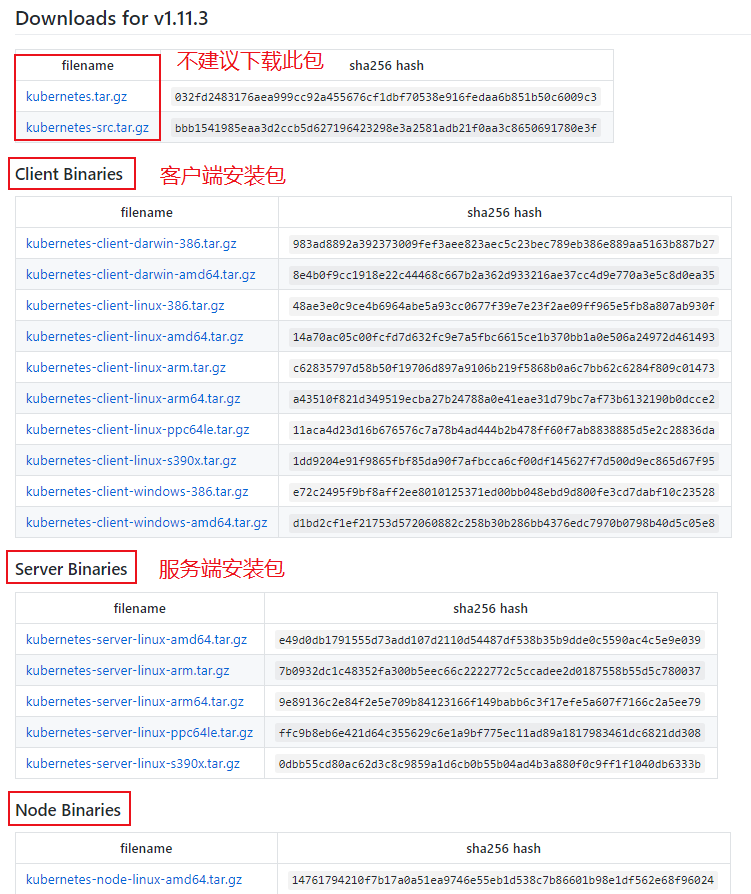

不管是master和node都应该安装服务端安装包，像图中的[kubernetes-server-linux-amd64.tar.gz](https://dl.k8s.io/v1.11.3/kubernetes-server-linux-amd64.tar.gz)包，如果要进行交互，则需要安装客户端

第二种部署方式获取软件包

如果是Cent OS，建议使用yum install安装，Google官方已经将这些组件制作成了RPM包，这些包需要RPM包生成器动态生成，所以不能下载到本地使用，只能通过在线仓库进行安装。

（2）master节点环境的安装

1、配置yum仓库

先安装docker镜像，去阿里云官方镜像网站：https://opsx.alibaba.com/mirror找到docker-ce对应的linux centos系统repo配置文件，右击复制链接

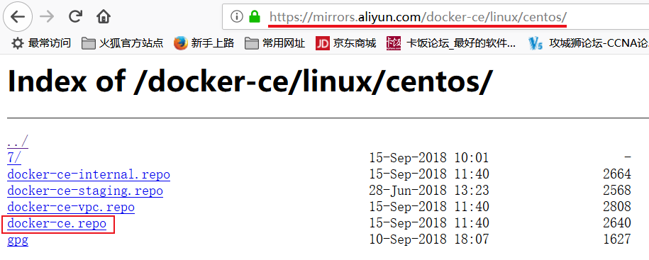

然后进入/etc/yum.repos.d目录，下载到本地。

wget https://mirrors.aliyun.com/docker-ce/linux/centos/docker-ce.repo

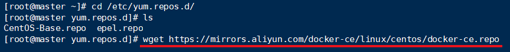

接着再生成Kubernetes的仓库文件，创建并编辑kubernetes.repo。

[root@master yum.repos.d]# vim kubernetes.repo

写入以下内容，baseurl和gpgkey的路径可在阿里云官方镜像网站Kubernetes目录下找到。

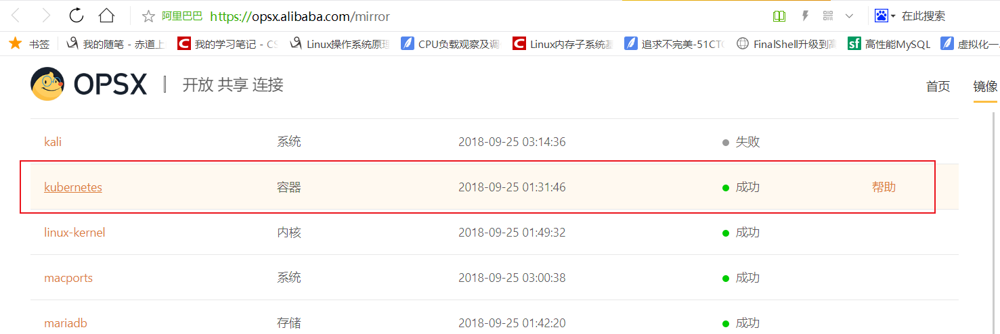

[kubernetes]
name=Kubernetes Repo
baseurl=https://mirrors.aliyun.com/kubernetes/yum/repos/kubernetes-el7-x86_64/
gpgcheck=1
gpgkey=https://mirrors.aliyun.com/kubernetes/yum/doc/yum-key.gpg
enabled=1

 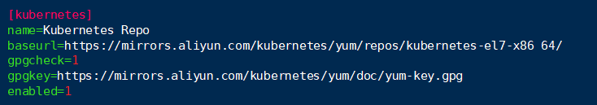

创建完之后，获取当前系统有效的repolist 

[root@master yum.repos.d]# yum repolist

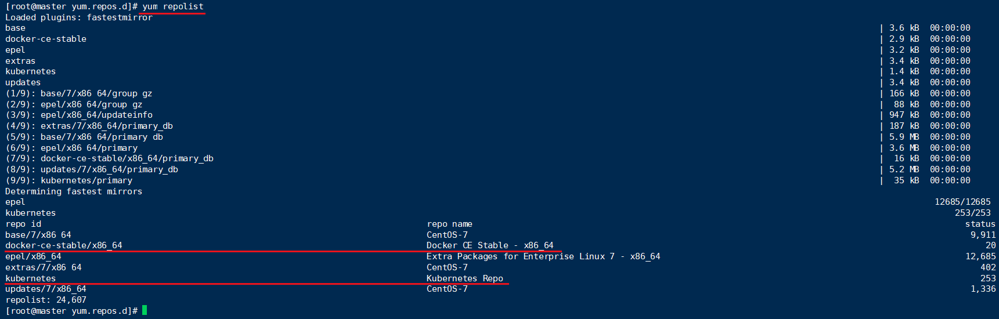

为了方便在node节点上安装，可以将这个两个配置文件通过scp命令复制到node节点服务器上

[root@master yum.repos.d]# scp kubernetes.repo docker-ce.repo node1:/etc/yum.repos.d/

2、安装各组件

kuberctl：API Server的命令行客户端

[root@master yum.repos.d]# yum install docker-ce kubelet kubeadm kubectl

可以看到加载到的是哪些版本的包

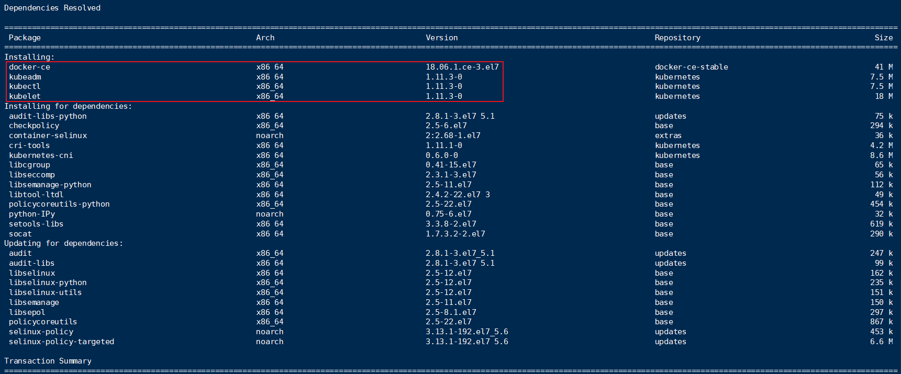

安装到cri-tools-1.11.1-0.x86_64包时提示gpgkey没有安装

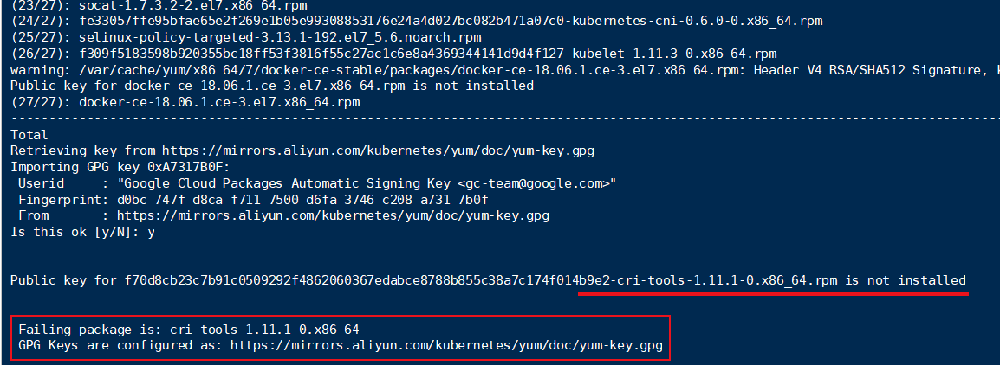

将yum-key.gpg下载到本地进行rpm --import导入

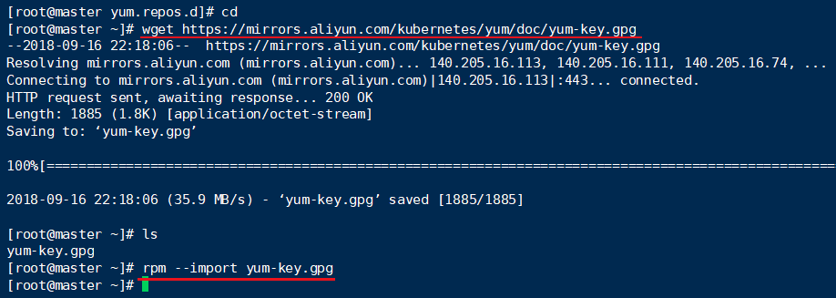

发现还是报同样的错，于是顺便也把rpm包的key也下载下来进行导入

wget https://mirrors.aliyun.com/kubernetes/yum/doc/rpm-package-key.gpg

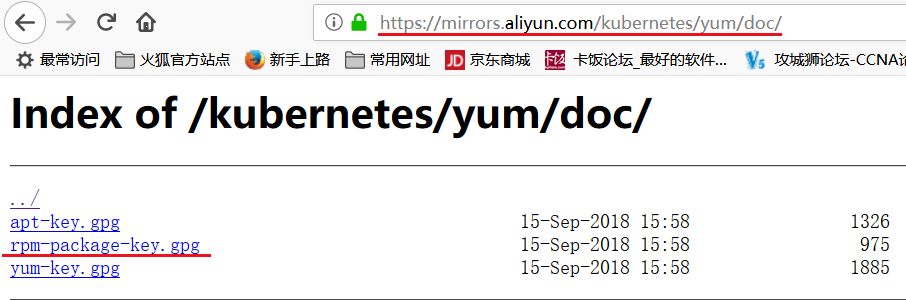

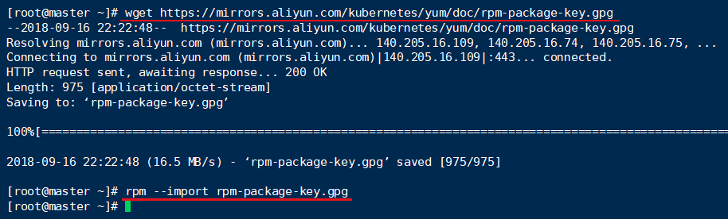

最后，都安装成功了。

3、启动docker

启动docker后，需要注意的是它会去docker仓库下载所依赖到的每个镜像文件，这些镜像文件暂时获取不到，建议将相关镜像文件通过其他途径下载到本地然后导入使用，或者推送到本地仓库。

在这里我们是借用别人此前提供的一种路径来获取并下载使用，因此在启动之前，需要编辑vim /usr/lib/systemd/system/docker.service，在该文件中定义一个环境变量

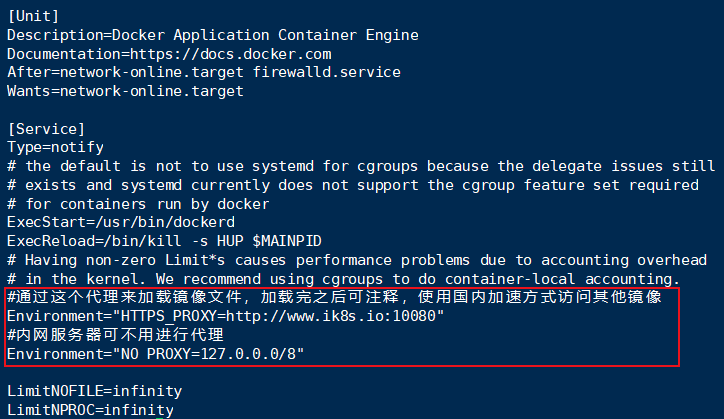

注意NO_PROXY中间是有下划线的。然后修改完配置文件之后需要重新加载配置文件，然后重新启动，否则修改不会生效。

[root@master ~]# systemctl daemon-reload
[root@master ~]# systemctl start docker

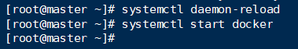

是否启动成功用docker info查看一下，可以看出已经启动成功了

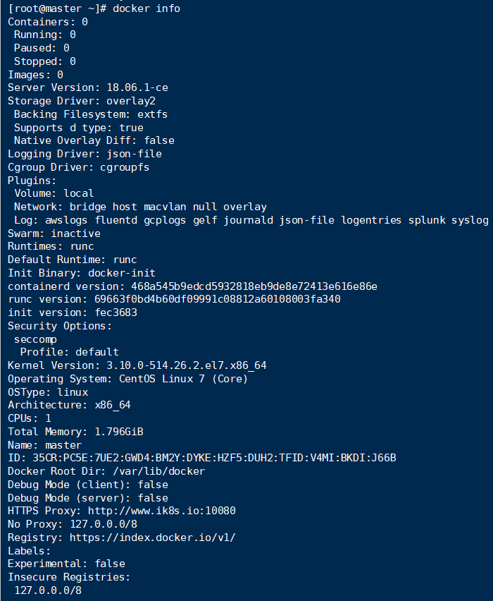

同时还要确保以下两个参数值为1。通过网桥转发的IP数据包会iptables规则过滤，而这两个选项将阻止过滤，Netfilter是默认情况下启用了桥梁，如果不阻止会导致严重的混乱

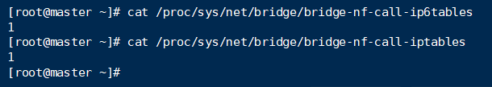

如果不是1需要修改为1

echo 1 > /proc/sys/net/bridge/bridge-nf-call-ip6tables

通过[root@master ~]# rpm -ql kubelet  命令查看都安装了什么文件

 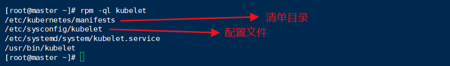

查看配置文件发现额外参数是空的

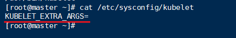

4、设置kubelet、docker为开机启动

[root@master ~]# systemctl start kubelet
[root@master ~]# systemctl status kubelet

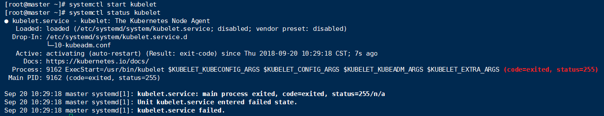

这边没有明显的错误提示，因此查看日志[root@master ~]# tail /var/log/messages

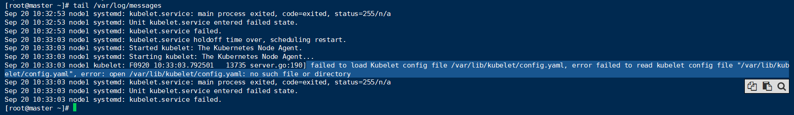

[root@master ~]# systemctl stop kubelet        #将kubelet关闭

因各个组件还未初始化完成所以不能启动，将其设置开机启动即可

[root@master ~]# systemctl enable kubelet    #将其设置为开机启动

[root@master ~]# systemctl enable docker    #将docker设置为开机启动

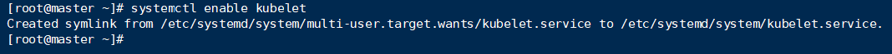

5、kubeadm init初始化

查看kubeadm init的帮助信息 

[root@master ~]# kubeadm init --help

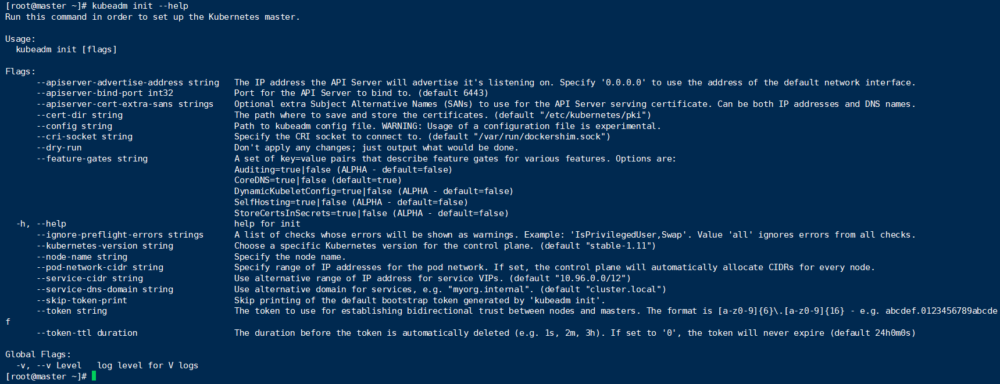

--apiserver-advertise-address：API服务器将通知它正在监听的IP地址，监听的地址为“0.0.0.0”，即本机所有IP地址。

--apiserver-bind-port：API服务器绑定到的端口。(默认：6443)

--cert-dir：加载证书的相关目录（默认：/etc/kubernetes/pki）

--config：配置文件的路径。警告:配置文件目前属于实验性，还不稳定。

--ignore-preflight-errors：将错误显示为警告的检查列表进行忽略。例如:“IsPrivilegedUser,Swp”。Value 'all'忽略所有检查中的错误。

--pod-network-cidr：指定pod网络的IP地址范围。如果设置，控制平面将为每个节点自动分配CIDRs。

--service-cidr：为service VIPs使用不同的IP地址。(默认“10.96.0.0/12”)

然后我们指定选项进行初始化：

[root@master ~]# kubeadm init --kubernetes-version=v1.11.1 --pod-network-cidr=10.244.0.0/16 --service-cidr=10.96.0.0/12

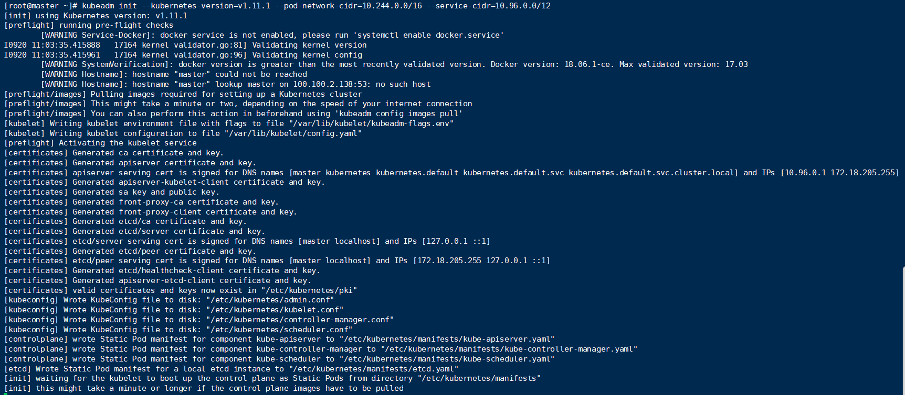

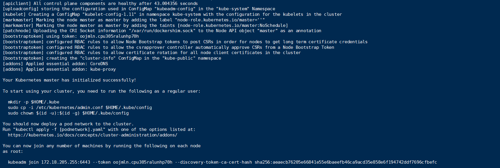

如果在初始化中碰到swap不支持的报错，如下图

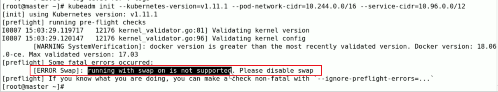

需要做两个设定

①[root@master ~]# vim /etc/sysconfig/kubelet        #加入以下参数

KUBELET_EXTRA_ARGS="--fail-swap-on=false"

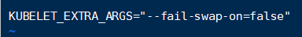

②[root@master ~]# kubeadm init --kubernetes-version=v1.11.1 --pod-network-cidr=10.244.0.0/16 --service-cidr=10.96.0.0/12 --ignore-preflight-errors=Swap   #在初始化时加入--ignore选项

最后通过[root@master ~]# docker image ls 查看镜像都拉取完了

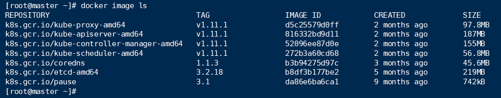

其中k8s.gcr.io/pause就是基础架构容器，可以不用启动，其他容器可以将它当成模板进行网络、存储卷复制。

特别注意：

其中有两个附件：CoreDNS和kube-proxy

CoreDNS：CoreDNS已经经历过三个版本：sky-dns（）----->kube-dns（1.3版本）----->CoreDNS（1.11版本）

kube-proxy：作为附件运行自托管与k8s之上，来帮忙负责生成service资源相关的iptables或者ipvs规则，在1.11版本默认使用ipvs。

6、创建kube目录，添加kubectl配置

建议用普通用户运行以下三个命令：

mkdir -p $HOME/.kube;

sudo cp -i /etc/kubernetes/admin.conf $HOME/.kube/config;

sudo chown $(id -u):$(id -g) $HOME/.kube/config

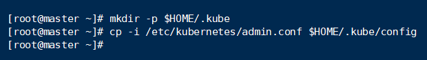

因不是生产环境，所以此处直接用root权限执行，第三步更改属主和属组也不需要操作

还未执行以上三个命令时，查看nodes节点是会报以下错误：

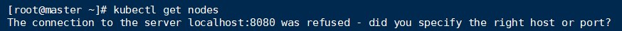

执行完之后，再查看nodes节点时，结果如下：

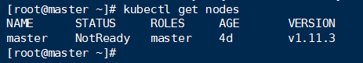

可以看出master的状态是未就绪（NotReady），之所以是这种状态是因为还缺少一个附件flannel或者Calico，没有网络各Pod是无法通信的。

也可以通过检查组件的健康状态

[root@master ~]# kubectl get componentstatus      #componentstatus可简写为cs

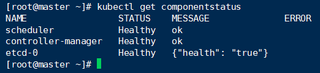

7、添加网络组件（flannel）

 组件flannel可以通过https://github.com/coreos/flannel中获取，此处也有介绍怎么安装

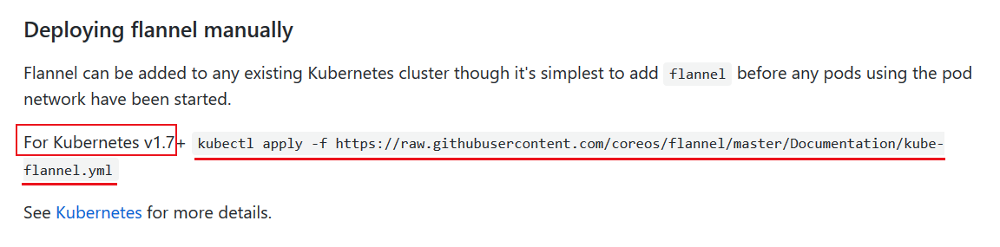

如果Kubernetes版本是1.7以上执行这行命令即可，在线自动获取部署清单，然后基于此清单下载镜像启动并部署

```
kubectl apply -f https://raw.githubusercontent.com/coreos/flannel/master/Documentation/kube-flannel.yml
```

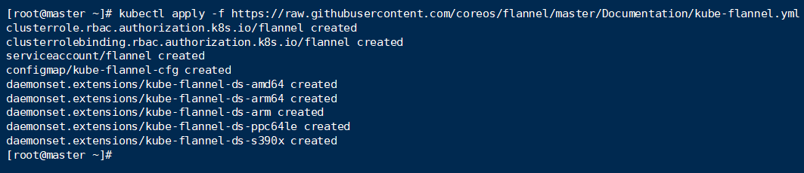

看到很多东西被创建是还不够的，还需要查看flannel是否处于正常启动并运行的状态，才算正在的部署完成

[root@node1 ~]# docker image ls           #查看flannel镜像是否有被拉取下来

可以看到flannel镜像已经下载下来了


注意：从这步开始我用的版本是v1.11.2，由于代理到期，导致之前的镜像下载不到重新换了途径下载，所以你们kubeadm init初始化时记得对应上版本。

[root@node1 ~]# kubectl get pods --all-namespaces       #查看所有名称空间的pod，同时可以看到flannel已经正常启动

[root@node1 ~]# kubectl get pods -n kube-system          #查看名称空间为kube-system的pod

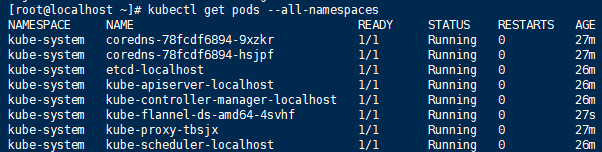

[root@localhost ~]# kubectl get ns    #查看有哪些名称空间

系统级别的Pod都在名称空间kube-system中

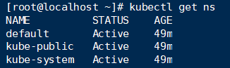

这样我们的master节点就部署好了

8、

（3）node节点环境的安装

[root@node01 ~]# rpm --import rpm-package-key.gpg

[root@node01 ~]# yum install -y docker-ce kubelet kubeadm

[root@master ~]# scp /usr/lib/systemd/system/docker.service node01:/usr/lib/systemd/system/docker.service

[root@master ~]# scp /etc/sysconfig/kubelet node01://etc/sysconfig/

[root@node01 ~]# systemctl daemon-reload

[root@node01 ~]# systemctl start docker

[root@node01 ~]# systemctl enble docker kubelet

[root@node01 ~]# kubeadm join 172.20.0.70:6443 --token jpy0lt.fxz77am8dgr4r93f --discovery-token-ca-cert-hash sha256:70b67aa60ebb2eef3e3e4f76e5278fc23e6972c1c4e0848d744b93caa6f9b6ec --ignore-preflight-errors=Swap

加入成功之后，等以下镜像下载完之后这个node节点就ok了。

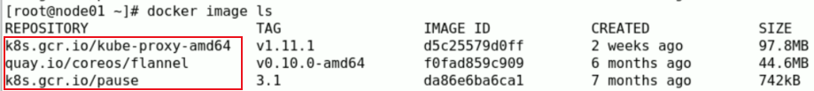

可以通过kubectl get pods -n kube-system -o wide查看flannel和proxy有两个，一个在master节点上，一个在node01节点上。

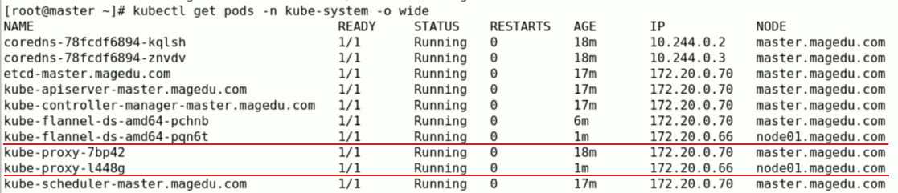

 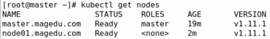

